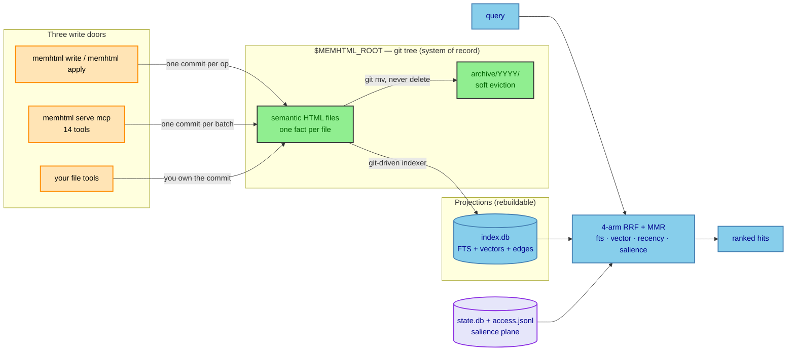
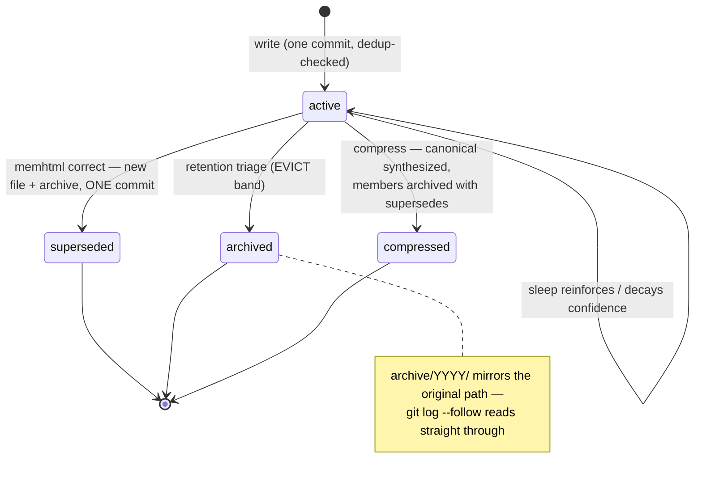
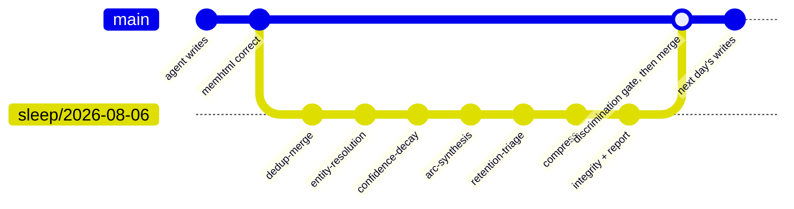

# memhtml

An agent's long-term memory as a **git repository of semantic HTML5 files** — one fact per file — with
a rebuildable SQLite index over it, a four-arm hybrid retrieval stack, and a nightly curation pipeline
that commits its work to a reviewable branch.

```bash
memhtml init                                  # scaffold $MEMHTML_ROOT: git init, PARA dirs, merge driver
memhtml write --title "WAL admits one writer and many readers" --type semantic \
  --claim "A CLI command and a running memhtml serve mcp share one index.db."
memhtml search "one writer many readers"      # FTS + vector + recency + salience, fused with RRF
memhtml serve mcp                             # the same store over stdio: 14 tools, 2 resources
```

`memhtml manifest` (or a bare `memhtml`) answers with every command, flag, response type, and error code the
binary accepts — on a machine with no repo, no database, and no credentials. Every command writes
exactly ONE JSON envelope to stdout; logs go to stderr; exit 0/2/1 for success/usage/runtime.
`AGENTS.md` is generated from the same table that drives parsing, so the doc cannot drift from the
binary.

## The design in three sentences

The git tree is the system of record; `.memhtml/index.db` is a projection of it, deleted and rebuilt
without loss. Anything that must survive `rm index.db` lives in the files — authored links are
`<link>` elements, metadata is `<meta>` elements — while re-derivable artifacts (embeddings, mined
edges) live only in the index. Nothing is ever deleted: eviction is a `git mv` into `archive/<YYYY>/`
with the original path mirrored beneath, so `git log --follow` reads straight through a memory's whole
life.



## Why files

A memory an agent can be trusted with has to be reviewable, diffable, and recoverable. Those are
git's properties, not a database's:

- **A correction is a commit.** `memhtml correct` writes the new file and archives the old one in ONE
  commit, so an interrupted run can never leave two live memories contradicting each other.
- **A batch is a commit.** `memhtml apply` (JSONL ops) and `memory_write_batch` (MCP) stage N files, make
  ONE commit, and reindex ONCE — atomic by default, per-op results in input order, and a duplicate is
  never an error (`deduped: true` with the existing path).
- **A nightly curation run is a branch.** `memhtml sleep run` walks fifteen phases and commits each
  one's work on its own, so a human reads the curation one phase-shaped diff at a time, and
  `memhtml sleep merge` fast-forwards `main` only after a quality gate that can refuse.

## Who does what

Three actors, one tree. The agent writes facts and resolves only the conflicts it found itself;
sleep curates nightly on a branch and detects conflicts without resolving them; the human owns the
gate and the one-way doors.

```mermaid
graph LR
    subgraph agent["Agent does (any hour)"]
        A1["write / apply<br/>one fact per file"]
        A2["search / recall<br/>no writes to the tree"]
        A3["correct<br/>resolve a conflict it FOUND"]
        A4["code-mode traversals<br/>read-only"]
    end

    subgraph sleep["Sleep does (nightly, on a branch)"]
        S1["dedup, entity resolution,<br/>confidence decay"]
        S2["detect conflicts<br/>never resolves them"]
        S3["compress N members<br/>into one canonical"]
        S4["synthesize arcs<br/>the one type agents cannot write"]
    end

    subgraph human["Human does (review gate)"]
        H1["memhtml sleep review<br/>read fifteen commits"]
        H2["memhtml sleep merge<br/>gate can refuse"]
        H3["settle contested conflicts<br/>the one-way doors"]
    end

    agent -->|"commits to main"| sleep
    sleep -->|"sleep/date branch"| human
    human -->|"fast-forward main"| agent

    classDef ag fill:#87CEEB,stroke:#4682B4,stroke-width:2px,color:darkblue
    classDef sl fill:#E6E6FA,stroke:#8A2BE2,stroke-width:2px,color:darkblue
    classDef hu fill:#90EE90,stroke:#333,stroke-width:2px,color:darkgreen
    class A1,A2,A3,A4 ag
    class S1,S2,S3,S4 sl
    class H1,H2,H3 hu
```



## The file format

One fact per file, standard HTML5, view-source readable, closed vocabulary (`memhtml doctor` warns on
anything outside it). Every element carries indexer semantics — structure Markdown cannot express:

```html
<article>
  <p><mark>If a prod rollback is issued, drain the VIP before reverting the deploy.</mark>
  The revert alone leaves in-flight connections pinned to the old target group —
  observed on <time datetime="2026-07-28">July 28</time> during the <cite>checkout-api sev2</cite>.</p>
  <dl><dt>Applies to</dt><dd>ALB/NLB target-group deploys</dd></dl>
  <details><summary>How this was learned</summary><p>Three rollbacks replayed the same 500-spike…</p></details>
  <aside><p>Fly.io and Cloud Run drain automatically; this is AWS-specific.</p></aside>
</article>
```

The one `<mark>` is the claim — it becomes the gist every listing shows and the span a correction
targets. `<time datetime>` is when the fact *happened*, so an episodic memory ranks by world-time
rather than write-time. `<dl>` pairs index as facets, `<cite>` as citations, `<details>` folds
elaboration behind a summary that recall always discloses. `docs/format.md` is the full vocabulary;
`docs/tasks.md` covers the task type (`memhtml-task-status`, `memhtml-due`), which rides the same format.

## Writing

Three doors, all legitimate, all landing in the same tree:

1. **The CLI** — `memhtml write` for one memory (prose path: `--claim` + `--body`, template owns the
   markup; or `--article-html`, you own the markup and the format check refuses violations before
   anything is written). `memhtml apply` for many: one JSONL op per line, validated for shape before any
   op executes, one commit, one index pass.
2. **The MCP server** — `memhtml serve mcp`, stdio, 14 tools and 2 resources over the same repo:
   write/read/search/recall/correct/link/archive, batch writes, trace search. A CLI command and a
   running server share one store: WAL admits one writer and any number of readers, and a contended
   write retries on `SQLITE_BUSY` (see `RUNBOOK.md`, section 4).
3. **Your file tools** — the tree is the system of record, so a hand-written file is as real as one
   the CLI wrote. You take on what the write path would have done: format validity (`memhtml doctor`),
   path choice, dedup, and the commit. Sleep refuses to start on a dirty tree.

Content-hash dedup is structural: a partial unique index over active files means a duplicate write
*cannot* be indexed — it returns the existing path with `deduped: true` and creates nothing.

A memory's whole life is commits in one tree:



## Retrieval

Four arms fused with RRF (k=60) in ONE SQL statement, then MMR diversification in TypeScript:

| arm | weight | what it ranks |
|---|---|---|
| fts | 1.0 | one denormalized title+gist+body column |
| vector | 1.0 | exact brute force over Cohere Embed v4 (1024-dim), grouped by path so long never beats relevant |
| recency | 0.5 | `coalesce(event_at, updated_at)` — episodic memories sort by when the fact happened |
| salience | 0.4 | the durable access plane, attached in the same statement — tasks and `resources/people/` excluded |

**Retrieval never errors because Bedrock is down.** Arms needing a query vector are dropped before
assembly, the response carries `degraded: true`, and the search gets narrower rather than failing.

**Salience counts chosen opens, not ranker guesses.** `memhtml read` / `memory_read` of a named path bumps
the access plane; a path merely *returned* by `memhtml search` or `memhtml recall` does not, and neither does a
sleep phase. Bumping on a hit would make today's top five rank higher tomorrow purely for having been
listed, while the memory that should displace them never appears to earn a first bump. `memhtml reinforce`
is the explicit outcome channel and moves the EWMA too. The arm also has no opinion about a `task` row
or a `resources/people/` reference record: those are reached by predicate and by key, and salience there
would reward a stale task and decay a person's identity.

`memhtml recall` layers a disclosure fold on top: arcs are folded under their own character envelope
rather than competing with the memories they summarize, both folds quote at most 2 memories per
entity name, and everything past a budget collapses to one index line plus a path for drill-down.

## The discrimination gate

`memhtml eval discriminate` is the one number that says whether retrieval works at all. Embeddings are
weakest on exactly the tokens carrying a fact's polarity — "drain the VIP before reverting" and "do
NOT drain the VIP before reverting" sit above 0.99 cosine while asserting opposite things. So the
gate generates controls *mechanically* from each probe's target (negation flip, numeric flip,
qualifier flip), making them high-cosine wrong-fact adversaries by construction. Every target must
strictly outrank all of its own controls, MRR must clear 0.85, and one inversion fails the run.

It gates two places: `pnpm check` — the tier any CI runs — and `memhtml sleep merge`, where a sleep run
that degrades retrieval cannot land. Fake-embedder mode is deterministic and credential-free;
`live` mode is an operator diagnostic that reports `skipped: true` loudly rather than ever letting a
skipped gate look green.

## Sleep

`memhtml sleep run` executes fifteen curation phases on a `sleep/<date>` branch — dedup-merge, entity
resolution, conflict detection, confidence decay, arc synthesis, retention triage, compress,
integrity, and friends — each committing phase making its own isolated commit with a
machine-readable trailer, so `memhtml sleep resume` re-runs only what is missing. Two commit nothing by
design: `preflight` just refreshes the index, and `relationship-mining` writes derived edges to the
index alone, because thousands of re-derivable edges would bury every real diff.
`trace-consolidation` hands unread session transcripts to an agent and lands each distilled memory as
its own commit — one per memory, so a reviewer reads one claim at a time. A failed phase never rolls
back its predecessors.
`memhtml sleep review` classifies every touched file; `memhtml sleep merge` re-runs the discrimination gate
and refuses to move `main` on regression. Conflict *detection* is nightly and automatic; conflict
*resolution* stays with the writer or a human — choosing a winner is a one-way door.



## Code-mode

The closed vocabulary makes the corpus a queryable API with no new surface: `article mark` is
always the claim, `link[rel^="memhtml-"]` always an authored edge, `dl` pairs always facets. (A
descendant selector, not a child one — the markup is `<article><p><mark>`, so `article > mark`
matches nothing and a helper written from that spelling silently reports zero claims.) An agent
that writes parser code against `$MEMHTML_ROOT` composes multi-hop traversals in one execution and
answers corpus-shaped questions no tool enumerates (live contradiction pairs, orphan census,
supersedence-chain walks). Read-only by contract — writes stay behind the write doors above.

`memhtml exec` ships this as a command: it runs your script in a QuickJS sandbox with the corpus mounted
read-only at `/mnt/memhtml` and a helper preloaded at `/workspace/lib/corpus.mjs`, and answers one
`exec.report` envelope. Measured on the 305-file fixture corpus: 305/305 claims parsed and 410/410
edges resolved in one execution. The tree is a pinned commit, so an answer is reproducible and an
uncommitted edit is not visible. Structural and lexical planes only — no cosine, no RRF, no
salience, and no index handle; for ranked retrieval a script shells out to `memhtml search` and consumes
its envelope. `docs/code-mode.md` is the cookbook, with a measured helper and five recipes.

## Measured

| benchmark | memhtml | published reference |
|---|---|---|
| MemoryAgentBench FactConsolidation single-hop (26KB–1.1MB stores) | 92–97% | ~60% at 26KB only |
| MemoryAgentBench FactConsolidation multi-hop | 37–49% | ≤7% all methods |
| BEAM Contradiction Resolution (100K split, 40 probes) | 43.8% mean | 0–5% all systems |
| LongMemEval-S (25-instance smoke) | 68% | ~55–65% typical agent baselines |

Judge caveat: cross-judge numbers are reference points, not rankings — the judges are verbatim prompt
ports running haiku-4.5 where the papers used gpt-4o / gpt-4.1-mini. `ROADMAP.md` carries these
numbers and the horizons they rank.

## Layout

```
$MEMHTML_ROOT/                        # its own git repo, one global memory store
  projects/<workspace-slug>/      # a workspace IS a directory. There is no workspaces table.
  areas/<area-slug>/              # ongoing responsibilities
  areas/arcs/                     # behavioural arcs (system-written by sleep only)
  areas/inbox/                    # where an unplaceable memory lands
  resources/<topic>/
  resources/people/<person>.html  # the person plane
  archive/<YYYY>/<original-path>  # soft-evicted, path-preserving, injective
  .memhtml/
    index.db                      # gitignored, rebuildable from the tree
    state.db                      # gitignored, NOT rebuildable from git
    state/access.jsonl            # COMMITTED sidecar — the state plane's only durable copy
    sleep/<run-id>.html           # committed sleep reports
  sitemap.xml + per-dir index.html  # generated by `memhtml publish`, committed
```

## Packages

Strict layering, enforced by TypeScript project references. `@memhtml/contracts` and `@memhtml/domain` import
nothing but `effect`, and a test asserts that `domain`'s own `dist` names no driver, no SDK, and no
`node:fs`.

| Package | What it owns |
|---|---|
| `@memhtml/contracts` | Schemas, the closed vocabularies, errors, path algebra. Zero I/O. |
| `@memhtml/domain` | Pure math: retention, decay, RRF, MMR, PageRank, the anti-merge guards. |
| `@memhtml/html` | The memory file format — parse, serialize, hash, surgical head editors. |
| `@memhtml/store` | The git-backed file store. One commit per operation, typed conflicts. |
| `@memhtml/index` | SQLite schema, the git-driven indexer, four-arm RRF retrieval, the state plane. |
| `@memhtml/traces` | Streaming JSONL parser over `~/.claude`, with a size+mtime+offset watermark. |
| `@memhtml/sleep` | The fifteen curation phases, each an isolated commit. |
| `@memhtml/llm` | Bedrock: Cohere embeddings and forced-tool structured output. |
| `@memhtml/eval` | The fixture corpus generator and the refusable discrimination gate. |
| `@memhtml/cli` | The `memhtml` binary, the envelope contract, and the one composition root. |
| `@memhtml/mcp` | The `memhtml-mcp` stdio server: 14 tools, 2 resources. |

## Development

[`mise`](https://mise.jdx.dev) is the command surface. It installs the toolchain — node, pnpm,
lefthook, the scanners — from `mise.toml`, pinned by checksum and provenance in the committed
`mise.lock`, so a clone resolves the same binaries CI does:

```bash
mise install    # node 24, pnpm 11.16.0, lefthook, scanners — from mise.lock
mise run install    # dependencies from the lockfile + the git hooks
mise run check      # lint + typecheck + test + test:integration + test:eval — the definition of done
```

CI runs that same `mise run check`, so the gate cannot drift from the one you run locally. Every task
delegates to the pnpm script underneath it; **turbo still owns the task graph and the cache**, and no
mise task declares `sources`/`outputs`, because mise decides freshness by mtime and turbo by content
hash — a mise-level skip would preempt turbo's per-package hashing.

`check` includes the discrimination gate in fake mode, so a change that degrades retrieval
fails the build rather than shipping. Tests use a real temp-dir git repo and a real SQLite database with
the shipped migrations; fakes are limited to the two edges that reach the network — the embedder and the
model — because a stateless fake verifies the shape of a call and misses the state semantics behind
it, which is where the defects in this system have actually lived.

| Command | Delegates to | What it runs |
|---|---|---|
| `mise run build` | `pnpm build` | `tsc -b` across the project graph |
| `mise run lint` | `pnpm lint` | biome |
| `mise run typecheck` | `pnpm typecheck` | strict `tsc --noEmit`, tests included |
| `mise run test` | `pnpm test` | every package's unit and property suites |
| `mise run test:integration` | `pnpm test:integration` | the cross-package contracts over a real repo and a real database |
| `mise run test:eval` | `pnpm test:eval` | the discrimination gate (fake mode) |
| `mise run gen:fixture` | `pnpm gen:fixture` | write a browsable fixture corpus (pure function of a seed) |
| `mise run agents-doc` | — | regenerate `AGENTS.md` from the built CLI's own table |
| `mise run security` | — | osv-scanner + semgrep + betterleaks, SARIF into `.sarif/` |
| `mise run tools:bump` | — | re-resolve every `latest` tool in `mise.lock` |

To narrow a run to one package, `mise run test-pkg <package> [vitest args]` — the package name takes
either spelling and everything after it is vitest's:

```bash
mise run test-pkg domain rrf -t "strictly"    # one test
mise run test-pkg index retrieval             # one file
```

That path goes straight to the package's vitest, so it **skips turbo and does not build first**. Every
`@memhtml/*` package's exports resolve only to `./dist`, so run `mise run build` after editing another
package's `src/`.

`mise.toml`'s `[tools] pnpm` and `package.json`'s `packageManager` both declare the pnpm that runs, and
neither can be derived from the other. `mise run tools:verify` fails when they disagree; `mise run
install` depends on it, so the check is not optional. The order matters too — `pnpm` is declared above
`node` because node's own bin holds a `pnpm` symlink into corepack wherever `corepack enable` has run,
and with node first every pnpm call would go through corepack instead of the pinned binary.

## Docs

| File | What it holds |
|---|---|
| `AGENTS.md` | The full command surface, generated from the binary's own table |
| `RUNBOOK.md` | Operating the store day to day |
| `ROADMAP.md` | The system-level view: measured standing, ranked horizons |
| `docs/design.md` | Every architectural decision with its evidence |
| `docs/format.md` | The file format and the closed vocabulary |
| `docs/tasks.md` | The task memory type |
| `docs/code-mode.md` | Navigating the corpus with code |
| `docs/backlog.md` | The fine-grained ledger |
