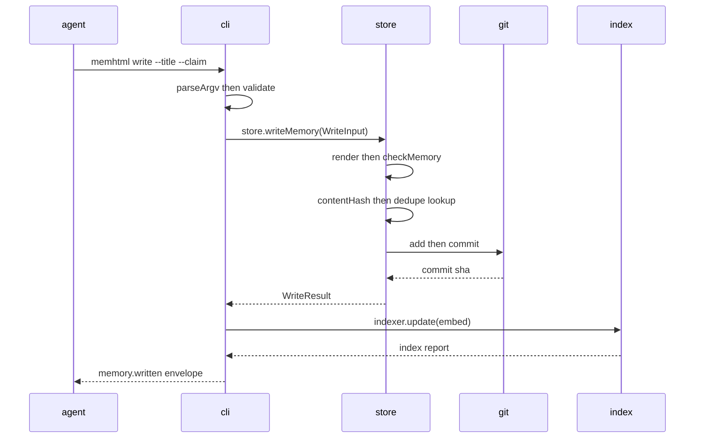
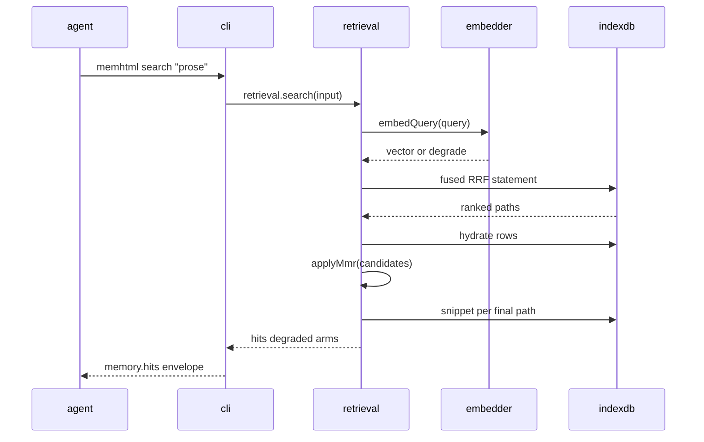
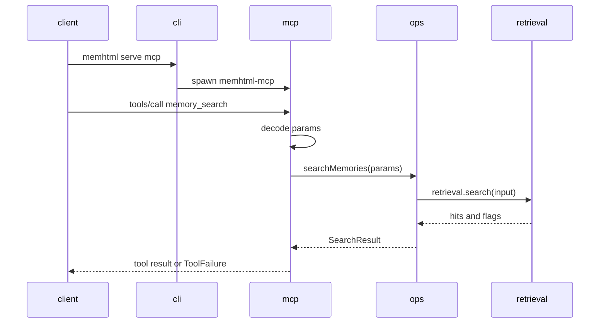

# memhtml-public · Data flow

This repository is the software that manages a separate memory tree, the `memhtml root`, located by `$MEMHTML_ROOT` (`AGENTS.md:435`). No memory lives in this repository. Every flow below acts on whichever root the environment points the process at, and the same binary serves many roots (`apps/cli/src/api-layer.ts:112`).

Each flow starts at an external event. Every process here is either a CLI invocation of the `memhtml` binary or a tool call arriving on the MCP server's stdio transport (`apps/cli/src/bin.ts:5`, `apps/mcp/src/bin.ts:15`). The repository has no HTTP server and no queue consumer.

The three flows below are a write, a read, and the same read reached through the MCP server. Participant labels follow `architecture/module-map.md`: `cli`, `store`, `index`, `mcp`.

## Flow 1: Write one memory

An agent runs `memhtml write --title … --claim … --type semantic`. The process renders the file, stops with an error if the format check finds a violation, checks for a duplicate before writing to disk, commits, and then brings the index up to the new commit.

1. The binary calls `run(process.argv.slice(2))` and writes the returned envelope to stdout as the only thing on that stream `apps/cli/src/bin.ts:5`.
2. `run` parses argv into a command, positionals, and a map of repeatable flag arrays `apps/cli/src/run.ts:814`.
3. `validate` checks flag names, required arguments, the claim-or-markup exclusive rule, and every closed vocabulary, and a returned failure becomes exit 2 before any service is built `apps/cli/src/run.ts:826`.
4. `run` provides `layerApp(--repo)`, the one production composition, which resolves the root and opens `$MEMHTML_ROOT/.memhtml/index.db` `apps/cli/src/run.ts:1028`.
5. The `write` dispatch arm calls `ops.writeMemory` with the decoded flags `apps/cli/src/run.ts:203`.
6. `writeMemory` decodes the parameters into the store's `WriteInput` and calls `store.writeMemory` `apps/cli/src/operations.ts:292`.
7. The store renders the article, runs `checkMemory` and rejects the write on any violation, hashes the bytes, returns the existing path when the hash already exists, then writes the file, stages it with `git add`, and makes one commit `packages/store/src/store.ts:534`.
8. Back in the operation, a created file triggers `indexer.update({ embed: true })`, which diffs the new commit against the watermark, applies the projection writes, records the new watermark, and fills missing vectors `apps/cli/src/operations.ts:294`.

## Flow 2: Ranked retrieval

An agent runs `memhtml search "<prose>"`. The process embeds the query when a credential is available. It then folds four reciprocal-rank-fusion arms into one SQL statement, hydrates the fused pool, reorders it with MMR for diversity, and runs one more statement to fetch the winning snippet per path.

1. The `search` dispatch arm calls `ops.searchMemories` with the query, the limit, and the shared retrieval scope, then names the response type `memory.hits` `apps/cli/src/run.ts:268`.
2. `searchMemories` delegates to the retrieval service and records no access bump, so a ranked hit does not feed back into salience `apps/cli/src/operations.ts:927`.
3. `search` asks for the query vector first `packages/index/src/retrieval.ts:334`.
4. `queryVector` catches an embedder failure, logs it, and returns `undefined`, which becomes `degraded: true` on the response rather than an error `packages/index/src/retrieval.ts:193`.
5. `fuse` sanitizes the FTS match text, assembles the RRF statement over the arms that can fire, and runs one query for the fused paths `packages/index/src/retrieval.ts:232`.
6. `hydrate` reads the fused paths' rows, entity names, entity references, superseding edge, and first chunk vector in one statement `packages/index/src/retrieval.ts:266`.
7. `applyMmr` reorders the pool down to the caller's limit, using fused rank as the relevance term `packages/index/src/retrieval.ts:354`.
8. `snippets` runs over the final paths only, picking each file's chunk nearest the query vector, and the hits go back with `degraded`, `arms`, `entityScope`, and `scopeEmpty` `packages/index/src/retrieval.ts:360`.

## Flow 3: MCP tool call

An MCP client runs `memhtml serve mcp`, which spawns the `memhtml-mcp` server as a child process holding the client's own descriptors. A `tools/call` then reaches the same operation that the matching CLI command calls.

1. `run` handles `serve mcp` before building the app layer, so the supervisor does not open the database the child exists to serve `apps/cli/src/run.ts:869`.
2. `serveMcp` resolves the server entry point and spawns it with `stdio: "inherit"` and `MEMHTML_ROOT` set to the resolved root, so the client talks to the child directly `apps/cli/src/serve.ts:77`.
3. The child launches `layerServer()` over the Node stdio transport for the process's lifetime `apps/mcp/src/bin.ts:15`.
4. `layerServer` merges the 15-tool toolkit and the 3 resources over `layerApp(repoOverride)`, the CLI's own composition, and routes every log to stderr so stdout stays the NDJSON-RPC stream `apps/mcp/src/server.ts:52`.
5. A `tools/call` lands on the handler table that `MemhtmlToolkit.toLayer` type-checks against the toolkit's own parameter and success schemas `apps/mcp/src/handlers.ts:309`.
6. The `memory_search` handler renames the snake_case wire parameters and calls the same `searchMemories` the CLI arm calls `apps/mcp/src/handlers.ts:527`.
7. Retrieval runs the flow-2 chain: query vector, fused RRF statement, hydrate, MMR, snippets `packages/index/src/retrieval.ts:331`.
8. The handler renames the result fields back to snake_case for the wire. Any typed failure passes through `toToolFailure`, which carries the stable code and its suggestions through the single prose error channel MCP offers `apps/mcp/src/handlers.ts:537`.

## See also

- [memhtml-public · Sequences](../diagrams/behavioral/sequences.md): 9 shared source citations
- [memhtml-public · Processes](../behavior/processes.md): 6 shared source citations
