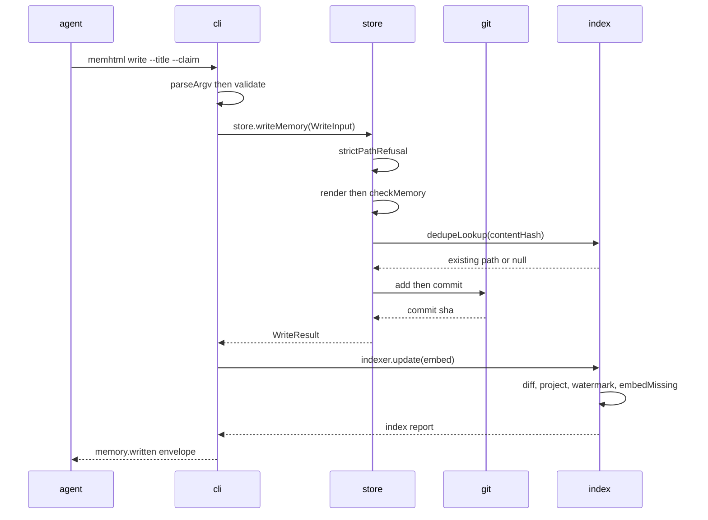
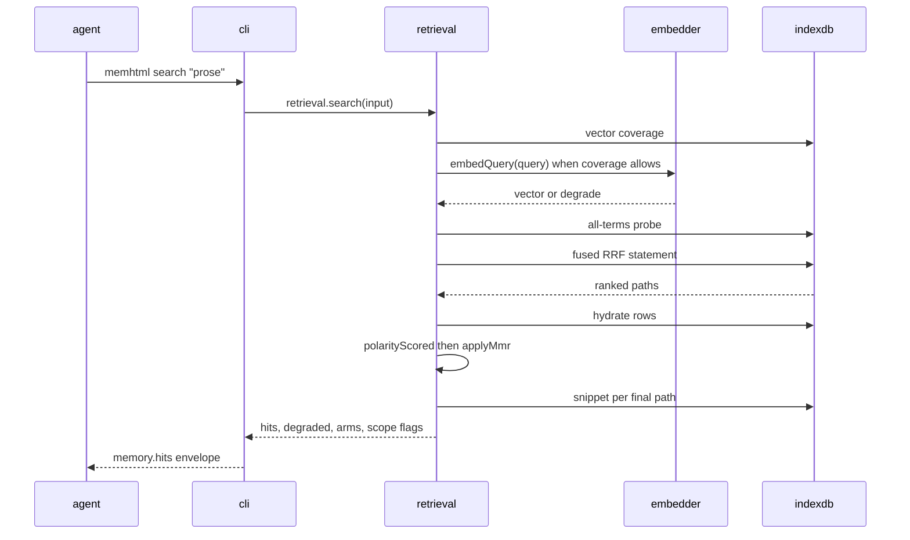
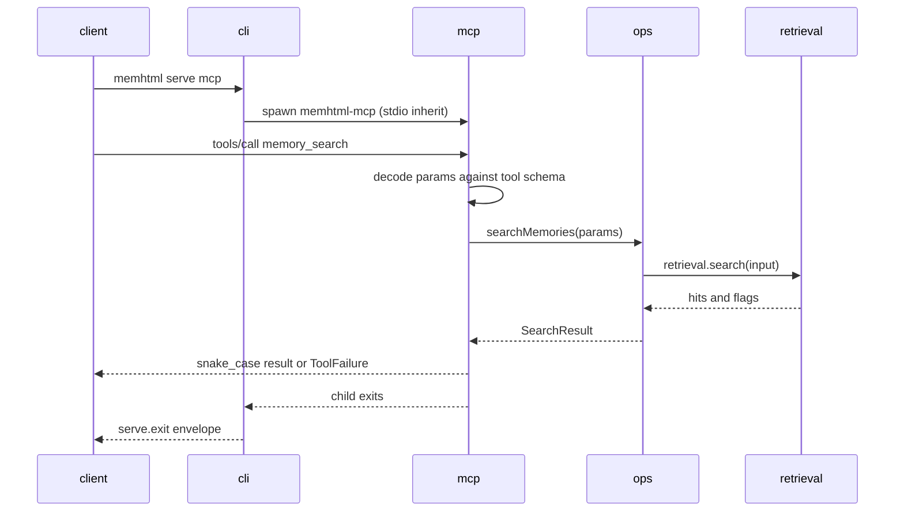

# memhtml-public · Data flow

Describes the source at 0.15.1 (main 4d03a6c, 2026-09-28). Citations are `path:line` into that tree.

This repository is the software that manages a separate memory tree, the `memhtml root`, located by `$MEMHTML_ROOT` (`AGENTS.md:575`). No memory lives in this repository.

Every flow below acts on whichever root the process resolves. `--repo` wins over `MEMHTML_ROOT`, so the same binary serves many roots without the caller changing its environment (`apps/cli/src/api-layer.ts:104-116`).

Each flow starts at an external event. Every process here is either a CLI invocation of the `memhtml` binary or a tool call arriving on the MCP server's stdio transport (`apps/cli/src/bin.ts:5`, `apps/mcp/src/bin.ts:15`). The repository has no HTTP server and no queue consumer.

The three flows below are a write, a ranked read, and the same read reached through the MCP server. Participant labels follow `architecture/module-map.md`: `cli`, `store`, `index`, `mcp`.

## Flow 1: Write one memory

An agent runs `memhtml write --title … --claim … --type semantic`. The process validates the line, renders the file, and stops with an error if the format check finds a violation. It then checks for a duplicate before anything touches disk, commits, and brings the index up to the new commit.

1. The binary calls `run(process.argv.slice(2))`, and the returned envelope is the only thing written to stdout `apps/cli/src/bin.ts:5`.
2. The process exits from the write's callback rather than straight after the write, so a slow pipe reader still receives the whole envelope (issue #117) `apps/cli/src/bin.ts:7-22`.
3. `run` parses argv into a command, positionals, and a map of repeatable flag arrays `apps/cli/src/run.ts:1430`. `parseArgv` matches compound command names, reads `-h` as `--help`, and turns `--no-<flag>` into `false` `apps/cli/src/run.ts:148-225`.
4. Help and the bare manifest answer before validation, so neither needs a repo `apps/cli/src/run.ts:1440-1444`.
5. `validate` returns a failure that becomes exit 2 before any service is built `apps/cli/src/run.ts:1446-1447`.
6. The checks run in order: flags against this command's own spec, stray boolean values, surplus and missing arguments, required flags, the claim-or-markup exclusive rule, and every closed vocabulary `apps/cli/src/run.ts:1176-1271`. The claim-or-markup rule lives in `claimOrArticle` `apps/cli/src/run.ts:924-949`.
7. When `MEMHTML_REFUSE_ENV_ROOT` is set and no `--repo` was given, `envRootRefusal` answers `ERR_REPO_REQUIRED` at exit 2, so nothing is opened `apps/cli/src/run.ts:1665-1666`, `apps/cli/src/run.ts:1077-1090`.
8. `run` provides `layerApp(--repo)`, the one production composition, then the tracer, and routes every log to stderr `apps/cli/src/run.ts:1797-1823`, `apps/cli/src/api-layer.ts:608-632`.
9. Building the layer opens `$MEMHTML_ROOT/.memhtml/index.db` with `state.db` attached on the same connection `apps/cli/src/api-layer.ts:126-136`.
10. The `write` dispatch arm calls `ops.writeMemory` with the decoded flags and names the response type `memory.written` `apps/cli/src/run.ts:348-369`.
11. `writeMemory` decodes the parameters into the store's `WriteInput` and calls `store.writeMemory` `apps/cli/src/operations.ts:335-344`.
12. `toWriteInput` decodes the type through the operator vocabulary, which admits `arc` on the CLI write doors while the MCP schemas refuse it (issue #88). It also decodes a task's status and due date before any file is rendered `apps/cli/src/operations.ts:293-327`.
13. The store takes its one in-process write permit, so two concurrent writers take turns instead of racing for a path or for `.git/index` `packages/store/src/store.ts:1405`, `packages/store/src/store.ts:1382-1399`.
14. The first gate is `strictPathRefusal`, which refuses an unusable explicit path when the caller asked for strict placement `packages/store/src/store.ts:692-709`.
15. The format check follows. `renderChecked` renders the article and rejects it with `InvalidMemory` on any `checkMemory` violation, before the file is written, staged, or committed `packages/store/src/store.ts:661-668`.
16. The duplicate check follows the format check. The store hashes the rendered bytes and asks the injected `dedupeLookup`, and an existing active path is returned with `deduped: true` and no commit `packages/store/src/store.ts:713-729`.
17. The lookup is the index recorder's `activePathForHash`, one query for a live, non-archived, non-task row with that content hash `apps/cli/src/api-layer.ts:203`, `packages/index/src/traces-persist.ts:196-203`.
18. The store picks a free path, then writes the file, stages it with `git add`, and makes one commit with provenance trailers, all under a journal that compensates a failure `packages/store/src/store.ts:731-758`.
19. Back in the operation, only a created file triggers `reindex`, because a dedupe changed nothing `apps/cli/src/operations.ts:341`.
20. `reindex` calls `indexer.update({ embed: true })` over the whole commit rather than a list of paths, because a rename is only expressible as a diff and the watermark is what makes freshness answerable `apps/cli/src/operations.ts:248-271`.
21. `update` falls through to a full reprojection when no watermark row exists, and refuses with `IndexStale` when a rebuild died before writing one `packages/index/src/indexer.ts:808-845`.
22. Otherwise `update` diffs the watermark against HEAD, adds uncommitted working-tree changes, and reads every changed blob in two subprocesses `packages/index/src/indexer.ts:854-887`.
23. It applies the projection writes, records the new watermark, and embeds the chunks this pass projected `packages/index/src/indexer.ts:994-1002`.
24. `embedMissing` returns 0 when no document embedder is bound. It embeds in slices, and a failed slice stops the pass while keeping every vector already written, so an embedder outage never fails the write `packages/index/src/indexer.ts:542-610`.
25. The operation records a `wrote` session link when the call carries a session id. A failed link is logged and never costs the caller the memory `apps/cli/src/operations.ts:342`, `apps/cli/src/operations.ts:201-218`.
26. The result becomes a `memory.written` envelope. A typed failure becomes a failure envelope through `failureFor` at exit 1 `apps/cli/src/run.ts:1797-1799`, `apps/cli/src/errors.ts:212-213`, `apps/cli/src/envelope.ts:188-189`.

```mermaid
sequenceDiagram
  participant agent
  participant cli
  participant store
  participant git
  participant index
  agent->>cli: memhtml write --title --claim
  cli->>cli: parseArgv then validate
  cli->>store: store.writeMemory(WriteInput)
  store->>store: strictPathRefusal
  store->>store: render then checkMemory
  store->>index: dedupeLookup(contentHash)
  index-->>store: existing path or null
  store->>git: add then commit
  git-->>store: commit sha
  store-->>cli: WriteResult
  cli->>index: indexer.update(embed)
  index->>index: diff, project, watermark, embedMissing
  index-->>cli: index report
  cli-->>agent: memory.written envelope
```

## Flow 2: Ranked retrieval

An agent runs `memhtml search "<prose>"`. The process reads vector coverage and embeds the query when coverage and a credential allow it. It then sanitizes the query, folds up to four reciprocal-rank-fusion arms into one SQL statement, hydrates the fused pool, demotes negation-flipped twins, and reorders the pool with MMR for diversity. One more statement fetches the winning snippet per final path.

1. The `search` dispatch arm calls `ops.searchMemories` with the query, the limit, and the shared retrieval scope, then names the response type `memory.hits` `apps/cli/src/run.ts:415-423`. The scope is one helper, so `search` and `recall` cannot diverge `apps/cli/src/run.ts:264-274`.
2. `searchMemories` delegates to the retrieval service and records no access bump, so a ranked hit does not feed back into salience `apps/cli/src/operations.ts:1176-1192`.
3. The retrieval service is built over the query embedder and the configured vector coverage floor `apps/cli/src/api-layer.ts:333-349`.
4. `search` defaults the limit to 10 and asks fusion for three times that many candidates, the pool MMR later chooses from `packages/index/src/retrieval.ts:43-49`, `packages/index/src/retrieval.ts:502-512`.
5. `gatedQueryVector` reads vector coverage first. Below the floor (default 0.95) the query is never embedded and the vector arm is dropped on purpose (issue #141) `packages/index/src/retrieval.ts:304-316`, `packages/index/src/vector-coverage.ts:44`.
6. `queryVector` returns `undefined` when no embedder is bound. It also catches an embedder failure, logs it, and returns `undefined`, which becomes `degraded: true` on the response rather than an error `packages/index/src/retrieval.ts:262-276`.
7. `fuse` never MATCHes the caller's prose. `ftsQueryForms` reduces the query to letter and digit runs, keeps a balanced double-quoted span as one phrase, and yields an all-terms form and an any-of form `packages/index/src/fts-query.ts:99-123`.
8. `fuse` binds the all-terms form when some file in scope holds every term, and the any-of form otherwise (issue #143). The probe is one `LIMIT 1` statement, skipped when the two forms are equal `packages/index/src/retrieval.ts:279-293`, `packages/index/src/retrieval.ts:350-354`.
9. `fuse` assembles the RRF statement over the arms that can fire and runs one query for the fused paths `packages/index/src/retrieval.ts:355-372`. The registry holds four arms, lexical, vector, recency, and salience, and an arm leaves the fold when it lacks a query vector, the state plane, or query terms `packages/index/src/retrieval-sql.ts:268-295`.
10. `hydrate` reads the fused paths' rows, entity names, entity references, superseding edge, and first chunk vector in one statement `packages/index/src/retrieval.ts:400-425`.
11. `polarityScored` gives each candidate `1 / fusedRank` and demotes a negation-flipped twin of a better-agreeing candidate `packages/index/src/retrieval.ts:526-534`, `packages/index/src/polarity.ts:78-82`.
12. `applyMmr` reorders the pool down to the caller's limit with lambda 0.5 `packages/index/src/retrieval.ts:535`, `packages/domain/src/mmr.ts:36-40`, `packages/domain/src/ranking.ts:11`.
13. `snippets` runs over the final paths only, picking each file's chunk nearest the query vector, or its opening chunk when there is none `packages/index/src/retrieval.ts:437-457`, `packages/index/src/retrieval.ts:541-544`.
14. When a named scope left nothing, `scopeEmpty` is true and the same scope is re-run over archived rows to report `archivedMatches` and `archived` (issue #130) `packages/index/src/retrieval.ts:545-554`, `packages/index/src/retrieval.ts:470-494`.
15. The hits go back with `degraded`, `vectorCoverage`, `arms`, `entityScope`, `scopeEmpty`, `archivedMatches`, and `archived` `packages/index/src/retrieval.ts:556-593`.

```mermaid
sequenceDiagram
  participant agent
  participant cli
  participant retrieval
  participant embedder
  participant indexdb
  agent->>cli: memhtml search "prose"
  cli->>retrieval: retrieval.search(input)
  retrieval->>indexdb: vector coverage
  retrieval->>embedder: embedQuery(query) when coverage allows
  embedder-->>retrieval: vector or degrade
  retrieval->>indexdb: all-terms probe
  retrieval->>indexdb: fused RRF statement
  indexdb-->>retrieval: ranked paths
  retrieval->>indexdb: hydrate rows
  retrieval->>retrieval: polarityScored then applyMmr
  retrieval->>indexdb: snippet per final path
  retrieval-->>cli: hits, degraded, arms, scope flags
  cli-->>agent: memory.hits envelope
```

## Flow 3: MCP tool call

An MCP client runs `memhtml serve mcp`, which spawns the `memhtml-mcp` server as a child process holding the client's own descriptors. A `tools/call` then reaches the same operation that the matching CLI command calls.

1. `run` handles `serve mcp` before building the app layer, so the supervisor does not open the database the child exists to serve `apps/cli/src/run.ts:1668-1699`.
2. The environment-root refusal still runs first, and for `serve mcp` an injected layer does not count as naming the root `apps/cli/src/run.ts:1050`, `apps/cli/src/run.ts:1665-1666`.
3. `serveMcp` resolves the server entry point from `MEMHTML_MCP_BIN` or the two shipped layouts `apps/cli/src/serve.ts:56-80`.
4. It spawns the entry point with `stdio: "inherit"` and `MEMHTML_ROOT` set to the resolved root, so the client talks to the child directly and a `--repo` override reaches it `apps/cli/src/serve.ts:82-90`.
5. Interrupting the supervisor kills the child, and the `serve.exit` envelope is written only after the child exits `apps/cli/src/serve.ts:95-110`, `apps/cli/src/run.ts:1690`.
6. The child launches `layerServer()` over the Node stdio transport for the process's lifetime `apps/mcp/src/bin.ts:15`.
7. `layerServer` merges the 15-tool toolkit and the 3 resources over `layerApp(repoOverride)`, the CLI's own composition. It pins protocol `v2025_06_18` and routes every log to stderr, so stdout stays the NDJSON-RPC stream `apps/mcp/src/server.ts:40-63`, `apps/mcp/src/tools.ts:1082-1098`, `apps/mcp/src/resources.ts:369`.
8. The call's arguments are decoded against the tool's own parameter schema, snake_case on the wire `apps/mcp/src/tools.ts:579-609`.
9. A `tools/call` lands on the handler table that `MemhtmlToolkit.toLayer` type-checks against the toolkit's own parameter and success schemas `apps/mcp/src/handlers.ts:324-328`.
10. The `memory_search` handler renames the wire parameters, decodes `facets` with the same parser the CLI uses, and calls the same `searchMemories` the CLI arm calls `apps/mcp/src/handlers.ts:563-578`.
11. Retrieval runs the flow 2 chain: coverage gate, query vector, fused RRF statement, hydrate, polarity, MMR, snippets `packages/index/src/retrieval.ts:502-594`.
12. The handler renames the result fields back to snake_case for the wire `apps/mcp/src/handlers.ts:579-602`.
13. Every handler's failures pass through `handled`, which maps them with `toToolFailure` `apps/mcp/src/handlers.ts:73-74`.
14. `toToolFailure` composes the stable code, the reason, and suggestions into the single prose error channel MCP offers. An already composed `ToolFailure` passes through unchanged `apps/mcp/src/failure.ts:149-189`.
15. The failure must be a `ToolFailure` that each tool declares, because `McpServer` rewrites an `AiError` or an undeclared failure to a generic internal-error sentence `apps/mcp/src/handlers.ts:60-71`, `apps/mcp/src/tools.ts:47-56`.

```mermaid
sequenceDiagram
  participant client
  participant cli
  participant mcp
  participant ops
  participant retrieval
  client->>cli: memhtml serve mcp
  cli->>mcp: spawn memhtml-mcp (stdio inherit)
  client->>mcp: tools/call memory_search
  mcp->>mcp: decode params against tool schema
  mcp->>ops: searchMemories(params)
  ops->>retrieval: retrieval.search(input)
  retrieval-->>ops: hits and flags
  ops-->>mcp: SearchResult
  mcp-->>client: snake_case result or ToolFailure
  mcp-->>cli: child exits
  cli-->>client: serve.exit envelope
```

## See also

Counts are the distinct existing non-docs source paths cited in inline backticks on both pages, measured against the tree at 4d03a6c.

- [memhtml-public · Processes](../behavior/processes.md): 19 shared source citations
- [memhtml-public · Sequences](../diagrams/behavioral/sequences.md): 18 shared source citations
- [memhtml-public · Module map](../architecture/module-map.md): 16 shared source citations
- [memhtml-public · Impact analysis](../insights/impact-analysis.md): 14 shared source citations
- [memhtml-public · Debugging guide](../insights/debugging-guide.md): 12 shared source citations
- [memhtml-public · Contract map](../insights/contract-map.md): 12 shared source citations
- [memhtml-public · Dependency graph](../diagrams/structural/dependency-graph.md): 10 shared source citations
- [memhtml-public · RPC tools](../reference/rpc-tools.md): 9 shared source citations
- [memhtml-public · Tech debt](../insights/tech-debt.md): 9 shared source citations
- [memhtml-public · Business logic](../insights/business-logic.md): 9 shared source citations
- [memhtml-public · System overview](../architecture/system-overview.md): 9 shared source citations
