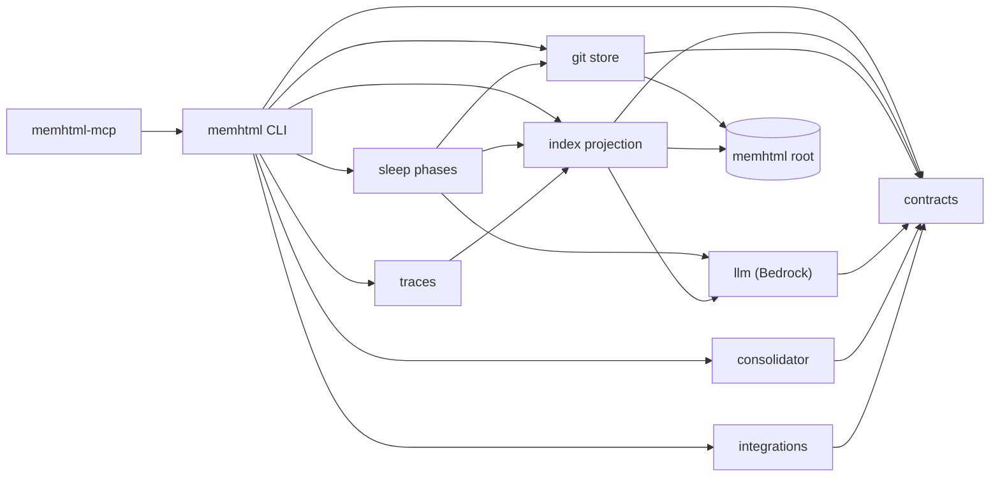

# memhtml-public · System overview

Describes the source at 0.15.1 (main 5c0f610, 2026-09-25). Citations are `path:line` into that tree. A package's file count is its `.ts` files under `src/`, and its LOC is the `wc -l` line count of those files summed, measured at that commit.

## What this repository is

This repository holds the software that manages an agent's long-term memory. It stores no memory of its own. The memory lives in a separate directory called the memhtml root, which is its own git repository. The environment variable `MEMHTML_ROOT` tells every command which root to act on, and it defaults to `~/memhtml` (`apps/cli/src/config.ts:62-67`, `apps/cli/src/config.ts:188-191`, `AGENTS.md:575`). One installed binary serves many roots.

Inside a root, one fact is one semantic HTML5 file, and the root's git tree is the system of record. `.memhtml/index.db` is a SQLite projection of that tree, so it can be deleted and rebuilt without loss (`packages/store/src/layout.ts:24-25`, `packages/index/src/indexer.ts:19`).

A second database, `.memhtml/state.db`, holds the access plane, which git cannot reproduce. It exports to a committed sidecar at `.memhtml/state/access.jsonl`, so a fresh clone plus `memhtml state import` plus `memhtml index rebuild` yields the whole system (`packages/store/src/layout.ts:27-31`, `packages/store/src/layout.ts:50-54`).

The primary caller is a coding agent. Two binaries are declared: `memhtml` (`apps/cli/package.json:21-23`) and `memhtml-mcp` (`apps/mcp/package.json:20-22`).

Every CLI call writes one JSON envelope carrying `apiVersion`, a `type` discriminator drawn from the append-only `RESPONSE_TYPES` list, and `data` (`apps/cli/src/envelope.ts:9-12`, `apps/cli/src/envelope.ts:62-66`). There are two exceptions: `memhtml help` on a terminal writes Markdown, and a successful `memhtml hook` writes the host's hook protocol (`apps/cli/src/envelope.ts:49-52`).

Failures carry a stable `code` from the append-only `ERROR_CODES` list plus `suggestions`, so an agent branches on the code instead of the prose (`apps/cli/src/envelope.ts:68-80`). Exit codes are fixed at 0 for success, 2 for usage, and 1 for runtime (`apps/cli/src/envelope.ts:120-122`).

`memhtml manifest` returns the whole command surface without building the app layer, so it answers on a machine with no root, no database, and no credentials (`apps/cli/src/run.ts:1449-1464`). `--dense` drops nulls and indentation to save context tokens (`apps/cli/src/envelope.ts:173-189`).

`AGENTS.md` is generated from the same `COMMANDS` array that drives argument parsing, so the doc stays in step with the binary (`apps/cli/src/agents-doc.ts:11-16`).

The MCP server exposes 15 tools and 3 resources over stdio (`apps/mcp/src/tools.ts:1082-1098`, `apps/mcp/src/resources.ts:14`, `apps/mcp/src/server.ts:44`). Sleep is deliberately absent from it, because a sleep run rewrites the corpus onto a branch a human is expected to read (`apps/mcp/src/tools.ts:30-34`).

## How the pieces fit

The repository is a pnpm workspace over `apps/*`, `packages/*`, and `tests-integration` (`pnpm-workspace.yaml:1-4`). That is eleven libraries, four apps, and one integration harness. TypeScript project references keep the layering strict (`apps/cli/tsconfig.json:10-47`).

`@memhtml/contracts` sits at the bottom with schemas, closed vocabularies, error types, and path algebra. It depends on nothing but `effect` (`packages/contracts/package.json:56-58`, 7 files, 798 LOC).

`@memhtml/telemetry` also depends only on `effect`. It is the opt-in OTLP trace exporter, switched on by `OTEL_EXPORTER_OTLP_ENDPOINT` (`packages/telemetry/src/index.ts:4-5`, 1 file, 129 LOC).

`@memhtml/domain` adds pure ranking and retention math on top of the contracts (`packages/domain/package.json:5`, 12 files, 1796 LOC). `@memhtml/html` parses, serializes, and hashes the memory file format (`packages/html/package.json:5`, 13 files, 2695 LOC).

`@memhtml/store` owns the git-backed file store and turns each operation that changes the corpus into one commit (`packages/store/src/store.ts:39-45`, 6 files, 2825 LOC). It also owns the root's on-disk shape. Creating a root is always an explicit step, so a typo in `MEMHTML_ROOT` errors instead of scaffolding a second empty root (`packages/store/src/layout.ts:12-19`).

`@memhtml/llm` reaches Bedrock for embeddings and structured output (`packages/llm/package.json:5`, 10 files, 1891 LOC).

`@memhtml/index` reads the tree through a git adapter and derives the projection (`packages/index/src/git-adapter.ts:5-9`, 18 files, 5150 LOC). It uses the built-in `node:sqlite` driver (`packages/index/src/database.ts:4`) over 12 committed migrations in `packages/index/migrations/`, plus 2 for the state plane in `packages/index/state-migrations/`. Retrieval is four weighted ranking arms fused by reciprocal rank fusion inside one SQL statement (`packages/index/src/retrieval-sql.ts:268`, `packages/index/src/retrieval-sql.ts:307-318`).

`@memhtml/traces` is a streaming parser and indexer for Claude Code JSONL transcripts, read from `~/.claude` by default (`packages/traces/package.json:5`, `apps/cli/src/config.ts:193-201`, 6 files, 1158 LOC).

`@memhtml/sleep` is the largest library at 38 files and 15208 LOC. Its `SLEEP_PHASES` list names 17 phases, from `preflight` through dedup, entity resolution, arc synthesis, and retention triage to `report`, and `PHASE_BODIES` gives each one a body (`packages/sleep/src/contract.ts:43-61`, `packages/sleep/src/phases/index.ts:29-47`).

Sleep does not depend on the consolidator. It declares the consolidator port it consumes, and the CLI supplies the implementation (`packages/sleep/src/consolidator.ts:8-11`, `packages/sleep/package.json:36-44`, `apps/cli/src/api-layer.ts:529`).

`@memhtml/integrations` wires a coding agent (Claude Code, Codex, Cursor, or OpenCode) to a memhtml store with an MCP entry, hooks, an instruction block, a skill, and a receipt (`packages/integrations/package.json:5`, `packages/integrations/src/types.ts:10`, 27 files, 4163 LOC).

`@memhtml/eval` owns the fixture corpus generator, the refusable retrieval discrimination gate, and the write-path discrimination arm (`packages/eval/package.json:5`, 14 files, 4568 LOC). It is the one library that depends on the consolidator app (`packages/eval/package.json:34`).

`@memhtml/consolidator` in `apps/consolidator` distills candidate memories from transcripts. A run is one AI SDK `generateText` tool loop over three bounded read-only tools, inside the calling process (`apps/consolidator/src/client.ts:39-41`, `apps/consolidator/src/turn.ts:20-24`, 10 files, 2875 LOC). The app also holds the read-only `just-bash` mount that `memhtml exec` runs agent scripts in (`apps/consolidator/src/mount.ts:10-11`, `apps/cli/src/exec.ts:12`, `apps/cli/src/exec.ts:27-29`).

`@memhtml/cli` is the one composition root. It depends on every library plus `@memhtml/consolidator`, and it holds the layer graph (`apps/cli/package.json:38-54`, `apps/cli/src/index.ts:1-7`, 22 files, 11493 LOC).

`@memhtml/mcp` depends on the CLI and reuses its `layerApp` and operations instead of composing its own (`apps/mcp/package.json:44`, `apps/mcp/src/server.ts:1`, 7 files, 2734 LOC).

`@memhtml/docs` in `apps/docs` is the Astro and Starlight documentation site, and it depends on the CLI (`apps/docs/package.json:20-25`). It is not measured here.

`tests-integration` holds the cross-package integration contracts (`tests-integration/package.json:6`). It has no `src/`, and its `tests/` directory holds 22 `.ts` files and 7235 LOC.

## Module map

The diagram shows the main dependency edges only.

## Stack

| Layer              | Technology                                                                         | Source                                                              |
| ------------------ | ---------------------------------------------------------------------------------- | ------------------------------------------------------------------- |
| Language           | TypeScript 7.0.2 (`apps/docs` pins 6.0.3)                                          | `package.json:39`, `apps/docs/package.json:51`                      |
| Runtime            | Node.js >= 24, pinned to 24                                                        | `package.json:7-9`, `mise.toml:39`                                  |
| Framework          | Effect 4.0.0-rc.117, one catalog set of four packages                              | `pnpm-workspace.yaml:92-96`                                         |
| Storage            | `node:sqlite` `DatabaseSync` over 12 SQL migrations plus 2 state-plane migrations  | `packages/index/src/database.ts:4`                                  |
| Storage            | git as the system of record for the root                                           | `packages/index/src/indexer.ts:19`                                  |
| HTML parsing       | parse5 8.0.1                                                                       | `packages/html/package.json:36`                                     |
| Embeddings         | AWS Bedrock SDK 3.1137.0, `cohere.embed-v4:0` at 1024 dims                         | `packages/llm/package.json:33`, `packages/llm/src/constants.ts:7-8` |
| Consolidator agent | ai 7.0.109, `@ai-sdk/amazon-bedrock` 5.0.90, `@ai-sdk/anthropic` 4.0.59, zod 4.6.5 | `apps/consolidator/package.json:35-41`                              |
| Script sandbox     | just-bash 3.4.2, for `memhtml exec`                                                | `apps/consolidator/package.json:40`, `apps/cli/package.json:52`     |
| Tracing            | Effect's own `OtlpTracer`, opt-in                                                  | `packages/telemetry/src/index.ts:14-18`                             |
| Build tooling      | turbo 2.11.2, pnpm 11.21.0, biome 2.5.14, tsdown 0.23.0                            | `package.json:6`, `package.json:34-38`                              |
| Test tooling       | vitest 5.0.1, `@effect/vitest`, fast-check 4.10.2                                  | `apps/cli/package.json:57-60`, `pnpm-workspace.yaml:96-97`          |
| Docs site          | astro ^7.3.3, `@astrojs/starlight` ^0.42.2                                         | `apps/docs/package.json:20`, `apps/docs/package.json:25`            |

## See also

Counts are the distinct existing non-docs source paths cited in inline backticks on both pages, measured against the tree at 5c0f610.

- [memhtml-public · Dependency graph](../diagrams/structural/dependency-graph.md): 27 shared source citations
- [memhtml-public · Module map](../architecture/module-map.md): 22 shared source citations
- [memhtml-public · Impact analysis](../insights/impact-analysis.md): 14 shared source citations
- [memhtml-public · Contract map](../insights/contract-map.md): 14 shared source citations
- [memhtml-public · Debugging guide](../insights/debugging-guide.md): 13 shared source citations
- [memhtml-public · Business logic](../insights/business-logic.md): 10 shared source citations
- [memhtml-public · Tech debt](../insights/tech-debt.md): 9 shared source citations
- [memhtml-public · CLI](../reference/cli.md): 8 shared source citations
