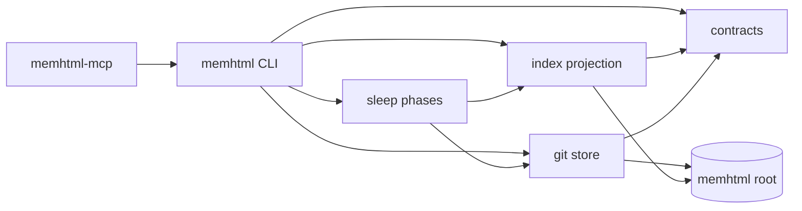

# memhtml-public · System overview

## What this repository is

This repository holds the software that manages an agent's long-term memory. It stores no memory of
its own. The memory lives in a separate directory called the memhtml root, which is its own git
repository, and the environment variable `MEMHTML_ROOT` tells every command which root to act on
(`apps/cli/src/config.ts:28`, default `~/memhtml` per `AGENTS.md:435`). One installed binary serves
many roots.

Inside a root, one fact is one semantic HTML5 file, and the root's git tree is the system of record.
`.memhtml/index.db` is a SQLite projection of that tree which can be deleted and rebuilt without loss
(`packages/store/src/layout.ts:22-24`, `packages/index/src/indexer.ts:18`). A second database,
`.memhtml/state.db`, holds the access plane that git cannot reproduce, so it exports to a committed
sidecar at `.memhtml/state/access.jsonl` (`packages/store/src/layout.ts:26-30`).

The primary caller is a coding agent. Two binaries are declared:
`memhtml` (`apps/cli/package.json:7-9`) and `memhtml-mcp` (`apps/mcp/package.json:7-9`). Every CLI
call writes exactly one JSON envelope carrying `apiVersion`, a `type` discriminator drawn from a
32-entry append-only list, and `data` (`apps/cli/src/envelope.ts:12-45`). Failures carry a stable
`code` from a 15-entry append-only list plus `suggestions`, so an agent branches on the code instead
of the prose (`apps/cli/src/envelope.ts:67-83`). Exit codes are fixed at 0 for success, 2 for usage,
1 for runtime (`apps/cli/src/envelope.ts:87-90`). `memhtml manifest` returns the whole command surface
before any root or database exists (`apps/cli/src/run.ts:823-843`), and `--dense` drops nulls and
indentation to save context tokens (`apps/cli/src/envelope.ts:140-157`). `AGENTS.md` is generated
from the same `COMMANDS` array that drives argument parsing, so the doc stays in step with the binary
(`apps/cli/src/agents-doc.ts:11-24`). The MCP server exposes 14 tools and 2 resources over stdio
(`apps/mcp/src/tools.ts:18`, `apps/mcp/src/resources.ts:10`).

## How the pieces fit

The repository is a pnpm workspace over `apps/*`, `packages/*`, and `tests-integration`
(`pnpm-workspace.yaml:1-4`), and TypeScript project references keep the layering strict.

`@memhtml/contracts` sits at the bottom with schemas, closed vocabularies, error types, and path
algebra, and it depends on nothing but `effect` (`packages/contracts/package.json:39-41`, 6 files, 624
LOC). `@memhtml/domain` adds pure ranking and retention math on top of it (11 files, 1397 LOC).
`@memhtml/html` parses, serializes, and hashes the memory file format (13 files, 2552 LOC).

`@memhtml/store` owns the git-backed file store and turns each operation into one commit
(`packages/store/src/store.ts:1-25`, 6 files, 2336 LOC). It also owns the root's on-disk shape.
Creating a root is always an explicit step, so a typo in `MEMHTML_ROOT` errors instead of scaffolding
a second empty root (`packages/store/src/layout.ts:12-19`).

`@memhtml/index` reads the tree through a git adapter and derives the projection
(`packages/index/src/git-adapter.ts:5-9`, 16 files, 3936 LOC). It uses the built-in `node:sqlite`
driver (`packages/index/src/database.ts:4`) over 10 committed migrations in
`packages/index/migrations/`, and it assembles retrieval as four weighted ranking arms fused by
reciprocal rank fusion inside one statement (`packages/index/src/retrieval-sql.ts:78-288`).

`@memhtml/sleep` is the largest library at 31 files and 6011 LOC. Its `PHASE_BODIES` registry names
15 nightly curation phases, from dedup and entity resolution through arc synthesis and retention
triage (`packages/sleep/src/phases/index.ts:27-43`). `@memhtml/traces` reads Claude Code transcripts,
`@memhtml/llm` reaches Bedrock, and `@memhtml/eval` owns the refusable discrimination gate.

`@memhtml/cli` is the one composition root: it depends on every library plus `@memhtml/consolidator`
(`apps/cli/package.json:24-37`), and `@memhtml/mcp` depends on the CLI and reuses its operations
(`apps/mcp/package.json:28-30`).

## Module map

## Stack

| Layer | Technology | Source |
|---|---|---|
| Language | TypeScript 7.0.2 | `package.json:28` |
| Runtime | Node.js >= 24, pinned to 24 | `package.json:6-8`, `mise.toml:39` |
| Framework | Effect 4.0.0-rc.109, one catalog pin | `pnpm-workspace.yaml:84-86` |
| Storage | `node:sqlite` `DatabaseSync` over 10 SQL migrations | `packages/index/src/database.ts:4` |
| Storage | git as the system of record for the root | `packages/store/src/layout.ts:22-24` |
| HTML parsing | parse5 8.0.1 | `packages/html/package.json:36` |
| Embeddings | AWS Bedrock SDK 3.1111.0, `cohere.embed-v4:0` at 1024 dims | `packages/llm/package.json:33`, `packages/llm/src/constants.ts:7-8` |
| Agent sandbox | eve 0.38.3, just-bash 3.3.0, ai 7.0.66 | `apps/consolidator/package.json:38-43` |
| Build tooling | turbo 2.10.10, pnpm 11.21.0, biome 2.5.8 | `package.json:6`, `package.json:30-35` |
| Test tooling | vitest 4.1.10, `@effect/vitest`, fast-check 4.9.0 | `apps/cli/package.json:55-58`, `pnpm-workspace.yaml:87` |

## See also

- [memhtml-public · Contract map](../insights/contract-map.md): 6 shared source citations
- [memhtml-public · Dependency graph](../diagrams/structural/dependency-graph.md): 5 shared source citations
- [memhtml-public · Module map](../architecture/module-map.md): 4 shared source citations
- [memhtml-public · Impact analysis](../insights/impact-analysis.md): 4 shared source citations
- [memhtml-public · CLI](../reference/cli.md): 3 shared source citations
