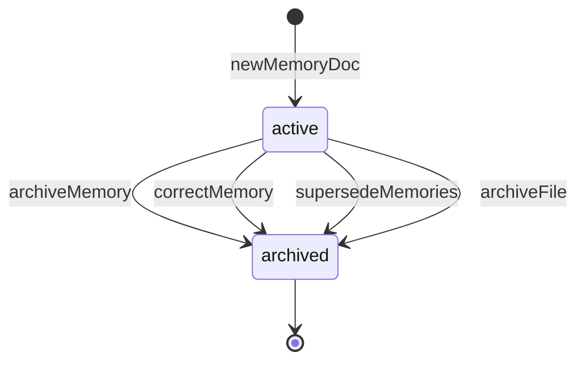
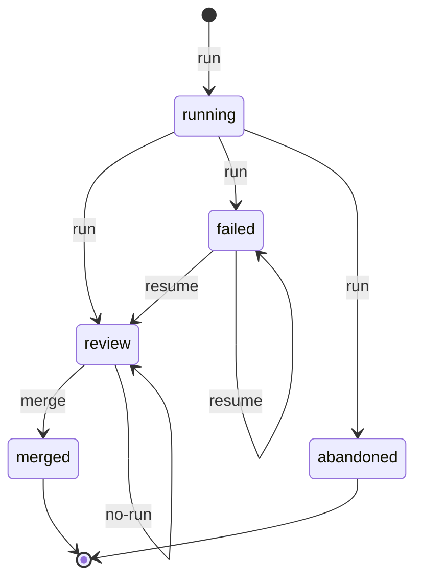
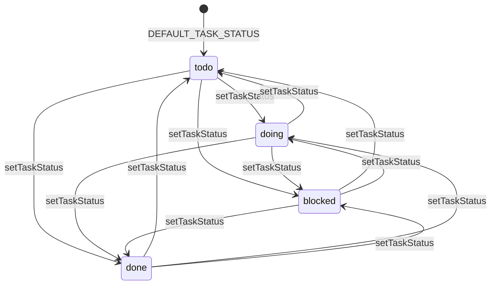

# memhtml-public · State machines

Three state machines drive the durable state an agent can observe. Two of them live on memory files in the `memhtml root`, the directory `$MEMHTML_ROOT` points at, and are stamped as `<meta>` values in the file's own HTML. The third lives in `.memhtml/index.db` inside that root and tracks one sleep run.

Every state name and transition label below appears verbatim in the cited source. Where a state has no outgoing transition in source, the diagram shows it reaching `[*]` and the surrounding prose says so.

## MemoryStatus

Two states, one direction. `MemoryStatus` is the axis every archive, correction, and publish path switches on, and its transitions are `git mv` operations rather than field writes: the archive path itself records the state, so `git log --follow` reads through the move and `diff -M` reports it as a rename (`packages/contracts/src/types.ts:58-70`).

An agent never chooses `active`. `newMemoryDoc` hardcodes it on every fresh memory document (`packages/html/src/template.ts:147-155`), and that function is the whole write path: `renderTemplate` calls it (`packages/html/src/template.ts:203-204`), and the store's `renderChecked` reaches it through `renderFor` (`packages/store/src/store.ts:502`, `packages/store/src/store.ts:521-528`).

Four call sites move a file to `archived`, and each stamps `["memhtml-status", "archived"]` alongside `memhtml-updated` and `memhtml-archived` in the same commit as the move. The `archiveMemory` transition is what an agent reaches through the `memory_archive` MCP tool (`apps/mcp/src/tools.ts:615`) and the `memhtml archive` command (`apps/cli/src/commands.ts:344-350`). The other three are system-driven: `correctMemory` archives the memory a correction supersedes (`packages/store/src/store.ts:874-880`), `supersedeMemories` archives the loser of each consolidation pair (`packages/store/src/store.ts:945-951`), and the sleep cycle's `archiveFile` does the same from inside a phase (`packages/sleep/src/edits.ts:155-181`).

`archived` is terminal. No source file writes `"active"` onto an existing memory: the only writes of that literal are the creation default (`packages/html/src/template.ts:154`), the parse-side validator that rejects any third value (`packages/html/src/parse.ts:93-106`), and an eval fixture (`packages/eval/src/fixture.ts:59`). An archived memory is still readable at its archive path, because `readMemory` resolves any path in the tree without consulting status (`packages/store/src/store.ts:409-415`), so terminal here means the status never changes back, not that the file becomes unreachable.

Defined at: `packages/contracts/src/types.ts:69`

## SleepRunStatus

Five states, tracking one nightly curation run from launch through merge. The vocabulary is closed twice over: once as the inline union on `recordRun` (`packages/sleep/src/sql.ts:730`) and once as a SQL `CHECK` constraint on `sleep_runs.status` (`packages/index/migrations/0006_sleep.sql:12`).

This row is reporting, not the system of record. The commit trailers on the run's own branch are what `memhtml sleep resume` reads back to decide which phases already ran (`packages/index/migrations/0006_sleep.sql:1-4`, `packages/sleep/src/run.ts:138-145`). A run's real progress is recoverable from git history with the row deleted.

The `run` function writes `running` before any phase executes (`packages/sleep/src/run.ts:99-108`), then picks the end state from two booleans: `dryRun ? "abandoned" : anyFailed ? "failed" : "review"` (`packages/sleep/src/run.ts:121`). A dry run reaches `abandoned` because it creates no branch and commits nothing (`packages/sleep/src/run.ts:95-97`). A run with at least one failed phase reaches `failed` and still keeps every commit the successful phases made, which is the isolation posture the whole package is built around (`packages/sleep/src/contract.ts:44-56`).

`resume` is how a `failed` run returns to `review`. It re-executes only the phases with no `Memhtml-Phase` trailer on the branch and rewrites the row with the same two-way choice, `failed` or `review` (`packages/sleep/src/run.ts:146-221`).

`merge` fast-forwards the target branch and writes `merged` (`packages/sleep/src/review.ts:286-299`). It refuses in three cases and writes nothing on any of them, so a refused run stays in `review` and the operator can retry. The three refusal labels come verbatim from `MergeReport.refusal` (`packages/sleep/src/contract.ts:169`): `no-run` when no row resolves (`packages/sleep/src/review.ts:232-240`), `main-advanced` when the target branch moved past the run's `base_sha` or the fast-forward itself fails (`packages/sleep/src/review.ts:248-259`, `packages/sleep/src/review.ts:276-284`), and `gate-failed` when the caller's `preMergeGate` refuses (`packages/sleep/src/review.ts:261-273`).

`abandoned` has no outgoing transition in source, and neither does `merged`. Nothing reads a run's status to gate a transition: `merge` keys on `base_sha` against the target branch head, never on the status value.

Defined at: `packages/sleep/src/sql.ts:730`

## TaskStatus

Four states, fully connected. `TaskStatus` is a second axis carried in `memhtml-task-status`, separate from `MemoryStatus`, which stays `active | archived` for every memory type including `task` (`packages/contracts/src/types.ts:72-85`).

A task enters at `todo`. `DEFAULT_TASK_STATUS` is `"todo"` (`packages/html/src/template.ts:73`), and `newMemoryDoc` applies it only when the memory type is `task`, leaving the meta absent on every other type (`packages/html/src/template.ts:173-174`).

`setTaskStatus` is the single transition function (`apps/cli/src/operations.ts:1319-1394`), reached by an agent through the `memhtml task status` command (`apps/cli/src/commands.ts:473-488`). It applies no from-state guard. The target status is narrowed against the closed vocabulary by `decodeTaskStatus` (`apps/cli/src/operations.ts:115-122`), and the only two rejections are a non-task memory type (`apps/cli/src/operations.ts:1329-1335`) and a no-op where the file already carries the requested status, which writes nothing and commits nothing (`apps/cli/src/operations.ts:1342-1350`). So every ordered pair of distinct states is a legal transition, all through the same event.

`done` is not a resting state in this vocabulary. Reaching it drives the other machine: `setTaskStatus` branches on `status !== "done"` and otherwise calls `store.archiveMemory` (`apps/cli/src/operations.ts:1363`, `apps/cli/src/operations.ts:1384`), so finishing a task stamps `done` and moves the file under `archive/<YYYY>/` in one commit. The design comment names the reason: a fifth `memhtml-status` value would silently change the meaning of every archive, correction, and publish path that switches on `active | archived` (`apps/cli/src/operations.ts:1309-1313`, `packages/contracts/src/types.ts:76-81`).

The diagram draws no `--> [*]` because source declares no terminal on this axis. `setTaskStatus` reads the file through `store.readMemory`, which resolves any path in the tree (`packages/store/src/store.ts:409-415`, `apps/cli/src/operations.ts:1328`), so a `done` task at its archive path can be moved back to `todo`, `doing`, or `blocked`. That reverse move restamps `memhtml-task-status` without moving the file back out of `archive/`, so the two axes disagree afterward. An agent reading the working set with `memhtml task list` will not see the row, because that query filters `f.archived = 0` unless `--include-archived` is passed (`apps/cli/src/operations.ts:1451`).

Defined at: `packages/contracts/src/types.ts:84`

## See also

- [memhtml-public · Processes](../behavior/processes.md): 7 shared source citations
- [memhtml-public · Sequences](../diagrams/behavioral/sequences.md): 4 shared source citations
- [memhtml-public · Business logic](../insights/business-logic.md): 2 shared source citations
