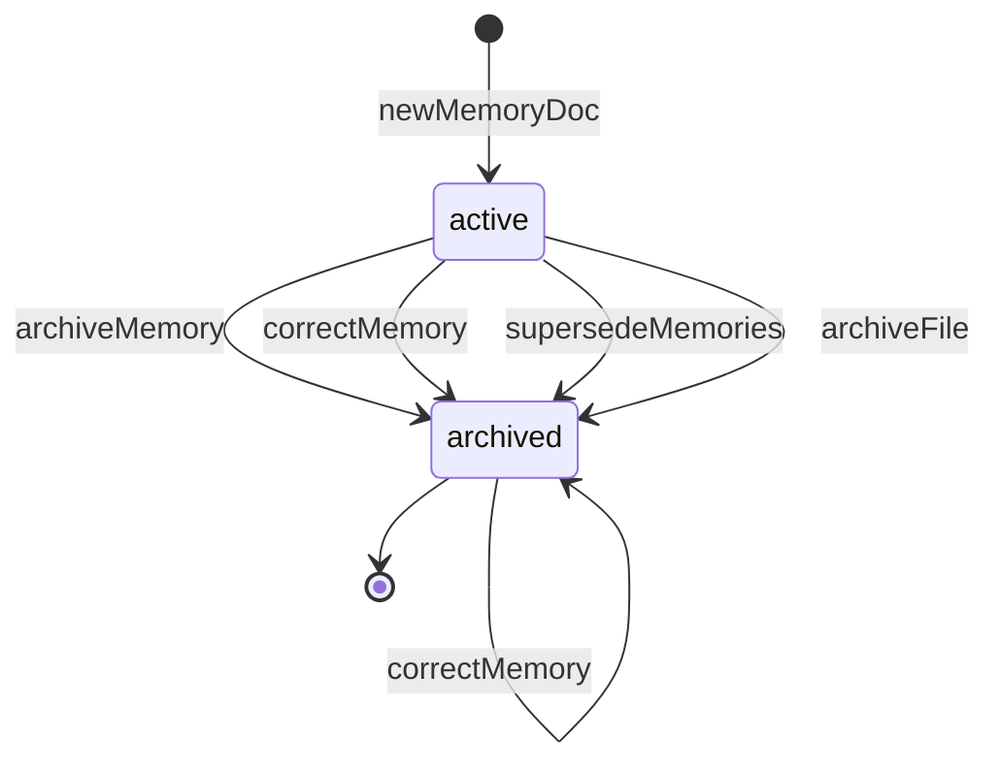
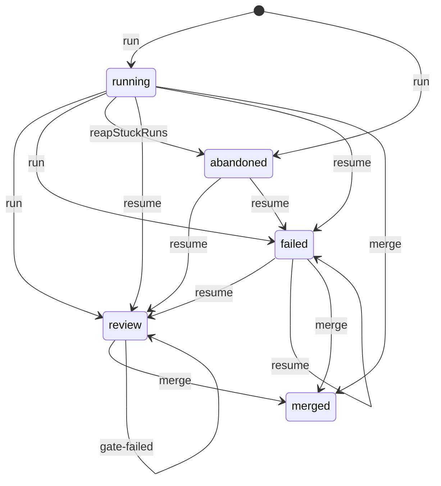
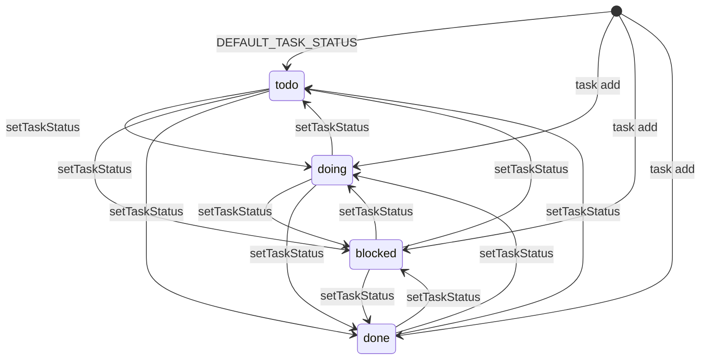
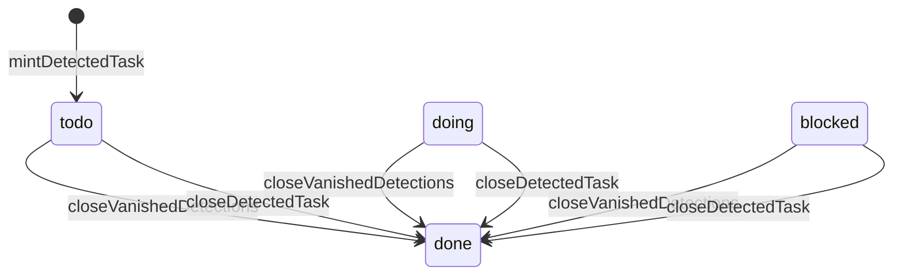
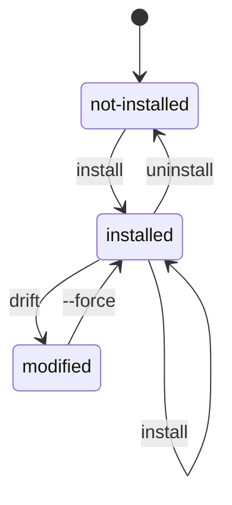

# memhtml-public · State machines

Describes the source at 0.15.1 (main 27d3895, 2026-10-02). Citations are `path:line` into that tree.

Four state machines drive the durable state an agent can observe. Two of them live on memory files in the `memhtml root`, the directory `$MEMHTML_ROOT` points at, and are stamped as `<meta>` values in the file's own HTML. The third lives in `.memhtml/index.db` inside that root and tracks one sleep run. The fourth is derived from a receipt file per host and scope, and tracks one host integration.

Every state name and transition label below appears verbatim in the cited source. A state drawn reaching `[*]` is one that source never moves to a different state. Where a diagram leaves out an edge that source allows, the prose beside it names the edge.

## MemoryStatus

`MemoryStatus` has two states and moves in one direction. Every archive, correction, and publish path switches on it. Its transitions are `git mv` operations rather than field writes, because the archive path itself records the state. That means `git log --follow` reads through the move, and `diff -M` reports the move as a rename (`packages/contracts/src/types.ts:58-70`).

The path is also what the index trusts. `projectFile` sets `archived` when the path's PARA bucket is `archive`, and it ignores `memhtml-status`, so a file whose head says `active` while it sits under `archive/` is indexed as archived (`packages/index/src/project.ts:133-151`).

An agent does not choose `active`. `newMemoryDoc` hardcodes it on every fresh memory document (`packages/html/src/template.ts:152-160`), and its one caller is `renderTemplate` (`packages/html/src/template.ts:204-210`). Six call sites render a new file through `renderTemplate`. One is the store's `renderFor`, which `renderChecked` runs for every write and every correction (`packages/store/src/store.ts:642`, `packages/store/src/store.ts:661-668`). The other five are in `@memhtml/sleep`: `arc-synthesis`, `compress`, `person-links`, `trace-consolidation`, and the detected-task mint `mintDetectedTask` (`packages/sleep/src/phases/arc-synthesis.ts:274`, `packages/sleep/src/phases/compress.ts:470`, `packages/sleep/src/phases/person-links.ts:63`, `packages/sleep/src/phases/trace-consolidation.ts:1175`, `packages/sleep/src/tasks.ts:455`).

Four functions move a file to `archived`. Each one stamps `memhtml-status` as `archived`, alongside `memhtml-updated` and `memhtml-archived`, on the moved file.

- `archiveMemory` is a plain eviction, and the store commits it (`packages/store/src/store.ts:1131-1157`). An agent reaches it through the `memory_archive` MCP tool and the `memhtml archive` command (`MemoryArchive`, `apps/mcp/src/tools.ts:911-924`, `archive`, `apps/cli/src/commands.ts:517-523`). `setTaskStatus` also calls `store.archiveMemory` for a task's `done` (`apps/cli/src/operations.ts:2236`).
- `correctMemory` archives the target a correction supersedes through `stageArchive`, in the same commit as the new file (`packages/store/src/store.ts:1099-1119`). An agent reaches it through `memory_correct` and `memhtml correct` (`apps/mcp/src/handlers.ts:649-661`, `apps/cli/src/run.ts:435-448`).
- `supersedeMemories` archives the loser of each consolidation pair, all pairs in one commit (`packages/store/src/store.ts:1159-1246`). Its one caller is the batch write's supersede pass, which runs when a batch sets `consolidate` to `last-wins` through `memhtml apply` or `memory_write_batch` (`apps/cli/src/operations.ts:1025-1068`, `apps/mcp/src/handlers.ts:444-449`).
- The sleep cycle's `archiveFile` stages the move and leaves the commit to the phase that called it (`packages/sleep/src/edits.ts:198-232`). It has six call sites, in `compress`, `dedup-merge`, `reprieve`, `retention-triage`, and the two detected-task closures (`packages/sleep/src/phases/compress.ts:446`, `packages/sleep/src/phases/dedup-merge.ts:822`, `packages/sleep/src/phases/reprieve.ts:88`, `packages/sleep/src/phases/retention-triage.ts:58`, `packages/sleep/src/tasks.ts:551`, `packages/sleep/src/tasks.ts:596`). Its moves land on the run's branch, so they reach `main` only through `merge`.

```mermaid
stateDiagram-v2
    [*] --> active : newMemoryDoc
    active --> archived : archiveMemory
    active --> archived : correctMemory
    active --> archived : supersedeMemories
    active --> archived : archiveFile
    archived --> archived : archiveMemory
    archived --> archived : correctMemory
    archived --> [*]
```

`archived` is terminal for the status. No source file writes `active` onto an existing memory. The two non-test writes of that literal are the creation default (`newMemoryDoc`, `packages/html/src/template.ts:159`) and the eval package's generated fixture corpus (`packages/eval/src/fixture.ts:64`). The parse-side validator rejects any third value (`packages/html/src/parse.ts:99-114`).

The file can still move again. No door refuses a path that is already under `archive/`. `archivePathFor` prefixes `archive/<YYYY>/` to whatever path it is given, and `originalPathFor` strips exactly one prefix, so a twice-archived path unwraps one layer (`packages/contracts/src/paths.ts:205-225`, `packages/contracts/tests/paths.test.ts:112-117`). So `archiveMemory` or `correctMemory` on an archived file moves it to a nested archive path, and the status stays `archived`. An archived memory is still readable at its archive path, because `readMemory` resolves any path in the tree without consulting status (`packages/store/src/store.ts:1022-1028`).

The three store functions read every path they will move through `readRaw` before they stage anything, so a missing path fails with the tree byte-identical (`correctMemory`, `packages/store/src/store.ts:1042-1044`, `archiveMemory`, `packages/store/src/store.ts:1136-1138`, `supersedeMemories`, `packages/store/src/store.ts:1174-1190`). The move, the stamps, and the commit then run under a journal. A failure or an interruption, including a caller that drops an MCP call, puts every touched path back, and the compensation runs uninterruptibly (`makeJournal`, `compensated`, `packages/store/src/store.ts:475-562`). A compensation that cannot finish is logged rather than raised. The dirty tree it leaves is what `requireCleanTree` refuses, and that check is the sleep cycle's preflight (`packages/store/src/store.ts:545-548`, `preflight`, `packages/sleep/src/phases/preflight.ts:52-54`).

`oneWriterAtATime` serializes the store's writes inside one process. Two processes sharing a root still contend, and git's own index lock refuses the loser, which is then compensated (`packages/store/src/store.ts:1382-1410`). Once the store has committed, the CLI and MCP doors run `reindex`, and a failure there fails the call although the move is already in git (`archiveMemory`, `apps/cli/src/operations.ts:1305-1314`). The index then describes the earlier commit until the next successful `update` (`reindex`, `apps/cli/src/operations.ts:248-271`).

A failed `supersedeMemories` inside a batch does not fail the batch. Its memories have already landed, the losers stay `active`, and each affected result omits `supersededPath` (`apps/cli/src/operations.ts:1034-1037`, `apps/cli/src/operations.ts:1053-1057`).

`archiveFile` has no journal of its own. When a phase fails, the runner undoes that phase's partial writes: `discardPhaseWrites` checks out every path the phase dirtied that `HEAD` holds and removes every path the phase created (`packages/sleep/src/run.ts:764-817`). When the runner cannot read the state before or after the phase, `discardPhaseWrites` leaves the partial writes and logs a warning (`packages/sleep/src/run.ts:789-801`). A source path with no file answers `null` and moves nothing. So does a probe that finds all `ARCHIVE_ORDINAL_LIMIT` (1000) archive paths taken, and the file stays live (`archiveFile`, `packages/sleep/src/edits.ts:194-214`, `freeArchivePath`, `packages/sleep/src/edits.ts:234-259`). A process killed inside a phase leaves the staged move uncommitted, and the next run's `preflight` refuses that dirty tree.

Defined at: `packages/contracts/src/types.ts:69`

## Sleep run status

The status column of a `sleep_runs` row has five states and tracks one curation run from launch through merge. No type in source names this vocabulary. It is closed in two places, once as the inline union on `recordRun` (`packages/sleep/src/sql.ts:1299-1309`) and once as a SQL `CHECK` constraint on `sleep_runs.status` (`packages/index/migrations/0006_sleep.sql:12`).

This row is a report of progress rather than the system of record. `memhtml sleep resume` decides which phases already ran by reading the `Memhtml-Phase` commit trailers on the run's own branch (`packages/index/migrations/0006_sleep.sql:1-4`, `completedPhases`, `packages/sleep/src/run.ts:857-874`). A run's progress is therefore recoverable from git history even with the row deleted. The row still matters, because `resume` and `merge` both read the run's `base_sha` from it (`resume`, `packages/sleep/src/run.ts:271-276`, `merge`, `packages/sleep/src/review.ts:280`).

Four `recordRun` call sites and one `abandonRun` call site write the column. Every `recordRun` is an upsert that replaces the whole row (`packages/sleep/src/sql.ts:1292-1326`).

| Writer                            | Writes                                               | Reads the status first | Source                                                                     |
| --------------------------------- | ---------------------------------------------------- | ---------------------- | -------------------------------------------------------------------------- |
| `run`, before the first phase     | `running`, for a real run only                       | no                     | `packages/sleep/src/run.ts:212-231`                                        |
| `run`, after the last phase       | `abandoned` for a dry run, else `failed` or `review` | no                     | `packages/sleep/src/run.ts:233-248`                                        |
| `resume`                          | `failed` or `review`                                 | no                     | `packages/sleep/src/run.ts:385-396`                                        |
| `merge`                           | `merged`                                             | no                     | `packages/sleep/src/review.ts:353-369`                                     |
| `reapStuckRuns`, via `abandonRun` | `abandoned`                                          | only `running`         | `packages/sleep/src/run.ts:608-644`, `packages/sleep/src/sql.ts:1344-1361` |

```mermaid
stateDiagram-v2
    [*] --> running : run
    [*] --> abandoned : run
    running --> review : run
    running --> failed : run
    running --> abandoned : reapStuckRuns
    running --> review : resume
    running --> failed : resume
    failed --> review : resume
    failed --> failed : resume
    abandoned --> review : resume
    abandoned --> failed : resume
    running --> merged : merge
    review --> merged : merge
    failed --> merged : merge
    review --> review : main-advanced
    review --> review : gate-failed
```

The `run` function writes `running` before the first phase, and only for a real run (`packages/sleep/src/run.ts:212-231`). It then picks the end state from two booleans, `dryRun ? "abandoned" : anyFailed ? "failed" : "review"` (`packages/sleep/src/run.ts:244`). When `dryRun` is set, the run creates no branch and commits nothing, so its one row write is the closing `abandoned` (`packages/sleep/src/run.ts:125-131`, `packages/sleep/src/run.ts:198-218`). A `running` row from a dry run would look like a killed run to the reaper and to `doctor`, which is why a dry run never writes one. A run with at least one failed phase reaches `failed` and keeps every commit the successful phases made. That per-phase isolation is what the package is built around (`packages/sleep/src/run.ts:25-43`).

A run that cannot start writes no row at all. That covers a date whose `MAX_SAME_DAY_RUNS` (100) run ids are all taken, and a branch checkout that fails or leaves `HEAD` on another branch (`runIdFor`, `packages/sleep/src/run.ts:143-153`, `enterRunBranch`, `packages/sleep/src/run.ts:198-211`, `abortedRun`, `packages/sleep/src/run.ts:511-552`). The reaper runs after the id is picked and before the checkout, so a failed checkout still closes earlier stale rows, while an exhausted date closes none. Both `run` writes go through `ignoreFailure`, so a failed reporting write never fails the run (`packages/sleep/src/run.ts:958-963`). A failed write leaves the row as it was before that write. A run whose closing write fails stays `running` until a later reaper or a `resume` closes it. A run whose two writes both fail has no row of its own. On a fresh run id, `resume` then aborts and `merge` refuses with `no-run`. On a reused run id, which the paragraph on run ids below describes, the older row under that id is still there, so `resume` and `merge` both resolve it and read its stale `base_sha` (`resolveRun`, `packages/sleep/src/review.ts:263-272`).

A process killed between the first `recordRun` and the last leaves the row at `running` with `ended_at` NULL, and that run never revisits it (`packages/sleep/src/contract.ts:262-271`). The reaper does. At the start of every later `run`, a dry run included and never a `resume`, `reapStuckRuns` stamps `abandoned` with `ended_at` set on each `running` row whose branch no longer exists, or whose `started_at` is more than `SLEEP_RUN_STALE_AFTER_MS` (20 hours) before the new run's own start (`stuckRunReason`, `packages/sleep/src/run.ts:556-644`, `packages/sleep/src/contract.ts:283`). Twenty hours bounds one run's duration, and it sits 4 hours short of a day, so a caller that runs once a day always reaps the previous run on the next start (`SLEEP_RUN_STALE_AFTER_MS`, `packages/sleep/src/contract.ts:262-277`).

The reaper's update carries `AND status = 'running'`, so a run that finished between the read and the write keeps its own outcome. The reaper lists a row only after a read-back shows `abandoned` (`abandonRun`, `packages/sleep/src/sql.ts:1344-1361`, `reapStuckRuns`, `packages/sleep/src/run.ts:629-641`). A row that is young and whose branch exists is a live run and is not touched. When git cannot say whether the branch exists, `branchExists` is undefined and `stuckRunReason` skips the branch rule and judges the row on age alone (`packages/sleep/src/run.ts:565-567`). A failure to read the candidates, or to write one row, is a warning and a shorter list. The new run's report lists each closed row under `reaped` with its reason, and `memhtml doctor` lists the same rows under `stuckSleepRuns` until a run closes them (`apps/cli/src/doctor.ts:435-476`).

`resume` is how a `failed` run returns to `review`, and how a killed `running` run finishes. It re-executes only the phases with no `Memhtml-Phase` trailer on the branch, and it rewrites the row with the same choice of `failed` or `review` (`packages/sleep/src/run.ts:263-410`). It reads no status. It needs the row, for `base_sha`, and the branch, which it checks out without creating, and it aborts with nothing written when either is missing (`resume`, `packages/sleep/src/run.ts:298-323`). So a reaped row whose branch still exists can be resumed, and the resume rewrites it (`reapStuckRuns`, `packages/sleep/src/run.ts:592-594`).

A trailer read that fails counts no phase as complete, so `resume` re-executes every phase (`completedPhases`, `packages/sleep/src/run.ts:863-866`). The rerun is cheap because every phase is idempotent (`merge`, `packages/sleep/src/review.ts:228-230`). A run or a resume that ends `failed` checks out the branch it started from and reads `HEAD` back. When no branch was checked out before the run, or the checkout or the read-back fails, it logs a warning and leaves `HEAD` on the sleep branch (`leaveRunBranch`, `packages/sleep/src/run.ts:463-509`).

`merge` lands the sleep branch on the target branch and writes `merged` (`packages/sleep/src/review.ts:256-389`). An unmoved target fast-forwards. A target that advanced on paths provably disjoint from the branch gets a merge commit that keeps both sides (issue #108) (`merge`, `packages/sleep/src/review.ts:233-239`, `mergeBothSides`, `packages/sleep/src/review.ts:333-344`). `merge` reads no status (`packages/sleep/src/review.ts:353-360`). So it lands a `running` row a killed process left, with `ended_at` taken from the merge's own instant (issue #146). It lands a `failed` run's partial branch the same way. A failed run exits 1, which stops a `sleep run && sleep merge` chain, but `merge` itself does not refuse it (`sleepExit`, `apps/cli/src/run.ts:651-652`).

`merge` stops in three cases and writes nothing in any of them, so the row keeps whatever status it had and the operator can retry. The three refusal labels come verbatim from `MergeReport.refusal` (`packages/sleep/src/contract.ts:352`). `no-run` means no row resolves, so there is no state to stay in (`packages/sleep/src/review.ts:263-272`). `main-advanced` means the target moved past the run's `base_sha` and the advance overlaps the branch's own touched paths, which `MergeReport.overlap` names. It also covers a touched set that could not be read, and a merge attempt that failed and was aborted (`advanceOverlap`, `packages/sleep/src/review.ts:280-312`, `packages/sleep/src/review.ts:333-344`, `mergeBothSides`, `packages/sleep/src/review.ts:521-531`). `gate-failed` means the caller's `preMergeGate` rejected the run (`packages/sleep/src/review.ts:319-331`).

`merge` swallows a failed checkout of the target and does not read the branch back, so the refusal checks and the merge itself run against whatever `HEAD` names (`checkoutBranch`, `packages/sleep/src/review.ts:274-278`). It also swallows a failed `merged` write (`recordRun`, `packages/sleep/src/review.ts:361-369`). When that write fails, or the process dies between landing the branch and writing the row, the target has moved and the row keeps its earlier status. A second `sleep merge` then reads the target as advanced past `base_sha`, finds the branch's own paths in the overlap, and refuses with `main-advanced` (`merge`, `packages/sleep/src/review.ts:371-377`). The index update runs after the row write on purpose. A process killed inside the embedding pass leaves a row that says `merged`, and a failed update is reported as `indexUpdated: false` without failing the merge (`reindex`, `packages/sleep/src/review.ts:405-419`).

The diagram leaves out three groups of edges that source allows. `resume` and `merge` read no status, and `merge` never deletes the run branch, so both also act on any row whose branch exists. `resume` rewrites a `review` or `merged` row to `failed` or `review`, and `merge` lands an `abandoned` row whose branch survived a reap for age. The third group comes from run ids. `runIdFor` picks `sleep/<date>`, then `-2` upward, from the branches that exist rather than from the rows (`runIdFor`, `packages/sleep/src/run.ts:85-102`, `existingSleepBranches`, `packages/sleep/src/run.ts:876-893`). Once a date's branch is deleted, the next run of that date takes the same id, and its upsert replaces whatever status the row held, with `running` for a real run or `abandoned` for a dry run (`recordRun`, `packages/sleep/src/sql.ts:1292-1298`, `reapStuckRuns`, `packages/sleep/src/run.ts:596-600`). So no status is final for the row.

The reaper is the one writer that gates a transition on a run's status, and it reads only `running`. `merge` keys on `base_sha` against the target branch head rather than on the status value.

Defined at: `packages/sleep/src/sql.ts:1306`

## TaskStatus

`TaskStatus` has four states. It is a second axis, carried in `memhtml-task-status` and separate from `MemoryStatus`. `MemoryStatus` stays `active | archived` for every memory type, including `task` (`packages/contracts/src/types.ts:72-85`). The vocabulary is closed in three places: `TASK_STATUSES`, the parser's refusal of any other value, and a SQL `CHECK` on `files.task_status` (`packages/contracts/src/types.ts:82`, `taskViolations`, `packages/html/src/parse.ts:226-246`, `packages/index/migrations/0008_tasks.sql:70-72`).

A task enters at `todo` by default. `DEFAULT_TASK_STATUS` is `"todo"`, and `newMemoryDoc` applies it only when the memory type is `task`, leaving the meta absent on every other type (`packages/html/src/template.ts:71-78`, `packages/html/src/template.ts:172-179`). So a task written through `memhtml write` or `memory_write` opens at `todo`, because neither carries a status. The tool's `writeFields` has no status field, and the `write` arm calls `writeMemory` without one (`apps/mcp/src/tools.ts:314-347`, `apps/cli/src/run.ts:348-369`).

A caller may name another opening state. `memhtml task add --status` takes any of the four, and so does the `status` field of a `memhtml apply` line. `decodeTaskStatus` narrows both before any file is rendered (`apps/cli/src/commands.ts:648-654`, `SCALAR_FIELDS`, `apps/cli/src/apply.ts:37-51`, `toWriteInput`, `apps/cli/src/operations.ts:293-299`). A task opened as `done` stays at its live path, because only `setTaskStatus` and the sleep closures pair `done` with the archive move.

`setTaskStatus` is the one transition function an agent can call (`apps/cli/src/operations.ts:2171-2246`). An agent reaches it through `memhtml task status`, and no MCP tool moves a task's status (`apps/cli/src/run.ts:557-565`). It applies no from-state guard. `decodeTaskStatus` narrows the target status against the closed vocabulary (`apps/cli/src/operations.ts:149-157`), and there are two more rejection cases. A non-task memory type is rejected with `InvalidMemory` (`apps/cli/src/operations.ts:2178-2187`). So is a no-op where the file already carries the requested status, which writes nothing, commits nothing, and reports `unchanged` (`apps/cli/src/operations.ts:2189-2202`). Because there is no from-state guard, every one of the 12 ordered pairs of distinct states is a legal transition, all through the same event.

```mermaid
stateDiagram-v2
    [*] --> todo : DEFAULT_TASK_STATUS
    [*] --> doing : task add
    [*] --> blocked : task add
    [*] --> done : task add
    todo --> doing : setTaskStatus
    todo --> blocked : setTaskStatus
    todo --> done : setTaskStatus
    doing --> todo : setTaskStatus
    doing --> blocked : setTaskStatus
    doing --> done : setTaskStatus
    blocked --> todo : setTaskStatus
    blocked --> doing : setTaskStatus
    blocked --> done : setTaskStatus
    done --> todo : setTaskStatus
    done --> doing : setTaskStatus
    done --> blocked : setTaskStatus
```

On success, `setTaskStatus` never leaves `done` at rest, and reaching it drives the other machine. `setTaskStatus` branches on `status !== "done"` and otherwise calls `store.archiveMemory` (`apps/cli/src/operations.ts:2215`, `apps/cli/src/operations.ts:2236`), so finishing a task stamps `done` and moves the file under `archive/<YYYY>/` in one commit. The design comment gives the reason for reusing the archive move instead of adding a state. A fifth `memhtml-status` value would change the meaning of every archive, correction, and publish path that switches on `active | archived` (`setTaskStatus`, `apps/cli/src/operations.ts:2161-2165`, `TaskStatus`, `packages/contracts/src/types.ts:76-80`).

`setTaskStatus` writes the file and commits outside the store's journal and outside `oneWriterAtATime`, through `attemptIo` and `store.git` directly (`apps/cli/src/operations.ts:2204-2217`). So for `todo`, `doing`, and `blocked`, a failed `git add` or commit, such as git's index lock held by another process, leaves the stamped bytes in the working tree with nothing committed. The next sleep `preflight` refuses that dirty tree until it is cleared. For `done`, the stamp reaches disk before `store.archiveMemory` runs, and the archive's `journal.note` records the bytes it reads, which already carry the stamp (`setTaskStatus`, `apps/cli/src/operations.ts:2228-2236`, `archiveMemory`, `packages/store/src/store.ts:1136-1145`). A failed archive therefore puts the file back at its live path with `done` written to disk and uncommitted. On every path, a `reindex` failure after the commit fails the command with the commit in place.

The diagram draws no `--> [*]` because source never stops a task moving. `setTaskStatus` reads the file through `store.readMemory`, which resolves any path in the tree (`packages/store/src/store.ts:1022-1028`, `apps/cli/src/operations.ts:2178-2180`), so a `done` task at its archive path can be moved back to `todo`, `doing`, or `blocked`. That reverse move restamps `memhtml-task-status` without moving the file back out of `archive/`, so the two axes disagree afterward. An agent reading the working set with `memhtml task list` will not see the row, because that query filters `f.archived = 0` unless `--include-archived` is passed (`listTasks`, `apps/cli/src/operations.ts:2342`), and `projectFile` sets `archived` from the path (`packages/index/src/project.ts:136-151`). Moving that task to `done` again archives it a second time, under a nested archive path.

Two other doors leave the axes apart. `memhtml archive` and `memory_archive` on a task move it under `archive/` with its task status unchanged, because `archiveMemory` hands `stageArchive` only the three archive metas (`packages/store/src/store.ts:1146-1150`). A correction of a task archives the old file the same way, with its task status unchanged. It also writes a new task file that opens at `todo` whatever the target carried, because `correctMemory` passes no task status to the template (`apps/cli/src/operations.ts:1256-1277`).

The session-start hook counts only `todo` and `doing` as open, so a `blocked` task is left out of the tasks it injects (`OPEN_TASK_STATUSES`, `apps/cli/src/hook.ts:92-96`, `openTasks`, `apps/cli/src/hook.ts:255-259`).

The sleep cycle moves task status too, on the tasks it detects. Five phases mint one through `mintDetectedTask`, at `todo`, authored `agent:sleep`, under `areas/inbox/tasks/det-<12 hex>-<slug>.html`, where the hex is the finding's `detectionKey` (`packages/sleep/src/tasks.ts:405-498`, `packages/sleep/src/tasks.ts:53-58`). A later run that sees the same finding only refreshes `memhtml-updated` and answers `refreshed`, so a human's edit or status change on the task stands (`mintDetectedTask`, `packages/sleep/src/tasks.ts:414-424`).

Two functions close a detected task, and both write the `done` stamp and archive move that `memhtml task status done` writes, plus a `machine-closed` tag (`MACHINE_CLOSED_TAG`, `packages/sleep/src/tasks.ts:178-200`). `closeVanishedDetections` closes each open detection of one detector whose finding the run no longer saw. Four phases call it, each only from a full-strength scan (`packages/sleep/src/tasks.ts:500-555`, `closeVanishedDetections`, `packages/sleep/src/phases/task-detection.ts:268-278`). `closeDetectedTask` closes one task when a transcript says the work is done. It refuses any path that is not a detected task's, so the cycle never closes a task a human opened (`packages/sleep/src/tasks.ts:557-597`, `closeDetectedTask`, `packages/sleep/src/phases/trace-consolidation.ts:528-535`).

```mermaid
stateDiagram-v2
    [*] --> todo : mintDetectedTask
    todo --> done : closeVanishedDetections
    doing --> done : closeVanishedDetections
    blocked --> done : closeVanishedDetections
    todo --> done : closeDetectedTask
    doing --> done : closeDetectedTask
    blocked --> done : closeDetectedTask
```

A human's `done` on a detected task is a standing dismissal. A later mint of the same finding reads the archive, finds a `done` detected task without the `machine-closed` tag, and declines with `dismissed` (`packages/sleep/src/tasks.ts:90-114`, `humanDismissed`, `packages/sleep/src/tasks.ts:647-684`). A machine closure carries the tag, so a finding that comes back is minted again.

These sleep writes are staged on the run's branch, so they reach `main` only through `merge`, and a discarded branch takes them along. A closure stamps the file before it archives it. When every archive ordinal is taken, or a run is interrupted between the stamp and the `git mv`, the file keeps its live path with `done` in its head, and `openDetections` skips it from then on (`packages/sleep/src/tasks.ts:611-645`). A phase that fails has its staged mints and closures undone with the rest of its writes (`discardPhaseWrites`, `packages/sleep/src/run.ts:724-731`).

Defined at: `packages/contracts/src/types.ts:84`

## InstallState

`InstallState` has three states and describes one host's wiring at one scope (`packages/integrations/src/types.ts:128-129`). It is not a stored field. Every reader derives it from the receipt file, which records what an install wrote and the SHA-256 of each owned entry, and from re-hashing those entries on disk. Each reader opens the receipt through `inspectReceiptFile` (`packages/integrations/src/receipt.ts:1-13`). `memhtml integrations list` reports it per host and scope (`listIntegrations`, `packages/integrations/src/list.ts:65-81`, `integrationsList`, `apps/cli/src/integrations.ts:389`).

`rowFor` derives it in three steps (`packages/integrations/src/list.ts:32-63`). No receipt file is `not-installed`. A receipt that cannot be read is `modified`, so an operator is not told `not-installed` and invited to install over the only record of an earlier install (`packages/integrations/src/list.ts:8-10`). Otherwise `compareEntries` answers `installed` when every claimed entry hashes to its receipt value, and `modified` when any one does not, including an entry that is gone (`packages/integrations/src/receipt.ts:154-176`).

```mermaid
stateDiagram-v2
    state "not-installed" as not_installed
    [*] --> not_installed
    not_installed --> installed : install
    installed --> installed : install
    installed --> modified : drift
    modified --> installed : --force
    installed --> not_installed : uninstall
```

`install` plans every write and checks every refusal before it touches disk (`install`, `packages/integrations/src/install.ts:666-754`). From `not-installed` it writes the files and then the receipt. Run again over `installed`, it rewrites what changed. When the entries, the options, and the files already match, `changed` is false and it writes nothing, not even the receipt, so `installedAt` does not move (`packages/integrations/src/install.ts:775-799`, `packages/integrations/src/install.ts:842-844`).

No memhtml code puts a host into `modified`. The state appears when someone edits or deletes an entry the receipt claims, and `compareEntries` reports the difference as drift on the next read. Over `modified`, `install` refuses with `IntegrationModified` and writes nothing. `--force` is the override: `install` then proceeds and keeps the prior bytes beside each drifted file as a timestamped backup named by `backupPathFor` (`packages/integrations/src/install.ts:683-700`, `packages/integrations/src/install.ts:846-868`). The same refusal and the same override apply to an unreadable receipt, to an artifact already in place that no receipt claims, and to a hand-written Codex `[mcp_servers.memhtml]` table (`planInstall`, `packages/integrations/src/install.ts:454-469`, `packages/integrations/src/install.ts:702-754`).

`uninstall` removes exactly what the receipt claims, strips each claimed fragment from its file, and removes the receipt last (`packages/integrations/src/uninstall.ts:91-173`). It has no `--force`. Over `modified` it refuses the whole uninstall with `IntegrationModified`, because deleting a file somebody has made their own cannot be undone (`packages/integrations/src/uninstall.ts:1-12`, `packages/integrations/src/uninstall.ts:127-140`). Over `not-installed` it succeeds and changes nothing, so it can be re-run (`packages/integrations/src/uninstall.ts:102-114`). It also refuses when a sibling host's receipt cannot be read, since that receipt may claim a skill file the two hosts share (`claimedElsewhere`, `packages/integrations/src/uninstall.ts:64-89`). The report's `state` names the state the call found, so a removal that ran reports `installed` (`UninstallReport`, `packages/integrations/src/uninstall.ts:35-36`, `packages/integrations/src/uninstall.ts:175-179`).

Both verbs snapshot every file they will touch before the first write. `install` writes the receipt last, and any throw restores every snapshot and removes every backup (`install`, `packages/integrations/src/install.ts:19-22`, `packages/integrations/src/install.ts:888-905`). So after a completed install, or a throw that was caught, the receipt on disk describes files that exist. `uninstall` restores its snapshots the same way (`packages/integrations/src/uninstall.ts:164-173`). Each restore step, a `restoreText` call, swallows its own failure so that the original error is the one reported, and a file whose restore failed stays as the failed step left it. A process killed mid-install runs no rollback. The receipt is still the earlier one, or absent, so a claimed file the killed run already rewrote reads as drift against that earlier receipt. A reinstall that retires an entry, such as `--hooks none`, removes that file inside the same write loop (`rm`, `packages/integrations/src/install.ts:869-873`), so a kill before the new receipt lands leaves the earlier receipt claiming a file that no longer exists, which also reads as `modified` (`writeReceipt`, `packages/integrations/src/install.ts:874-887`).

With several hosts, `integrations install` runs `install` for every host as a dry run first, so a refusal that is already visible at that point leaves no host wired. The dry run is a preflight, not a transaction across hosts. The real pass then runs `install` again for each host in turn, so drift or a conflicting artifact that appears after the preflight can make a later host refuse after earlier hosts have landed. That failure, like a disk failure during the real pass, is reported by `failureOf` with the hosts that did land (`integrationsInstall`, `apps/cli/src/integrations.ts:297-310`, `failureOf`, `apps/cli/src/integrations.ts:334-335`).

Defined at: `packages/integrations/src/types.ts:128`

## See also

Counts are the distinct existing non-docs source paths cited in inline backticks on both pages, measured against the tree at 27d3895.

- [memhtml-public · Impact analysis](../insights/impact-analysis.md): 29 shared source citations
- [memhtml-public · Business logic](../insights/business-logic.md): 27 shared source citations
- [memhtml-public · Contract map](../insights/contract-map.md): 27 shared source citations
- [memhtml-public · Module map](../architecture/module-map.md): 23 shared source citations
- [memhtml-public · Processes](../behavior/processes.md): 21 shared source citations
- [memhtml-public · CLI](../reference/cli.md): 14 shared source citations
- [memhtml-public · Sequences](../diagrams/behavioral/sequences.md): 12 shared source citations
- [memhtml-public · Debugging guide](../insights/debugging-guide.md): 10 shared source citations
- [memhtml-public · Public API](../reference/public-api.md): 10 shared source citations
- [memhtml-public · Tech debt](../insights/tech-debt.md): 10 shared source citations
- [memhtml-public · RPC tools](../reference/rpc-tools.md): 8 shared source citations
- [memhtml-public · Components](../diagrams/architecture/components.md): 7 shared source citations
- [memhtml-public · Data flow](../architecture/data-flow.md): 5 shared source citations
- [memhtml-public · Dependency graph](../diagrams/structural/dependency-graph.md): 5 shared source citations
- [memhtml-public · System overview](../architecture/system-overview.md): 5 shared source citations
