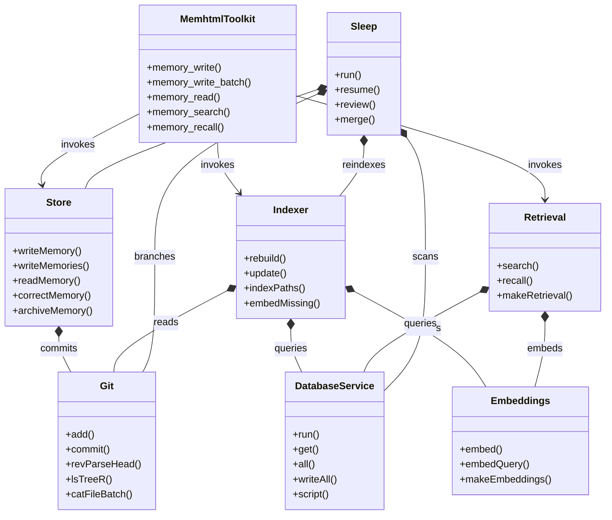

# memhtml-public · Components

```mermaid
classDiagram
    class MemhtmlToolkit {
        +memory_write()
        +memory_write_batch()
        +memory_read()
        +memory_search()
        +memory_recall()
    }
    class Store {
        +writeMemory()
        +writeMemories()
        +readMemory()
        +correctMemory()
        +archiveMemory()
    }
    class Git {
        +add()
        +commit()
        +revParseHead()
        +lsTreeR()
        +catFileBatch()
    }
    class Indexer {
        +rebuild()
        +update()
        +indexPaths()
        +embedMissing()
    }
    class Retrieval {
        +search()
        +recall()
        +makeRetrieval()
    }
    class DatabaseService {
        +run()
        +get()
        +all()
        +writeAll()
        +script()
    }
    class Sleep {
        +run()
        +resume()
        +review()
        +merge()
    }
    class Embeddings {
        +embed()
        +embedQuery()
        +makeEmbeddings()
    }

    MemhtmlToolkit --> Store : invokes
    MemhtmlToolkit --> Retrieval : invokes
    MemhtmlToolkit --> Indexer : invokes
    Store *-- Git : commits
    Indexer *-- Git : reads
    Indexer *-- DatabaseService : queries
    Indexer *-- Embeddings : embeds
    Retrieval *-- DatabaseService : queries
    Retrieval *-- Embeddings : embeds
    Sleep *-- Store : writes
    Sleep *-- Git : branches
    Sleep *-- DatabaseService : scans
    Sleep *-- Indexer : reindexes
```
