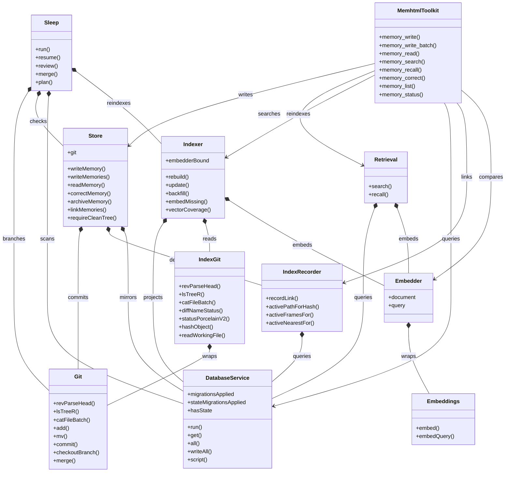

# memhtml-public · Components

Describes the source at 0.15.1 (main 943969c, 2026-09-29). Citations are `path:line` into that tree.

The diagram shows the MCP toolkit and the ten Effect services at the center of the app layer, with the edge each service takes on another. The tree defines 16 `Context.Service` tags in all. The ten drawn here come from `packages/store/src/store.ts:307`, `packages/store/src/git.ts:148`, `packages/index/src/indexer.ts:147`, `packages/index/src/retrieval.ts:193`, `packages/index/src/database.ts:95`, `packages/index/src/git-port.ts:82`, `packages/index/src/traces-persist.ts:162`, `packages/llm/src/embeddings.ts:27`, `packages/sleep/src/service.ts:42`, and `apps/cli/src/api-layer.ts:230`.

A service class is a `Context.Service` tag, and its members are the `readonly` fields of the tag's shape interface. `Store` is `Context.Service<StoreShape>` at `packages/store/src/store.ts:307`, over the interface at `packages/store/src/store.ts:225-305`. A member drawn with `()` is a function. A member drawn without them is a value, such as `Store.git` at `packages/store/src/store.ts:227` or `DatabaseShape.hasState` at `packages/index/src/database.ts:92`.

`MemhtmlToolkit` is not a service. It is a `Toolkit.make` of 15 tool schemas at `apps/mcp/src/tools.ts:1082-1098`, and it takes no dependency itself. The dependencies belong to its handler layer, `MemhtmlToolkit.toLayer` at `apps/mcp/src/handlers.ts:324-328`, which requires `AppServices`, the whole output of `layerApp` (`apps/mcp/src/handlers.ts:49`). Each handler calls an operation imported from `@memhtml/cli` (`apps/mcp/src/handlers.ts:1-26`), and the operation is where the service is taken. So the toolkit's edges below cite `apps/cli/src/operations.ts`.

Three classes are larger than the diagram shows. The `Toolkit.make` has 15 tools and 8 are drawn (`apps/mcp/src/tools.ts:1083-1097`). `StoreShape` has 12 members and 8 are drawn (`packages/store/src/store.ts:225-305`). `GitShape` has 21 members and 8 are drawn (`packages/store/src/git.ts:54-133`). Every other class shows its whole shape.

The layers are composed in one file. `layerCore` stacks the services in dependency order with `Layer.provideMerge` (`apps/cli/src/api-layer.ts:595-599`). `layerApp` adds the roots, the embedder, the model ports, the consolidator port, and the retrieval policy on top (`apps/cli/src/api-layer.ts:608-632`). The CLI runs every command over `layerApp` (`apps/cli/src/run.ts:1601`). The MCP server provides the same `layerApp` under `ToolHandlers` (`apps/mcp/src/server.ts:40-53`), so a tool and its CLI twin read one database and one git root.

Six tags sit outside the diagram because they carry configuration or an optional client rather than behavior of their own. `Roots` holds the two resolved directories (`apps/cli/src/api-layer.ts:94-101`). `RetrievalPolicy` holds the vector coverage floor (`apps/cli/src/api-layer.ts:289-294`). `ModelPort`, `ExtractorPort`, and `ConsolidatorPortService` each hold one optional client (`apps/cli/src/api-layer.ts:357-361`, `apps/cli/src/api-layer.ts:398-402`, `apps/cli/src/api-layer.ts:442-448`). `ModelClient` is the model transport behind the first two (`packages/llm/src/model-client.ts:71`). Their edges are listed after the diagram.

`Sleep` is drawn but the toolkit does not reach it. No handler calls a sleep operation, and the MCP sleep resource reads `Roots` rather than `Sleep` (`apps/mcp/src/resources.ts:247`). The CLI's `sleep run` command takes it at `apps/cli/src/run.ts:639`.

## Edges

An arrow from `MemhtmlToolkit` is a call from one of its handlers into an operation. A diamond is a layer that takes the other service when it is built.

`MemhtmlToolkit --> Store`: `writeMemory`, `batchWrite`, `readMemory`, `correctMemory`, `linkMemories`, and `archiveMemory` take `Store` at `apps/cli/src/operations.ts:337`, `apps/cli/src/operations.ts:885`, `apps/cli/src/operations.ts:1164`, `apps/cli/src/operations.ts:1258`, `apps/cli/src/operations.ts:1296`, and `apps/cli/src/operations.ts:1308`, and `statusReport` takes it at `apps/cli/src/operations.ts:2678`.

`MemhtmlToolkit --> Retrieval`: `searchMemories` and `recallMemories` take `Retrieval` at `apps/cli/src/operations.ts:1190` and `apps/cli/src/operations.ts:1207`.

`MemhtmlToolkit --> Indexer`: every write brings the index up to its commit through `reindex`, which takes `Indexer` at `apps/cli/src/operations.ts:269`.

`MemhtmlToolkit --> DatabaseService`: the read paths take `DatabaseService` directly, in `bumpAccess` (`apps/cli/src/operations.ts:1220`), `reinforceMemories` (`apps/cli/src/operations.ts:1320`), `neighborsOf` (`apps/cli/src/operations.ts:1486`), `resolveMemory` (`apps/cli/src/operations.ts:1735`), `listMemories` (`apps/cli/src/operations.ts:1827`), `searchTraces` (`apps/cli/src/operations.ts:2533`), `traceLinks` (`apps/cli/src/operations.ts:2620`), and `statusReport` (`apps/cli/src/operations.ts:2679`).

`MemhtmlToolkit --> IndexRecorder`: `recordLink` takes `IndexRecorder` to write the session link at `apps/cli/src/operations.ts:204`, and the batch assists `detectFrameConflicts`, `detectNearDuplicates`, and `planLastWins` take `IndexRecorder` at `apps/cli/src/operations.ts:566`, `apps/cli/src/operations.ts:684`, and `apps/cli/src/operations.ts:809`.

`MemhtmlToolkit --> Embedder`: `detectNearDuplicates` takes `Embedder` for its document port at `apps/cli/src/operations.ts:670` to compare a batch against the store.

The toolkit also takes two ports outside the diagram. `batchWrite` takes `ExtractorPort` at `apps/cli/src/operations.ts:975`, and `statusReport` takes `RetrievalPolicy` at `apps/cli/src/operations.ts:2680`.

`Store *-- Git`, `Store *-- IndexRecorder`, `Store *-- DatabaseService`: `layerStore` takes `Git`, `IndexRecorder`, and `DatabaseService` at `apps/cli/src/api-layer.ts:199-201`. The recorder supplies `dedupeLookup`, and the database mirrors `state.access` on a move (`apps/cli/src/api-layer.ts:202-205`).

`IndexRecorder *-- DatabaseService`: `layerRecorder` takes `DatabaseService` at `apps/cli/src/api-layer.ts:181`.

`IndexGit *-- Git`: `layerIndexGit` takes the store's `Git` at `apps/cli/src/api-layer.ts:162` and wraps it with `makeGitPort` at `apps/cli/src/api-layer.ts:163`.

`Indexer *-- DatabaseService`, `Indexer *-- IndexGit`, `Indexer *-- Embedder`: `layerIndexer` takes all three at `apps/cli/src/api-layer.ts:264-266`, and passes `embedder.document` at `apps/cli/src/api-layer.ts:272`.

`Retrieval *-- DatabaseService`, `Retrieval *-- Embedder`: `layerRetrieval` takes both at `apps/cli/src/api-layer.ts:339-340`, and passes `embedder.query` at `apps/cli/src/api-layer.ts:344`. It also takes `RetrievalPolicy` at `apps/cli/src/api-layer.ts:341`.

`Embedder *-- Embeddings`: `layerEmbedder` takes `Embeddings` at `apps/cli/src/api-layer.ts:248` unless `MEMHTML_EMBED` is `off` (`apps/cli/src/api-layer.ts:243-247`).

`Sleep *-- Git`, `Sleep *-- Store`, `Sleep *-- DatabaseService`, `Sleep *-- Indexer`: `layerSleep` takes all four at `apps/cli/src/api-layer.ts:562-565`. The run stages its own file changes with `git.add` (`packages/sleep/src/edits.ts:142`), and its one call on `Store` is `requireCleanTree` in preflight (`packages/sleep/src/phases/preflight.ts:54`).

`layerSleep` also takes `ModelPort`, `ConsolidatorPortService`, and `RetrievalPolicy` at `apps/cli/src/api-layer.ts:566-568`. `ModelPort` and `ExtractorPort` take `ModelClient` at `apps/cli/src/api-layer.ts:372` and `apps/cli/src/api-layer.ts:416`. `Roots` is read by the database, git, index git, and consolidator layers at `apps/cli/src/api-layer.ts:130`, `apps/cli/src/api-layer.ts:141`, `apps/cli/src/api-layer.ts:161`, and `apps/cli/src/api-layer.ts:491`.

## See also

Counts are the distinct existing non-docs source paths cited in inline backticks on both pages, measured against the tree at 943969c.

- [memhtml-public · Module map](../../architecture/module-map.md): 17 shared source citations
- [memhtml-public · Contract map](../../insights/contract-map.md): 14 shared source citations
- [memhtml-public · Impact analysis](../../insights/impact-analysis.md): 13 shared source citations
- [memhtml-public · Sequences](../behavioral/sequences.md): 13 shared source citations
- [memhtml-public · Processes](../../behavior/processes.md): 12 shared source citations
- [memhtml-public · Debugging guide](../../insights/debugging-guide.md): 11 shared source citations
- [memhtml-public · Data flow](../../architecture/data-flow.md): 11 shared source citations
- [memhtml-public · Dependency graph](../structural/dependency-graph.md): 10 shared source citations
- [memhtml-public · Public API](../../reference/public-api.md): 9 shared source citations
- [memhtml-public · Business logic](../../insights/business-logic.md): 8 shared source citations
- [memhtml-public · System overview](../../architecture/system-overview.md): 8 shared source citations
