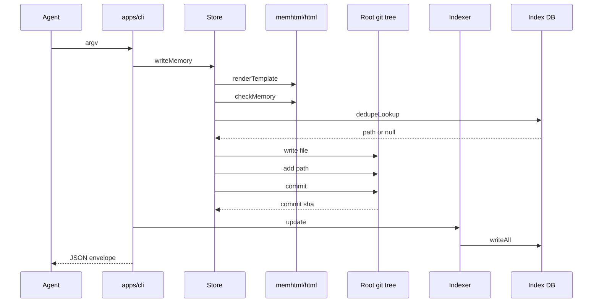
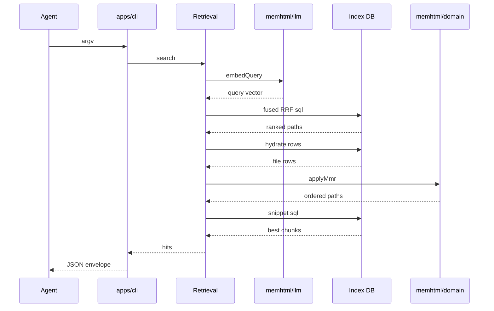
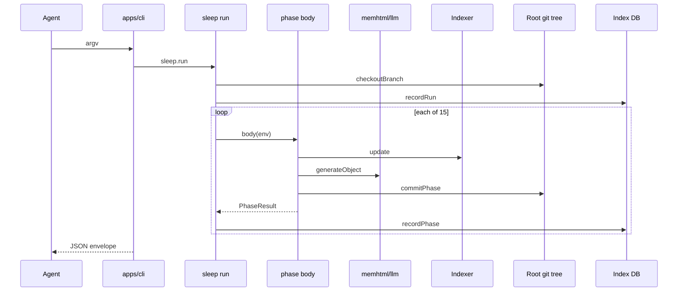

# memhtml-public · Sequences

Three processes, drawn as call order. Every participant is a module in this repository or an actor outside it, and each is named in `docs/architecture/module-map.md:1`. The `Root git tree` and `Index DB` lifelines are the external memhtml root that `$MEMHTML_ROOT` locates, not this repository (`docs/architecture/module-map.md:3`).

## memhtml write

Call sites in order: `apps/cli/src/bin.ts:5`, `apps/cli/src/run.ts:203`, `apps/cli/src/operations.ts:292`, `packages/store/src/store.ts:502`, `packages/store/src/store.ts:524`, `packages/store/src/store.ts:541`, `packages/store/src/store.ts:563`, `packages/store/src/store.ts:564`, `packages/store/src/store.ts:565`, `apps/cli/src/operations.ts:230`, `packages/index/src/indexer.ts:668`, `apps/cli/src/bin.ts:6`.

The `apps/cli` lifeline groups two modules: `run.ts` dispatches the parsed argv (`apps/cli/src/run.ts:186`) and `operations.ts` holds the shared use case (`apps/cli/src/operations.ts:288`). The `dedupeLookup` arrow reaches the index database rather than store code, because `@memhtml/store` is SQL-free and the lookup is injected as `activePathForHash` at composition time (`apps/cli/src/api-layer.ts:208`, `packages/index/src/traces-persist.ts:162`). Order matters twice: `checkMemory` runs before any bytes reach disk, so a refused write leaves the tree byte-identical (`packages/store/src/store.ts:521`), and the dedupe question is asked before a file is written, so a duplicate needs no rollback (`packages/store/src/store.ts:537`). The indexer runs only when a file was created (`apps/cli/src/operations.ts:294`). Not drawn, and folded into the `Indexer` lifeline: `revParseHead` (`packages/index/src/indexer.ts:534`), `diffNameStatus` (`packages/index/src/indexer.ts:557`), `writeState` (`packages/index/src/indexer.ts:669`), and `embeddings.embed` (`packages/index/src/indexer.ts:329`).

## memhtml search

Call sites in order: `apps/cli/src/run.ts:268`, `apps/cli/src/operations.ts:927`, `packages/index/src/retrieval.ts:196`, `packages/index/src/retrieval.ts:247`, `packages/index/src/retrieval.ts:270`, `packages/index/src/retrieval.ts:354`, `packages/index/src/retrieval.ts:360`, `packages/index/src/retrieval.ts:365`, `apps/cli/src/run.ts:273`.

The four arms named `fts`, `vector`, `recency`, and `salience` are a registry folded into one statement rather than four service calls (`packages/index/src/retrieval-sql.ts:6`, `packages/index/src/retrieval-sql.ts:114`, `packages/index/src/retrieval-sql.ts:163`), so they appear as the single `fused RRF sql` message. The assembler `buildRrfSql` is folded into the `Retrieval` lifeline, because `retrieval.ts` calls it in process (`packages/index/src/retrieval.ts:232`). An embedder failure is logged and swallowed to `undefined`, which drops the vector arm and sets `degraded` on the response instead of failing the search (`packages/index/src/retrieval.ts:203`, `packages/index/src/retrieval.ts:390`). The fusion pool is three times the caller's limit before MMR narrows it (`packages/index/src/retrieval.ts:35`, `packages/index/src/retrieval.ts:338`), and snippets are fetched for the final paths only (`packages/index/src/retrieval.ts:357`). Search records no access bump, so a hit never teaches the ranker (`apps/cli/src/operations.ts:916`).

## memhtml sleep run

Call sites in order: `apps/cli/src/run.ts:463`, `packages/sleep/src/run.ts:96`, `packages/sleep/src/run.ts:99`, `packages/sleep/src/run.ts:258`, `packages/sleep/src/phases/preflight.ts:23`, `packages/sleep/src/phases/arc-synthesis.ts:109`, `packages/sleep/src/phases/arc-synthesis.ts:215`, `packages/sleep/src/run.ts:293`, `apps/cli/src/run.ts:468`.

The runner creates the `sleep/<date>` branch before any phase runs, so `main` in the root is never touched (`packages/sleep/src/run.ts:65`). The fifteen phase names and their order are one contract list (`packages/sleep/src/contract.ts:17`). The loop body is drawn as one representative phase, because all fifteen share the same shape, and not every phase uses every arrow: `preflight` calls the indexer and commits nothing (`packages/sleep/src/phases/preflight.ts:23`), and four phases call the model (`packages/sleep/src/llm.ts:6`). Every commit goes through the single `commitPhase` that writes the `Memhtml-Run`, `Memhtml-Phase`, and `Memhtml-Counts` trailer block (`packages/sleep/src/commit.ts:23`, `packages/sleep/src/commit.ts:69`). A phase body runs inside `Effect.result`, so a failure becomes a value the loop reads and the later phases still run (`packages/sleep/src/run.ts:258`, `packages/sleep/src/contract.ts:47`), and a failed phase's staged files are reset with `git reset --quiet HEAD --` before the next phase commits (`packages/sleep/src/run.ts:289`, `packages/sleep/src/run.ts:301`). Not drawn: each phase's own corpus reads (`packages/sleep/src/phases/dedup-merge.ts:34`), the `requireCleanTree` precondition folded into the `Git` lifeline (`packages/sleep/src/phases/preflight.ts:22`), and the closing `recordRun` that sets status `review`, `failed`, or `abandoned` (`packages/sleep/src/run.ts:121`). The branch waits for `memhtml sleep review` and `memhtml sleep merge` rather than merging itself (`apps/cli/src/run.ts:481`, `apps/cli/src/run.ts:519`).

## See also

- [memhtml-public · Processes](../../behavior/processes.md): 11 shared source citations
- [memhtml-public · Data flow](../../architecture/data-flow.md): 9 shared source citations
- [memhtml-public · State machines](../../behavior/state-machines.md): 4 shared source citations
- [memhtml-public · Module map](../../architecture/module-map.md): 2 shared source citations
- [memhtml-public · Debugging guide](../../insights/debugging-guide.md): 2 shared source citations
