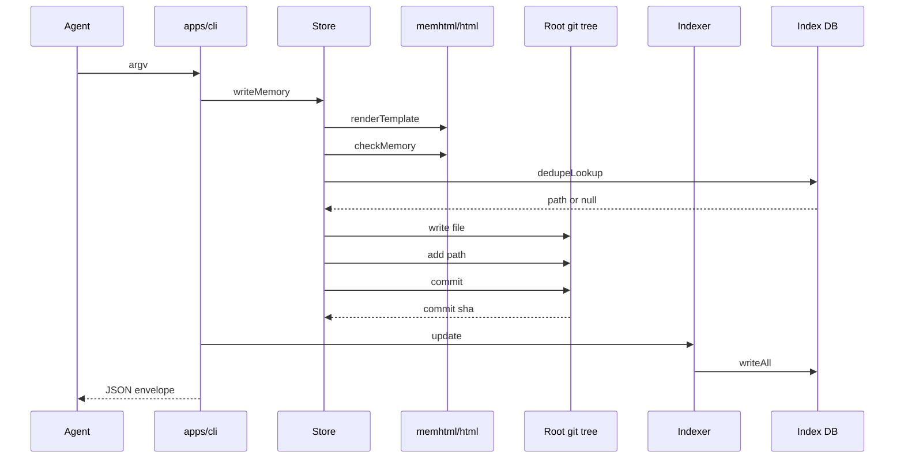
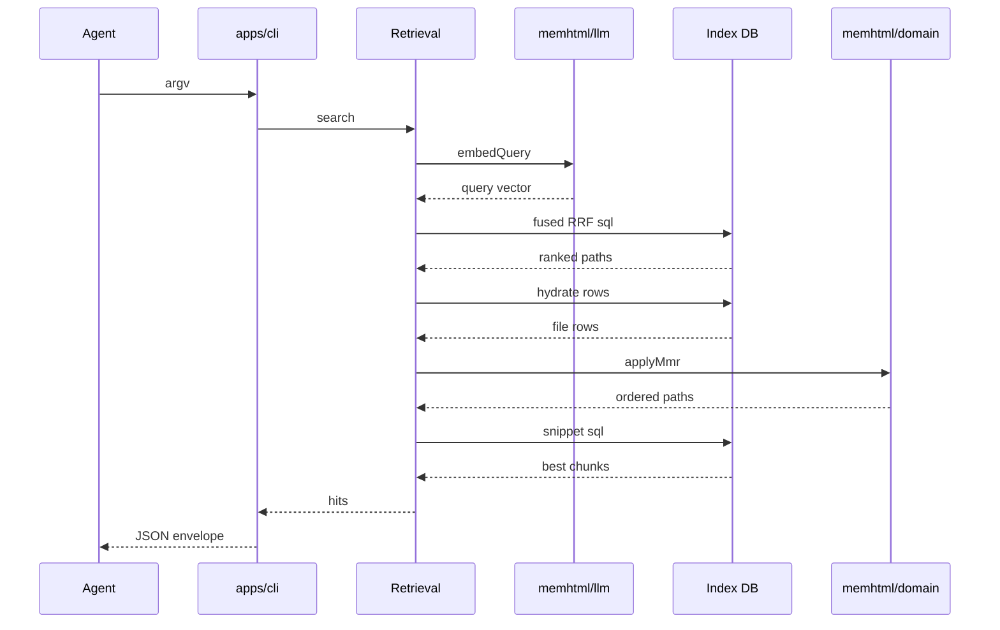
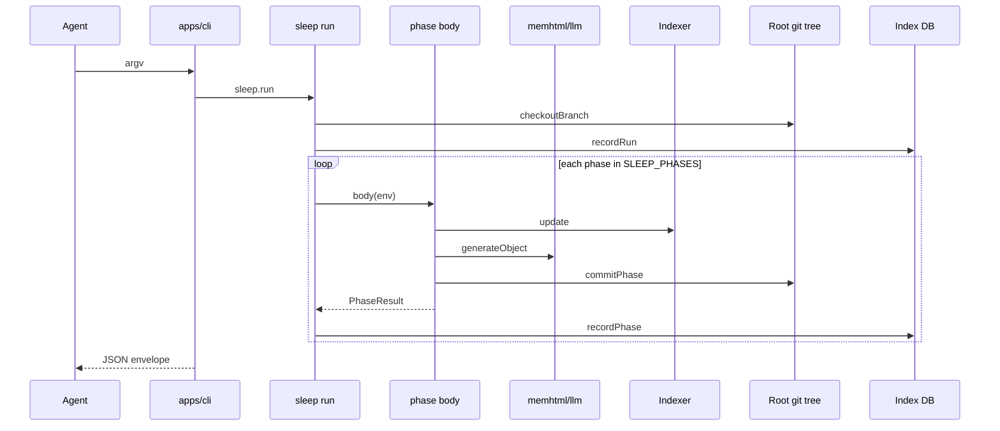

# memhtml-public · Sequences

These three diagrams show the call order of three processes. Every participant is either a module in this repository or an actor outside it, and each one is named in `docs/architecture/module-map.md:1`. The `Root git tree` and `Index DB` lifelines belong to the external memhtml root that `$MEMHTML_ROOT` locates, not to this repository (`docs/architecture/module-map.md:3`).

## memhtml write

Call sites in order: `apps/cli/src/bin.ts:5`, `apps/cli/src/run.ts:203`, `apps/cli/src/operations.ts:292`, `packages/store/src/store.ts:502`, `packages/store/src/store.ts:524`, `packages/store/src/store.ts:541`, `packages/store/src/store.ts:563`, `packages/store/src/store.ts:564`, `packages/store/src/store.ts:565`, `apps/cli/src/operations.ts:230`, `packages/index/src/indexer.ts:668`, `apps/cli/src/bin.ts:6`.

The `apps/cli` lifeline covers two modules. `run.ts` dispatches the parsed argv (`apps/cli/src/run.ts:186`), and `operations.ts` holds the shared use case (`apps/cli/src/operations.ts:288`). The `dedupeLookup` arrow reaches the index database instead of store code, because `@memhtml/store` contains no SQL and the lookup is injected as `activePathForHash` at composition time (`apps/cli/src/api-layer.ts:208`, `packages/index/src/traces-persist.ts:162`).

Two steps depend on running early. `checkMemory` runs before any bytes reach disk, so a refused write leaves the tree byte-identical (`packages/store/src/store.ts:521`). The dedupe lookup also runs before a file is written, so a duplicate needs no rollback (`packages/store/src/store.ts:537`). The indexer runs only when a file was created (`apps/cli/src/operations.ts:294`). Four more indexer calls are folded into the `Indexer` lifeline and not drawn: `revParseHead` (`packages/index/src/indexer.ts:534`), `diffNameStatus` (`packages/index/src/indexer.ts:557`), `writeState` (`packages/index/src/indexer.ts:669`), and `embeddings.embed` (`packages/index/src/indexer.ts:329`).

## memhtml search

Call sites in order: `apps/cli/src/run.ts:268`, `apps/cli/src/operations.ts:927`, `packages/index/src/retrieval.ts:197`, `packages/index/src/retrieval.ts:248`, `packages/index/src/retrieval.ts:297`, `packages/index/src/retrieval.ts:385`, `packages/index/src/retrieval.ts:391`, `packages/index/src/retrieval.ts:396`, `apps/cli/src/run.ts:273`.

The four arms named `fts`, `vector`, `recency`, and `salience` come from a registry that is compiled into one SQL statement instead of four service calls (`packages/index/src/retrieval-sql.ts:6`, `packages/index/src/retrieval-sql.ts:124`, `packages/index/src/retrieval-sql.ts:188`), so they appear as the single `fused RRF sql` message. The assembler `buildRrfSql` is folded into the `Retrieval` lifeline, because `retrieval.ts` calls it in process (`packages/index/src/retrieval.ts:233`). When the embedder fails, the error is logged and the result becomes `undefined`, which drops the vector arm and sets `degraded` on the response rather than failing the search (`packages/index/src/retrieval.ts:204`, `packages/index/src/retrieval.ts:421`). The fusion pool is three times the caller's limit before MMR narrows it (`packages/index/src/retrieval.ts:36`, `packages/index/src/retrieval.ts:369`), and snippets are fetched for the final paths only (`packages/index/src/retrieval.ts:388`). Search records no access bump, so a search hit does not change later ranking (`apps/cli/src/operations.ts:916`).

## memhtml sleep run

Call sites in order: `apps/cli/src/run.ts:574`, `packages/sleep/src/run.ts:376`, `packages/sleep/src/run.ts:178`, `packages/sleep/src/run.ts:460`, `packages/sleep/src/phases/preflight.ts:31`, `packages/sleep/src/phases/arc-synthesis.ts:109`, `packages/sleep/src/phases/arc-synthesis.ts:215`, `packages/sleep/src/run.ts:645`, `apps/cli/src/run.ts:586`.

The runner creates the `sleep/<date>` branch before any phase runs, so the phases never write to `main` in the root (`packages/sleep/src/run.ts:376`). The phase names and their order come from one contract list (`SLEEP_PHASES`, `packages/sleep/src/contract.ts:43` — seventeen as of v0.6.0). Every phase has the same shape, so the loop body is drawn as one representative phase. A given phase does not use every arrow: `preflight` calls the indexer and commits nothing (`packages/sleep/src/phases/preflight.ts:31`), two phases commit nothing at all (`NON_COMMITTING_PHASES`, `contract.ts:197`), and eight phases call the model (`LLM_PHASES`, `contract.ts:168`) while the other nine are deterministic and cost no model call. Every commit goes through the single `commitPhase`, which writes the `Memhtml-Run`, `Memhtml-Phase`, and `Memhtml-Counts` trailer block (`packages/sleep/src/commit.ts:22-28`, `packages/sleep/src/commit.ts:69`).

The last arrow carries a detail the diagram cannot draw. A run with any failed phase returns the `sleep.report` SUCCESS envelope — carrying the whole per-phase report — and the process exits **1** (`sleepExit`, `apps/cli/src/run.ts:284`). Both halves are load-bearing: `@memhtml/sleep` types `run` and `resume` with error channel `never` because a failed phase is a normal terminal state with a report row, so a failure envelope would carry no `data` and delete exactly the per-phase detail an operator needs; and a cron reading only the exit code has to be told the curation did not happen. A partially-failed run and a fully-aborted one exit alike, since the caller's question is the same and the payload already distinguishes them — an abort is every selected phase `failed` with `headSha === baseSha` and no commits. `sleep status` and `sleep review` are excluded, because a read that exited non-zero over a run it merely describes would make "tell me what happened" indistinguishable from "I could not tell you".

A phase body runs inside `Effect.result`, so a failure comes back to the loop as a value and the later phases still run (`packages/sleep/src/run.ts:258`, `packages/sleep/src/contract.ts:47`). A failed phase's staged files are reset with `git reset --quiet HEAD --` before the next phase commits (`packages/sleep/src/run.ts:289`, `packages/sleep/src/run.ts:301`). Three things are left out of the diagram: each phase's own corpus reads (`packages/sleep/src/phases/dedup-merge.ts:34`), the `requireCleanTree` precondition, which is folded into the `Git` lifeline (`packages/sleep/src/phases/preflight.ts:22`), and the closing `recordRun` that sets status `review`, `failed`, or `abandoned` (`packages/sleep/src/run.ts:121`). The runner leaves the branch in place for `memhtml sleep review` and `memhtml sleep merge` to handle, and does not merge it (`apps/cli/src/run.ts:481`, `apps/cli/src/run.ts:519`).

## See also

- [memhtml-public · Processes](../../behavior/processes.md): 11 shared source citations
- [memhtml-public · Data flow](../../architecture/data-flow.md): 9 shared source citations
- [memhtml-public · State machines](../../behavior/state-machines.md): 4 shared source citations
- [memhtml-public · Module map](../../architecture/module-map.md): 2 shared source citations
- [memhtml-public · Debugging guide](../../insights/debugging-guide.md): 2 shared source citations
