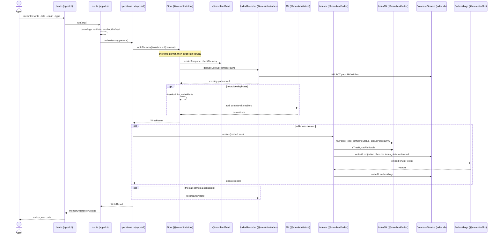
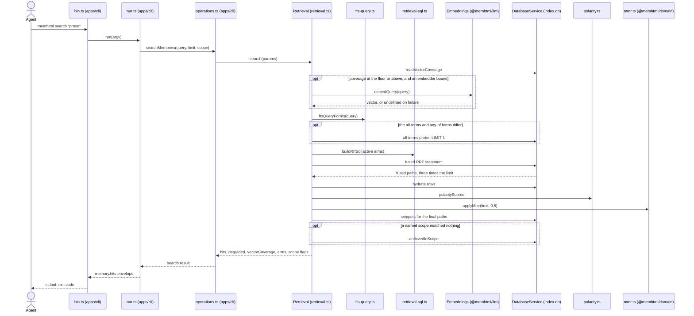
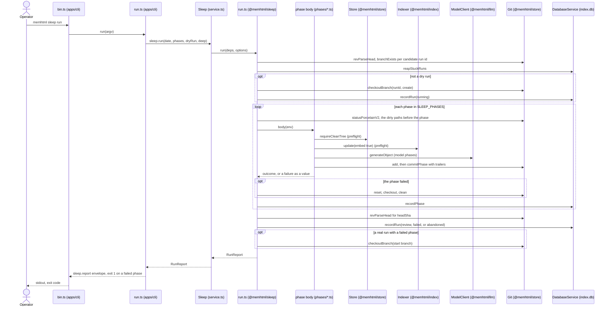

# memhtml-public · Sequences

Describes the source at 0.15.1 (main bdd9be4, 2026-09-30). Citations are `path:line` into that tree.

These three diagrams show the call order of `memhtml write`, `memhtml search`, and `memhtml sleep run`. Each participant is a file, a package, or an Effect service tag defined in this repository, apart from the human or agent at the terminal. Each arrow is a call that the source makes, and the section under each diagram cites it.

All three flows act on the memhtml root, the separate memory tree that `--repo` or `MEMHTML_ROOT` names (`apps/cli/src/api-layer.ts:104-116`). `DatabaseService` is one connection to that root's `.memhtml/index.db` with `state.db` attached (`apps/cli/src/api-layer.ts:126-136`). `Git` runs `git` subprocesses in that root (`packages/store/src/git.ts:216-222`).

Every CLI command runs its dispatch arm over `layerApp`, the one production composition (`apps/cli/src/run.ts:1797-1807`, `apps/cli/src/api-layer.ts:608-632`). A handler in the MCP server reaches the same operations through the same layer. For example, `memory_write` calls `writeMemory` at `apps/mcp/src/handlers.ts:333` and `memory_search` calls `searchMemories` at `apps/mcp/src/handlers.ts:566`. The MCP door itself is drawn in `architecture/data-flow.md`.

## memhtml write

```mermaid
sequenceDiagram
    actor Agent
    participant Bin as bin.ts (apps/cli)
    participant Run as run.ts (apps/cli)
    participant Ops as operations.ts (apps/cli)
    participant Store as Store (@memhtml/store)
    participant Html as @memhtml/html
    participant Recorder as IndexRecorder (@memhtml/index)
    participant Git as Git (@memhtml/store)
    participant Indexer as Indexer (@memhtml/index)
    participant IndexGit as IndexGit (@memhtml/index)
    participant Db as DatabaseService (index.db)
    participant Emb as Embeddings (@memhtml/llm)

    Agent->>Bin: memhtml write --title --claim --type
    Bin->>Run: run(argv)
    Run->>Run: parseArgv, validate, envRootRefusal
    Run->>Ops: writeMemory(params)
    Ops->>Store: writeMemory(toWriteInput(params))
    Note over Store: one write permit, then strictPathRefusal
    Store->>Html: renderTemplate, checkMemory
    Store->>Recorder: dedupeLookup(contentHash)
    Recorder->>Db: SELECT path FROM files
    Recorder-->>Store: existing path or null
    opt no active duplicate
        Store->>Store: freePathFor, writeFileAt
        Store->>Git: add, commit with trailers
        Git-->>Store: commit sha
    end
    Store-->>Ops: WriteResult
    opt a file was created
        Ops->>Indexer: update(embed true)
        Indexer->>IndexGit: revParseHead, diffNameStatus, statusPorcelainV2
        Indexer->>IndexGit: lsTreeR, catFileBatch
        Indexer->>Db: writeAll projection, then the index_state watermark
        Indexer->>Emb: embed(chunk texts)
        Emb-->>Indexer: vectors
        Indexer->>Db: writeAll embeddings
        Indexer-->>Ops: update report
    end
    opt the call carries a session id
        Ops->>Recorder: recordLink(wrote)
    end
    Ops-->>Run: WriteResult
    Run-->>Bin: memory.written envelope
    Bin-->>Agent: stdout, exit code
```

### Write call sites

`Agent->>Bin` and `Bin->>Run`: the binary calls `run(process.argv.slice(2))`, and the envelope it returns is the only thing written to stdout (`apps/cli/src/bin.ts:5`).

`Run->>Run`: `run` parses argv with `parseArgv` at `apps/cli/src/run.ts:1430`. Help and the bare manifest answer first (`apps/cli/src/run.ts:1440-1444`). `validate` then refuses a bad call at exit 2 before any service is built (`apps/cli/src/run.ts:1446-1447`). `envRootRefusal` refuses a root taken from the environment when `MEMHTML_REFUSE_ENV_ROOT` is set (`apps/cli/src/run.ts:1665-1666`).

`Run->>Ops`: the `write` dispatch arm calls `ops.writeMemory` and names the response type `memory.written` (`apps/cli/src/run.ts:348-368`).

`Ops->>Store`: `writeMemory` decodes the parameters with `toWriteInput` and calls `store.writeMemory` (`apps/cli/src/operations.ts:335-339`). The decode checks the type against the operator vocabulary and checks a task's status and due date before any file is rendered (`apps/cli/src/operations.ts:293-327`).

The note on `Store`: the store's `writeMemory` runs under one in-process permit, so two writers take turns (`oneWriterAtATime`, `packages/store/src/store.ts:1400`, `packages/store/src/store.ts:1405`). Its first gate is `strictPathRefusal` (`packages/store/src/store.ts:709`, `packages/store/src/store.ts:692-705`).

`Store->>Html`: `renderFor` calls `renderTemplate` (`packages/store/src/store.ts:642`), and `renderChecked` fails with `InvalidMemory` on any `checkMemory` violation before the file is written (`packages/store/src/store.ts:661-668`). Both functions are imported from `@memhtml/html` (`packages/store/src/store.ts:22-31`).

`Store->>Recorder` and `Recorder->>Db`: the store hashes the rendered bytes and calls its injected `dedupeLookup` (`packages/store/src/store.ts:713-719`). The composition injects the recorder's `activePathForHash` (`apps/cli/src/api-layer.ts:203`), which is one query for a live, non-archived, non-task row with that hash (`packages/index/src/traces-persist.ts:196-203`). A match returns `deduped: true` with no file and no commit (`packages/store/src/store.ts:720-729`).

`Store->>Store`: `freePathFor` picks a free path (`packages/store/src/store.ts:731-739`), and `writeFileAt` writes the file with `node:fs` (`packages/store/src/store.ts:752`, `packages/store/src/store.ts:460-465`).

`Store->>Git` and `Git-->>Store`: the store calls `git.add` and `git.commit` with provenance trailers (`packages/store/src/store.ts:753-756`). The `add` member of `Git` runs `git add` (`packages/store/src/git.ts:390-393`), and its `commit` member runs `git commit` and then `git rev-parse HEAD` for the sha (`packages/store/src/git.ts:397-412`). The write, the stage, and the commit run under a journal that compensates a failure (`makeJournal`, `packages/store/src/store.ts:747-758`).

`Store-->>Ops`: the result carries the path, `created`, `deduped`, the commit sha, and the content hash (`packages/store/src/store.ts:760-766`).

`Ops->>Indexer`: only a created file triggers `reindex` (`apps/cli/src/operations.ts:341`), which calls `indexer.update({ embed: true })` (`apps/cli/src/operations.ts:267-271`).

`Indexer->>IndexGit`: `update` reads HEAD at `packages/index/src/indexer.ts:811`, diffs the watermark against it with `diffNameStatus` at `packages/index/src/indexer.ts:857`, and reads uncommitted changes with `statusPorcelainV2` at `packages/index/src/indexer.ts:858`. It reads the changed blobs with `lsTreeR` and `catFileBatch` (`packages/index/src/indexer.ts:873`, `packages/index/src/indexer.ts:880`). `IndexGit` is the store's `Git` wrapped by `makeGitPort` (`apps/cli/src/api-layer.ts:162-163`).

`Indexer->>Db`, first arrow: `applyProjectionWrites` sends the projection through `db.writeAll` in batches (`packages/index/src/indexer.ts:994`, `packages/index/src/indexer.ts:284`). `writeState` then records the new watermark in `index_state` (`packages/index/src/indexer.ts:995`, `packages/index/src/indexer.ts:439-441`).

`Indexer->>Emb` and `Emb-->>Indexer`: `embedMissing` runs over the chunks this pass projected (`packages/index/src/indexer.ts:1002`) and calls `embeddings.embed` one slice at a time (`packages/index/src/indexer.ts:577`). The port is the embedder's document half (`apps/cli/src/api-layer.ts:272`). The `embed` member of `Embeddings` sends each chunk of texts to Bedrock through `embedChunk` with `invokeJson` (`packages/llm/src/embeddings.ts:136-141`, `packages/llm/src/embeddings.ts:116`).

`Indexer->>Db`, second arrow: each slice's vectors are written through `applyWrites`, the same batched `writeAll` (`packages/index/src/indexer.ts:606`). When a slice comes back as a `Failure`, the pass ends and keeps every vector already written, so an embedder outage does not fail the write (`packages/index/src/indexer.ts:585`).

`Ops->>Recorder`: `recordLink` writes a `wrote` session link when the call carries a session id, and logs a failure instead of raising it (`apps/cli/src/operations.ts:342`, `apps/cli/src/operations.ts:201-217`).

`Run-->>Bin` and `Bin-->>Agent`: a success becomes an envelope at exit 0, and a typed failure goes through `failureFor` at exit 1 (`apps/cli/src/run.ts:1798-1799`, `apps/cli/src/errors.ts:212`). The codes are `EXIT_OK`, `EXIT_USAGE`, and `EXIT_RUNTIME` (`apps/cli/src/envelope.ts:120-122`). The binary calls `process.exit` from the write callback, so a slow pipe reader still gets the whole envelope (`apps/cli/src/bin.ts:22`).

The diagram leaves out the indexer's two early exits. With no watermark row from `readState`, `update` reprojects the whole tree (`packages/index/src/indexer.ts:812`, `packages/index/src/indexer.ts:821-822`). With a watermark a rebuild left empty, it fails with `IndexStale` (`packages/index/src/indexer.ts:842-845`). The batch door, `memhtml apply`, calls `ops.batchWrite` instead (`apps/cli/src/run.ts:377-379`), and `architecture/data-flow.md` covers the rest of the write steps.

## memhtml search

```mermaid
sequenceDiagram
    actor Agent
    participant Bin as bin.ts (apps/cli)
    participant Run as run.ts (apps/cli)
    participant Ops as operations.ts (apps/cli)
    participant Retrieval as Retrieval (retrieval.ts)
    participant Fts as fts-query.ts
    participant Sql as retrieval-sql.ts
    participant Emb as Embeddings (@memhtml/llm)
    participant Db as DatabaseService (index.db)
    participant Polarity as polarity.ts
    participant Mmr as mmr.ts (@memhtml/domain)

    Agent->>Bin: memhtml search "prose"
    Bin->>Run: run(argv)
    Run->>Ops: searchMemories(query, limit, scope)
    Ops->>Retrieval: search(params)
    Retrieval->>Db: readVectorCoverage
    opt coverage at the floor or above, and an embedder bound
        Retrieval->>Emb: embedQuery(query)
        Emb-->>Retrieval: vector, or undefined on failure
    end
    Retrieval->>Fts: ftsQueryForms(query)
    opt the all-terms and any-of forms differ
        Retrieval->>Db: all-terms probe, LIMIT 1
    end
    Retrieval->>Sql: buildRrfSql(active arms)
    Retrieval->>Db: fused RRF statement
    Db-->>Retrieval: fused paths, three times the limit
    Retrieval->>Db: hydrate rows
    Retrieval->>Polarity: polarityScored
    Retrieval->>Mmr: applyMmr(limit, 0.5)
    Retrieval->>Db: snippets for the final paths
    opt a named scope matched nothing
        Retrieval->>Db: archivedInScope
    end
    Retrieval-->>Ops: hits, degraded, vectorCoverage, arms, scope flags
    Ops-->>Run: search result
    Run-->>Bin: memory.hits envelope
    Bin-->>Agent: stdout, exit code
```

### Search call sites

`Agent->>Bin` through `Run->>Ops`: the binary and `run` behave as in the write flow. The `search` arm calls `ops.searchMemories` with the query, the limit, and the shared scope, and names the response type `memory.hits` (`apps/cli/src/run.ts:415-423`). The scope comes from one helper that `search` and `recall` share (`apps/cli/src/run.ts:264-274`).

`Ops->>Retrieval`: `searchMemories` takes `Retrieval` and delegates (`apps/cli/src/operations.ts:1188-1192`). It records no access bump, so a ranked hit does not feed back into salience (`apps/cli/src/operations.ts:1180-1186`).

`Retrieval->>Db`, coverage: `search` first calls `gatedQueryVector` (`packages/index/src/retrieval.ts:505`), which calls `readVectorCoverage` (`packages/index/src/retrieval.ts:306`, `packages/index/src/vector-coverage.ts:100-111`). Below the floor, `VECTOR_COVERAGE_FLOOR` or 0.95 by default, the query is never embedded (`packages/index/src/retrieval.ts:307-313`, `packages/index/src/vector-coverage.ts:44`). The floor comes from `RetrievalPolicy` (`apps/cli/src/api-layer.ts:341`).

`Retrieval->>Emb` and `Emb-->>Retrieval`: `queryVector` returns `undefined` when no embedder is bound. Otherwise it calls `embedQuery`, logs a failure, and turns it into `undefined` (`packages/index/src/retrieval.ts:315`, `packages/index/src/retrieval.ts:262-276`). `embedQuery` embeds one text with the `search_query` input type (`packages/llm/src/embeddings.ts:142-144`).

`Retrieval->>Fts`: `fuse` never matches the caller's prose. It asks `ftsQueryForms` for an all-terms form and an any-of form (`packages/index/src/retrieval.ts:350`, `packages/index/src/fts-query.ts:99`).

`Retrieval->>Db`, probe: when the two forms differ, `holdsEveryTerm` runs one `LIMIT 1` statement from `buildFtsProbeSql` to decide which form to bind (`packages/index/src/retrieval.ts:351-354`, `packages/index/src/retrieval.ts:279-292`, `packages/index/src/retrieval-sql.ts:149`).

`Retrieval->>Sql`: `buildRrfSql` folds the arms that can fire into one statement (`packages/index/src/retrieval.ts:355-360`, `packages/index/src/retrieval-sql.ts:307-311`). The registry holds four arms: lexical, vector, recency, and salience (`packages/index/src/retrieval-sql.ts:268`). In `activeArms`, an arm leaves the fold when it lacks a query vector, the state plane, or query terms (`packages/index/src/retrieval-sql.ts:288-295`). With no arm left, the `sql` is `undefined` and `fuse` returns no paths (`packages/index/src/retrieval.ts:361`).

`Retrieval->>Db`, fused statement: one `db.all` returns the fused paths (`packages/index/src/retrieval.ts:370`). The pool is `MMR_POOL_FACTOR` times the limit, and `DEFAULT_SEARCH_LIMIT` is 10 (`packages/index/src/retrieval.ts:510`, `packages/index/src/retrieval.ts:43`, `packages/index/src/retrieval.ts:49`).

`Retrieval->>Db`, hydrate: one statement reads each fused path's row, entities, superseding edge, and first chunk vector (`packages/index/src/retrieval.ts:513`, `packages/index/src/retrieval.ts:400-419`).

`Retrieval->>Polarity`: `polarityScored` gives each candidate a score from its fused rank and demotes a negation-flipped twin (`packages/index/src/retrieval.ts:526-529`, `packages/index/src/polarity.ts:78`).

`Retrieval->>Mmr`: `applyMmr` reorders the pool down to the limit with `MMR_LAMBDA` of 0.5 (`packages/index/src/retrieval.ts:535`, `packages/domain/src/mmr.ts:36`, `packages/domain/src/ranking.ts:11`).

`Retrieval->>Db`, snippets: `snippets` runs over the final paths only and keeps each file's best chunk from one `buildSnippetSql` statement (`packages/index/src/retrieval.ts:541-544`, `packages/index/src/retrieval.ts:437-447`, `packages/index/src/retrieval-sql.ts:343`).

`Retrieval->>Db`, archived: when a named scope left nothing, `archivedInScope` counts the archived rows in the same scope (`packages/index/src/retrieval.ts:545-554`, `packages/index/src/retrieval.ts:470-489`).

`Retrieval-->>Ops` through `Bin-->>Agent`: the result carries the hits and the response flags (`packages/index/src/retrieval.ts:556-593`). `degraded` is true whenever the search ran without a query vector, for any of the three reasons above (`packages/index/src/retrieval.ts:581`). The envelope and exit follow the write flow.

The diagram folds the SQL each arm contributes into the one `fused RRF statement` message. The arm bodies live in `packages/index/src/retrieval-sql.ts`, and `recall` follows the same path up to fusion (`packages/index/src/retrieval.ts:596-600`).

## memhtml sleep run

```mermaid
sequenceDiagram
    actor Operator
    participant Bin as bin.ts (apps/cli)
    participant Run as run.ts (apps/cli)
    participant Sleep as Sleep (service.ts)
    participant Runner as run.ts (@memhtml/sleep)
    participant Phase as phase body (phases/*.ts)
    participant Store as Store (@memhtml/store)
    participant Indexer as Indexer (@memhtml/index)
    participant Model as ModelClient (@memhtml/llm)
    participant Git as Git (@memhtml/store)
    participant Db as DatabaseService (index.db)

    Operator->>Bin: memhtml sleep run
    Bin->>Run: run(argv)
    Run->>Sleep: sleep.run(date, phases, dryRun, deep)
    Sleep->>Runner: run(deps, options)
    Runner->>Git: revParseHead, branchExists per candidate run id
    Runner->>Db: reapStuckRuns
    opt not a dry run
        Runner->>Git: checkoutBranch(runId, create)
        Runner->>Db: recordRun(running)
    end
    loop each phase in SLEEP_PHASES
        Runner->>Git: statusPorcelainV2, the dirty paths before the phase
        Runner->>Phase: body(env)
        Phase->>Store: requireCleanTree (preflight)
        Phase->>Indexer: update(embed true) (preflight)
        Phase->>Model: generateObject (model phases)
        Phase->>Git: add, then commitPhase with trailers
        Phase-->>Runner: outcome, or a failure as a value
        opt the phase failed
            Runner->>Git: reset, checkout, clean
        end
        Runner->>Db: recordPhase
    end
    Runner->>Git: revParseHead for headSha
    Runner->>Db: recordRun(review, failed, or abandoned)
    opt a real run with a failed phase
        Runner->>Git: checkoutBranch(start branch)
    end
    Runner-->>Sleep: RunReport
    Sleep-->>Run: RunReport
    Run-->>Bin: sleep.report envelope, exit 1 on a failed phase
    Bin-->>Operator: stdout, exit code
```

### Sleep run call sites

`Operator->>Bin` and `Bin->>Run`: as in the write flow. The MCP server has no sleep tool, so this flow starts only from the CLI (`apps/mcp/src/tools.ts:30-34`).

`Run->>Sleep`: the `sleep run` arm takes `Sleep` and calls `sleep.run` with the date, the phase filter, and the dry-run, deep, and budget flags (`apps/cli/src/run.ts:637-650`). `layerSleep` builds the service over `Git`, `Store`, `DatabaseService`, `Indexer`, the model port, the consolidator port, and the coverage floor (`apps/cli/src/api-layer.ts:562-578`).

`Sleep->>Runner`: `makeSleep` hands `run` straight to the runner (`packages/sleep/src/service.ts:46`).

`Runner->>Git`, run id: the runner reads the base sha with `revParseHead` (`packages/sleep/src/run.ts:142`). `existingSleepBranches` then probes `sleep/<date>`, `sleep/<date>-2`, and so on with `branchExists` until one is free, and `runIdFor` takes the next id (`packages/sleep/src/run.ts:143-144`, `packages/sleep/src/run.ts:877-893`). When all 100 are taken, the run ends in `abortedRun` (`packages/sleep/src/run.ts:145-153`).

`Runner->>Db`, reaper: `reapStuckRuns` closes earlier rows that a killed run left `running` (`packages/sleep/src/run.ts:159`, `packages/sleep/src/run.ts:608-644`). It reads them with `runningRuns` and closes them with `abandonRun` (`packages/sleep/src/sql.ts:1336`, `packages/sleep/src/sql.ts:1353`). The `sleep_runs` and `sleep_phases` tables live in `index.db` (`packages/index/migrations/0006_sleep.sql:6`, `packages/index/migrations/0006_sleep.sql:18`).

`Runner->>Git`, branch: a real run calls `enterRunBranch`, which checks out a new branch named after the run id and aborts if HEAD is not on it afterwards (`packages/sleep/src/run.ts:198-211`, `packages/sleep/src/run.ts:420-444`). `checkoutBranch` runs `git checkout -b` (`packages/store/src/git.ts:415-418`).

`Runner->>Db`, opening row: a real run writes its `running` row with `recordRun`, and a dry run writes none (`packages/sleep/src/run.ts:219-231`, `packages/sleep/src/sql.ts:1299`).

`loop`: `executePhases` walks the selected phases in the order of `SLEEP_PHASES`, which lists 17 (`packages/sleep/src/run.ts:233`, `phases` at `packages/sleep/src/run.ts:676`, `packages/sleep/src/contract.ts:43-61`).

`Runner->>Git`, dirty paths: before a real phase runs, the runner records the dirty paths with `dirtyPathSet`, which calls `statusPorcelainV2` (`packages/sleep/src/run.ts:699`, `packages/sleep/src/run.ts:748-751`).

`Runner->>Phase`: the runner looks up the body in `PHASE_BODIES`, or builds the `report` body, and runs it under `Effect.result` (`packages/sleep/src/run.ts:701-703`, `packages/sleep/src/phases/index.ts:29`).

`Phase->>Store` and `Phase->>Indexer`: only `preflight` makes these two calls. It asserts a clean tree, then updates the index with embedding on (`packages/sleep/src/phases/preflight.ts:54-55`). It fails the phase when the vector plane is in use and its coverage is below `VECTOR_COVERAGE_HARD_FLOOR` (`packages/sleep/src/phases/preflight.ts:58-64`).

`Phase->>Model`: eight phases call the model, listed in `LLM_PHASES` (`packages/sleep/src/contract.ts:169-178`). The arrow is drawn from `arc-synthesis`, whose triage call is `model.generateObject` (`packages/sleep/src/phases/arc-synthesis.ts:110`). `layerSleep` passes `modelPort.model` as the model (`apps/cli/src/api-layer.ts:574`).

`Phase->>Git`: a committing phase stages its own files with `git.add` and commits through `commitPhase`, as `arc-synthesis` does (`packages/sleep/src/phases/arc-synthesis.ts:283`, `packages/sleep/src/phases/arc-synthesis.ts:299`). `commitPhase` calls the `commit` member of `Git` (`packages/sleep/src/commit.ts:69-82`), and `phaseTrailers` builds the `Memhtml-Run`, `Memhtml-Phase`, and `Memhtml-Counts` trailers (`packages/sleep/src/commit.ts:23-31`). `preflight` and `relationship-mining` never commit (`packages/sleep/src/contract.ts:241`).

`Phase-->>Runner`: a success becomes an `ok` result with counts, a commit sha, and a model call count, and a failure becomes a `failed` result (`packages/sleep/src/run.ts:706-722`).

`Runner->>Git`, discard: after a real phase fails, `discardPhaseWrites` calls `runGit` three times. It unstages with `git reset`, restores tracked files with `git checkout`, and removes new ones with `git clean` (`packages/sleep/src/run.ts:730`, `packages/sleep/src/run.ts:788`, `packages/sleep/src/run.ts:812`, `packages/sleep/src/run.ts:815`).

`Runner->>Db`, phase row: `recordOne` writes the phase row through `recordPhase` on a real run (`packages/sleep/src/run.ts:734`, `packages/sleep/src/run.ts:842`, `packages/sleep/src/sql.ts:1364`).

`Runner->>Git`, head: after the loop, the runner reads the head sha (`packages/sleep/src/run.ts:234`).

`Runner->>Db`, closing row: the closing `recordRun` sets `abandoned` for a dry run, `failed` when any phase failed, and `review` otherwise (`packages/sleep/src/run.ts:238-248`).

`Runner->>Git`, return: a real run with a failed phase checks out the branch it started on, and the run branch stays in place (`packages/sleep/src/run.ts:249`, `packages/sleep/src/run.ts:481-508`). A run with no failure leaves HEAD on the run branch for `memhtml sleep review` and `memhtml sleep merge` (`apps/cli/src/run.ts:663-666`, `apps/cli/src/run.ts:704`).

`Runner-->>Sleep` through `Bin-->>Operator`: the runner returns the run report with its `runId`, `phases`, and `llmCalls` (`packages/sleep/src/run.ts:251-260`), and the CLI shapes it with `sleepRunReport` (`apps/cli/src/run.ts:651`, `apps/cli/src/views.ts:143`). `sleepExit` sets exit 1 when any phase failed, on the same success envelope, so the per-phase report still reaches the caller (`apps/cli/src/run.ts:652`, `apps/cli/src/run.ts:318-319`).

A phase whose hard prerequisite failed does not run. The runner records it as `skipped` and moves on (`packages/sleep/src/run.ts:677-690`). `preflight` is a prerequisite of all 16 phases after it, and `dedup-merge` is one of `compress` and `retention-triage` (`packages/sleep/src/contract.ts:108-127`).

The loop draws one representative phase, and no single phase makes every arrow in it. The diagram leaves out each phase's own reads of `index.db` through `packages/sleep/src/sql.ts`, the file writes a phase makes before it stages, and the consolidator agent that `trace-consolidation` calls with `consolidate` (`packages/sleep/src/phases/trace-consolidation.ts:1018`).

`memhtml sleep resume` runs the same loop over the phases whose trailers the branch does not yet carry. `resume` starts at `packages/sleep/src/run.ts:277`, and `completedPhases` reads the trailers at `packages/sleep/src/run.ts:858-865`.

## See also

Counts are the distinct existing non-docs source paths cited in inline backticks on both pages, measured against the tree at bdd9be4.

- [memhtml-public · Processes](../../behavior/processes.md): 25 shared source citations
- [memhtml-public · Module map](../../architecture/module-map.md): 20 shared source citations
- [memhtml-public · Data flow](../../architecture/data-flow.md): 18 shared source citations
- [memhtml-public · Contract map](../../insights/contract-map.md): 17 shared source citations
- [memhtml-public · Impact analysis](../../insights/impact-analysis.md): 16 shared source citations
- [memhtml-public · Business logic](../../insights/business-logic.md): 16 shared source citations
- [memhtml-public · Debugging guide](../../insights/debugging-guide.md): 15 shared source citations
- [memhtml-public · Components](../architecture/components.md): 13 shared source citations
- [memhtml-public · System overview](../../architecture/system-overview.md): 9 shared source citations
- [memhtml-public · State machines](../../behavior/state-machines.md): 7 shared source citations
- [memhtml-public · Dependency graph](../structural/dependency-graph.md): 6 shared source citations
