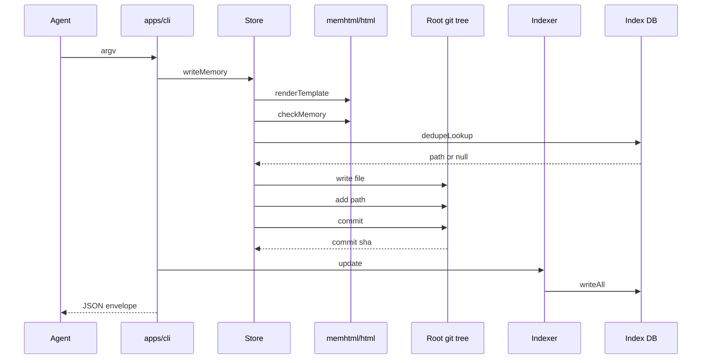
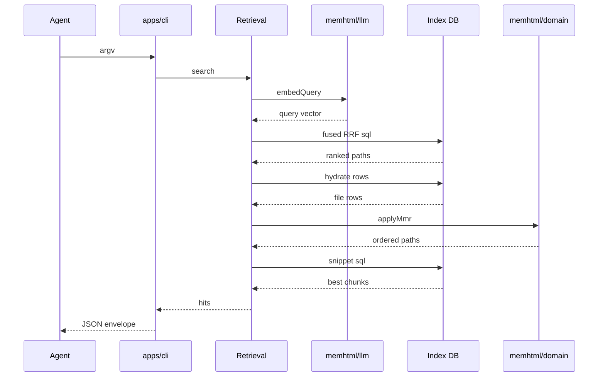

# memhtml-public · Sequences

These three diagrams show the call order of three processes. Every participant is either a module in this repository or an actor outside it, and each one is named in `docs/architecture/module-map.md:1`. The `Root git tree` and `Index DB` lifelines belong to the external memhtml root that `$MEMHTML_ROOT` locates, not to this repository (`docs/architecture/module-map.md:3`).

## memhtml write

```mermaid
sequenceDiagram
    participant Agent
    participant Cli as apps/cli
    participant Store
    participant Html as memhtml/html
    participant Git as Root git tree
    participant Indexer
    participant Db as Index DB

    Agent->>Cli: argv
    Cli->>Store: writeMemory
    Store->>Html: renderTemplate
    Store->>Html: checkMemory
    Store->>Db: dedupeLookup
    Db-->>Store: path or null
    Store->>Git: write file
    Store->>Git: add path
    Store->>Git: commit
    Git-->>Store: commit sha
    Cli->>Indexer: update
    Indexer->>Db: writeAll
    Cli-->>Agent: JSON envelope
```

Call sites in order: `apps/cli/src/bin.ts:5`, `apps/cli/src/run.ts:203`, `apps/cli/src/operations.ts:292`, `packages/store/src/store.ts:502`, `packages/store/src/store.ts:524`, `packages/store/src/store.ts:541`, `packages/store/src/store.ts:563`, `packages/store/src/store.ts:564`, `packages/store/src/store.ts:565`, `apps/cli/src/operations.ts:230`, `packages/index/src/indexer.ts:668`, `apps/cli/src/bin.ts:6`.

The `apps/cli` lifeline covers two modules. `run.ts` dispatches the parsed argv (`apps/cli/src/run.ts:186`), and `operations.ts` holds the shared use case (`apps/cli/src/operations.ts:288`). The `dedupeLookup` arrow reaches the index database instead of store code, because `@memhtml/store` contains no SQL and the lookup is injected as `activePathForHash` at composition time (`apps/cli/src/api-layer.ts:208`, `packages/index/src/traces-persist.ts:162`).

Two steps depend on running early. `checkMemory` runs before any bytes reach disk, so a refused write leaves the tree byte-identical (`packages/store/src/store.ts:521`). The dedupe lookup also runs before a file is written, so a duplicate needs no rollback (`packages/store/src/store.ts:537`). The indexer runs only when a file was created (`apps/cli/src/operations.ts:294`). Four more indexer calls are folded into the `Indexer` lifeline and not drawn: `revParseHead` (`packages/index/src/indexer.ts:534`), `diffNameStatus` (`packages/index/src/indexer.ts:557`), `writeState` (`packages/index/src/indexer.ts:669`), and `embeddings.embed` (`packages/index/src/indexer.ts:329`).

## memhtml search

```mermaid
sequenceDiagram
    participant Agent
    participant Cli as apps/cli
    participant Retrieval
    participant Embed as memhtml/llm
    participant Db as Index DB
    participant Mmr as memhtml/domain

    Agent->>Cli: argv
    Cli->>Retrieval: search
    Retrieval->>Embed: embedQuery
    Embed-->>Retrieval: query vector
    Retrieval->>Db: fused RRF sql
    Db-->>Retrieval: ranked paths
    Retrieval->>Db: hydrate rows
    Db-->>Retrieval: file rows
    Retrieval->>Mmr: applyMmr
    Mmr-->>Retrieval: ordered paths
    Retrieval->>Db: snippet sql
    Db-->>Retrieval: best chunks
    Retrieval-->>Cli: hits
    Cli-->>Agent: JSON envelope
```

Call sites in order: `apps/cli/src/run.ts:268`, `apps/cli/src/operations.ts:927`, `packages/index/src/retrieval.ts:197`, `packages/index/src/retrieval.ts:248`, `packages/index/src/retrieval.ts:297`, `packages/index/src/retrieval.ts:385`, `packages/index/src/retrieval.ts:391`, `packages/index/src/retrieval.ts:396`, `apps/cli/src/run.ts:273`.

The four arms named `fts`, `vector`, `recency`, and `salience` come from a registry that is compiled into one SQL statement instead of four service calls (`packages/index/src/retrieval-sql.ts:6`, `packages/index/src/retrieval-sql.ts:124`, `packages/index/src/retrieval-sql.ts:188`), so they appear as the single `fused RRF sql` message. The assembler `buildRrfSql` is folded into the `Retrieval` lifeline, because `retrieval.ts` calls it in process (`packages/index/src/retrieval.ts:233`). When the embedder fails, the error is logged and the result becomes `undefined`, which drops the vector arm and sets `degraded` on the response rather than failing the search (`packages/index/src/retrieval.ts:204`, `packages/index/src/retrieval.ts:421`). The fusion pool is three times the caller's limit before MMR narrows it (`packages/index/src/retrieval.ts:36`, `packages/index/src/retrieval.ts:369`), and snippets are fetched for the final paths only (`packages/index/src/retrieval.ts:388`). Search records no access bump, so a search hit does not change later ranking (`apps/cli/src/operations.ts:916`).

## See also

- [memhtml-public · Processes](../../behavior/processes.md): 11 shared source citations
- [memhtml-public · Data flow](../../architecture/data-flow.md): 9 shared source citations
- [memhtml-public · State machines](../../behavior/state-machines.md): 4 shared source citations
- [memhtml-public · Module map](../../architecture/module-map.md): 2 shared source citations
- [memhtml-public · Debugging guide](../../insights/debugging-guide.md): 2 shared source citations
