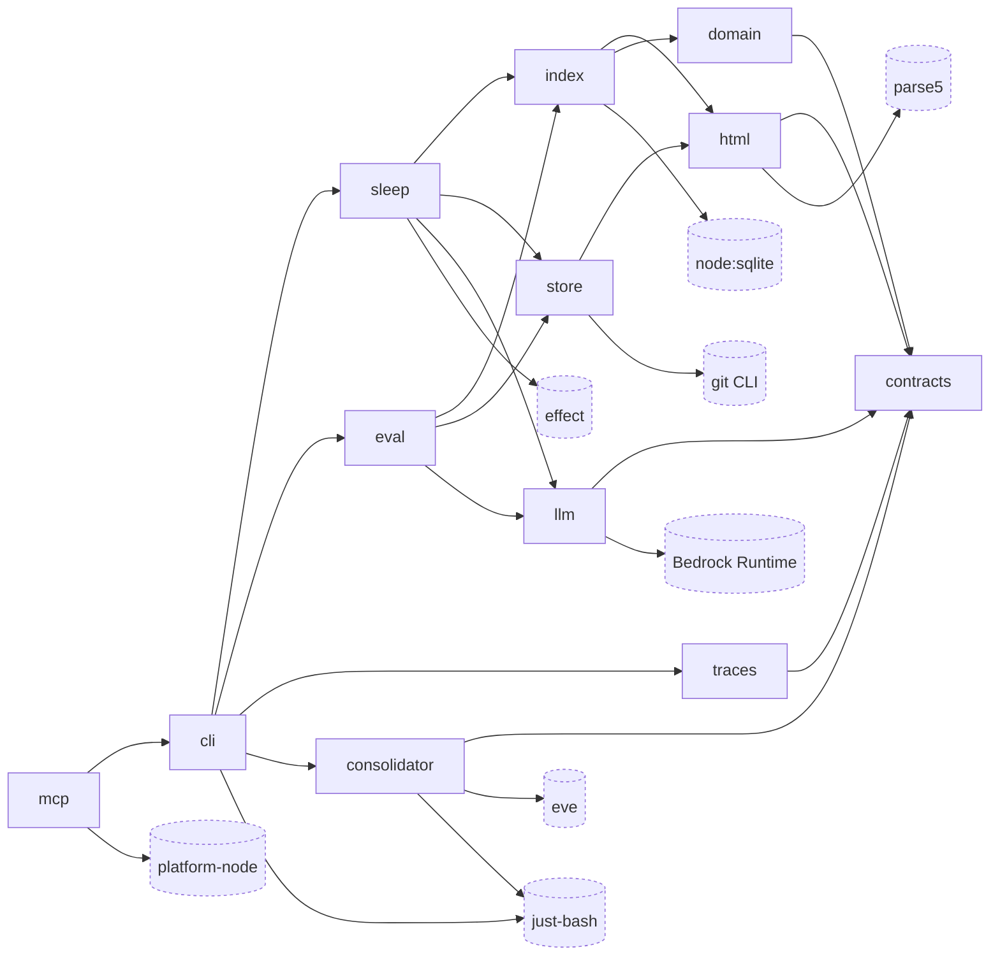

# memhtml-public · Dependency graph

This repository holds the software that manages a memhtml root. It stores no memories itself. The root is a separate directory located by `$MEMHTML_ROOT` (`apps/cli/src/config.ts:28`). The software reaches into that root in two ways, which are the two external nodes at the bottom of this graph. The git CLI owns the system of record (`packages/store/src/git.ts:170`), and `node:sqlite` owns the rebuildable projection at `.memhtml/index.db` (`packages/index/src/database.ts:4`, `packages/index/src/index.ts:5`).

The graph shows 12 internal workspace packages and 8 external dependencies. Internal edges are the transitive reduction of the direct-import graph: an edge is left out when the same relation already holds along a longer path through other packages. A missing arrow between two internal nodes therefore means the relation is implied by a path, not that it is absent.

The reduction dropped 18 of the 37 direct internal edges. All twelve packages import `contracts`, and `cli` imports nine of the other eleven, so the unreduced graph is close to dense and hard to read. `contracts` is the only sink, because `grep -rn 'from "@memhtml' packages/contracts/src` returns zero matches. The graph is also acyclic, so there is exactly one transitive reduction of it.

Three examples show what the reduction left out. `cli --> contracts` has 14 import sites in `apps/cli/src`, and the relation still holds through `cli --> sleep --> contracts`. `mcp --> store` (`apps/mcp/src/resources.ts:5`) still holds through `mcp --> cli --> sleep --> store`. `sleep --> html` has 8 sites in `packages/sleep/src`, and it still holds through `sleep --> store --> html`.

## Internal nodes

Each description is the `description` field of the package's own manifest.

| Node           | Manifest                            | Description                                                                                                               |
| -------------- | ----------------------------------- | ------------------------------------------------------------------------------------------------------------------------- |
| `cli`          | `apps/cli/package.json:2`           | The `memhtml` binary (`apps/cli/package.json:6`). Publishes the `memhtml` bin at `apps/cli/package.json:8`.               |
| `mcp`          | `apps/mcp/package.json:2`           | The `memhtml-mcp` stdio server (`apps/mcp/package.json:6`). Publishes the `memhtml-mcp` bin at `apps/mcp/package.json:8`. |
| `consolidator` | `apps/consolidator/package.json:2`  | The eve agent that distills candidate memories from raw transcripts (`apps/consolidator/package.json:6`).                 |
| `contracts`    | `packages/contracts/package.json:2` | Schemas, enums, errors, and path algebra. Zero I/O (`packages/contracts/package.json:6`).                                 |
| `domain`       | `packages/domain/package.json:2`    | Pure math: retention, decay, RRF, MMR, merge guards (`packages/domain/package.json:6`).                                   |
| `html`         | `packages/html/package.json:2`      | Parse and serialize the memory file format (`packages/html/package.json:6`).                                              |
| `index`        | `packages/index/package.json:2`     | SQLite schema, migrations, the git-driven indexer, and four-arm retrieval (`packages/index/package.json:6`).              |
| `llm`          | `packages/llm/package.json:2`       | Bedrock embeddings and structured output (`packages/llm/package.json:6`).                                                 |
| `sleep`        | `packages/sleep/package.json:2`     | Sleep-cycle phases as git commits (`packages/sleep/package.json:6`).                                                      |
| `store`        | `packages/store/package.json:2`     | Git-backed file store: read, write, move, commit, status (`packages/store/package.json:6`).                               |
| `traces`       | `packages/traces/package.json:2`    | Streaming JSONL parser and trace indexer (`packages/traces/package.json:6`).                                              |
| `eval`         | `packages/eval/package.json:2`      | Fixture corpus generator and the refusable discrimination gate (`packages/eval/package.json:6`).                          |

`mcp --> cli` is the most important internal edge. The MCP server imports the CLI's operations instead of reimplementing them. `apps/mcp/src/server.ts:1` takes `layerApp`, `apps/mcp/src/resources.ts:4` takes `Roots` and `readMemory`, and `apps/mcp/src/failure.ts:1` takes `codeFor` and `messageFor`. A tool call and a CLI invocation therefore resolve through the same code and produce the same error codes. The CLI also publishes a machine-readable description of itself. `apps/cli/src/commands.ts:113` registers a `manifest` command, and `apps/cli/src/commands.ts:102` states that one command table drives parsing, the manifest, and the generated agent doc, so that description cannot drift from behavior.

## External nodes

| Node              | Version pin                                                               | Source module         | Import sites                                                                                                                           |
| ----------------- | ------------------------------------------------------------------------- | --------------------- | -------------------------------------------------------------------------------------------------------------------------------------- |
| `effect`          | `4.0.0-rc.109` (`pnpm-workspace.yaml:84`)                                 | `sleep`               | 76 files across `apps/*/src` and `packages/*/src`; 25 in `packages/sleep` alone. Declared by all 12 packages, always as `catalog:`.    |
| `platform-node`   | `4.0.0-rc.109` (`pnpm-workspace.yaml:85`)                                 | `mcp`                 | `apps/mcp/src/bin.ts:2` takes `NodeRuntime` and `NodeStdio`, which is what makes the server a stdio process.                           |
| `eve`             | `0.38.3` (`apps/consolidator/package.json:42`)                            | `consolidator`        | `apps/consolidator/agent/agent.ts:2`, `apps/consolidator/agent/channels/eve.ts:1-2`, `apps/consolidator/agent/sandbox/sandbox.ts:1-2`. |
| `Bedrock Runtime` | `3.1111.0` (`packages/llm/package.json:33`)                               | `llm`                 | `packages/llm/src/client.ts:1`, `packages/llm/src/model-client.ts:1`, `packages/llm/src/embeddings.ts:1`.                              |
| `just-bash`       | `3.3.0` (`apps/cli/package.json:50`, `apps/consolidator/package.json:43`) | `consolidator`, `cli` | `apps/consolidator/src/mount.ts:6-7` imports it statically; `apps/cli/src/exec.ts:326` loads it through a dynamic `import`.            |
| `parse5`          | `8.0.1` (`packages/html/package.json:36`)                                 | `html`                | `packages/html/src/tree.ts:1-2`, `packages/html/src/markup.ts:1`.                                                                      |
| `node:sqlite`     | Node builtin, `node >=24` (`package.json:7`)                              | `index`               | `packages/index/src/database.ts:4` imports `DatabaseSync`.                                                                             |
| `git CLI`         | External binary                                                           | `store`               | `packages/store/src/git.ts:1` imports `node:child_process`; `packages/store/src/git.ts:170` spawns git through `execFile`.             |

`just-bash` carries two edges because both exist at runtime and they load differently. The CLI's edge is dynamic on purpose. `apps/cli/src/index.ts:92` states that `just-bash` arrives dynamically, and `apps/cli/src/exec.ts:315-317` gives the measured reason, a 6 MB bundle across 20 chunks costing roughly 160ms to load. That same comment records a leak in the current graph. `@memhtml/consolidator`'s barrel re-exports `mount.js`, which imports `just-bash` statically, and `apps/cli/src/api-layer.ts` imports that barrel, so `just-bash` already loads on every `memhtml read` (`apps/cli/src/exec.ts:317-320`).

Two declared workspace dependencies produce no runtime edge and so are not drawn:

- `packages/traces/package.json:21` declares `@memhtml/index` as a runtime dependency, and no file under `packages/traces/src` or `packages/traces/tests` imports it. The dependency runs the other way. `packages/index/src/traces-persist.ts:10-11` explains it: the trace scanner lives in `@memhtml/traces`, which depends on `@memhtml/index`, so `traces-persist.ts` declares the shapes it consumes structurally instead of importing them.
- `packages/index/package.json:29` declares `@memhtml/store` under `devDependencies`, and its only imports are in tests (`packages/index/tests/git-adapter.test.ts:5-6`).

## Legend (overflow)

Ten nodes were measured and left out of the 20-node budget. Edge counts are `from "<spec>"` import sites across `apps/cli/src`, `apps/mcp/src`, `apps/consolidator/src`, `apps/consolidator/agent`, and `packages/*/src`, with `apps/docs` excluded.

| Elided node              | Edge count | Why elided                                                                                                                                                                                                                                                                                    |
| ------------------------ | ---------- | --------------------------------------------------------------------------------------------------------------------------------------------------------------------------------------------------------------------------------------------------------------------------------------------- |
| `node:path`              | 18         | Node builtin used by nearly every module, so drawing it would add edges everywhere and tell the reader nothing new.                                                                                                                                                                           |
| `node:fs/promises`       | 16         | Same. Present in `apps/mcp/src/resources.ts:1` among others.                                                                                                                                                                                                                                  |
| `node:os`                | 6          | Same.                                                                                                                                                                                                                                                                                         |
| `node:crypto`            | 5          | Same.                                                                                                                                                                                                                                                                                         |
| `node:url`               | 3          | Same. Present in `apps/cli/src/exec.ts:4`.                                                                                                                                                                                                                                                    |
| `node:module`            | 2          | Same. `apps/cli/src/exec.ts:2` uses `createRequire` to resolve a path only.                                                                                                                                                                                                                   |
| `highlight.js`           | 2          | `11.11.2` (`packages/html/package.json:35`). Type-only at `packages/html/src/detect.ts:45` and lazily required at `packages/html/src/detect.ts:61`, so it is never on the load-time graph.                                                                                                    |
| `@ai-sdk/amazon-bedrock` | 1          | `5.0.57` (`apps/consolidator/package.json:38`). One site, `apps/consolidator/agent/agent.ts:1`, and it reaches the same service as the `Bedrock Runtime` node already drawn.                                                                                                                  |
| `@memhtml/docs`          | n/a        | The Astro documentation site (`apps/docs/package.json:2`), out of scope for this run.                                                                                                                                                                                                         |
| `@memhtml/integration`   | 11         | The cross-package integration test harness (`tests-integration/package.json:6`). It declares all eleven other workspace packages (`tests-integration/package.json:13-23`) and ships no runtime code, so drawing it would add eleven edges that describe the test tier rather than the system. |

## See also

- [memhtml-public · Module map](../../architecture/module-map.md): 5 shared source citations
- [memhtml-public · System overview](../../architecture/system-overview.md): 5 shared source citations
- [memhtml-public · Contract map](../../insights/contract-map.md): 2 shared source citations
- [memhtml-public · Tech debt](../../insights/tech-debt.md): 2 shared source citations
