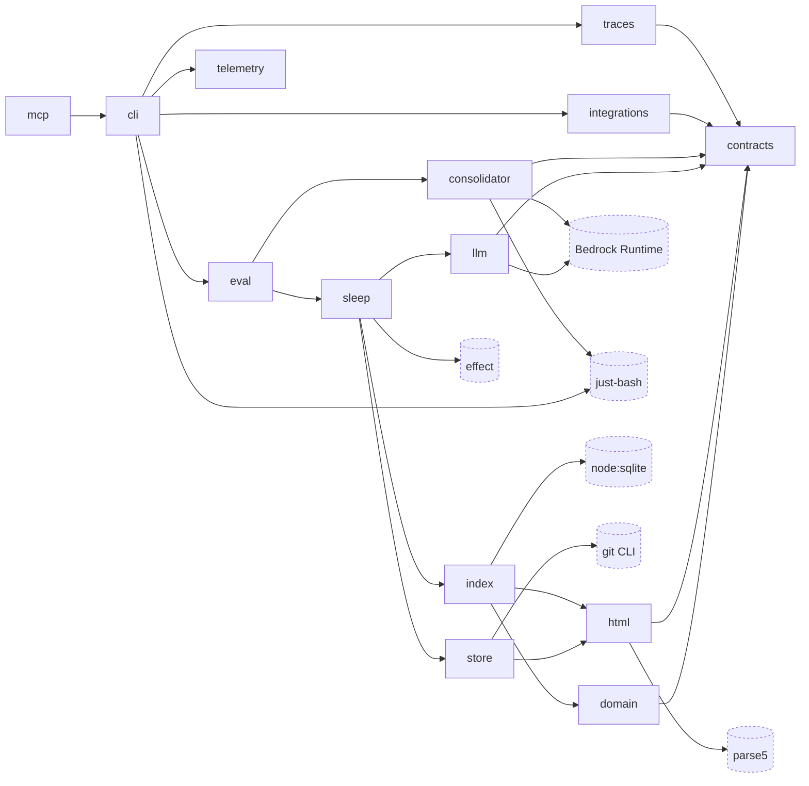

# memhtml-public · Dependency graph

Describes the source at 0.15.1 (main d64e6a3, 2026-09-23). Citations are `path:line` into that tree.

This repository holds the software that manages a memhtml root. It stores no memories itself. The root is a separate directory located by `$MEMHTML_ROOT` (`apps/cli/src/config.ts:64-66`). The software reaches into that root in two ways, which are the two external nodes at the bottom of this graph. The git CLI owns the system of record (`packages/store/src/git.ts:222-223`), and `node:sqlite` owns the rebuildable projection at `.memhtml/index.db` (`packages/index/src/database.ts:4`, `packages/index/src/index.ts:5`).

The graph shows 14 internal workspace packages and 6 external dependencies, which fills the 20-node budget exactly. Internal edges are the transitive reduction of the direct-import graph: an edge is left out when the same relation already holds along a longer path through other packages. A missing arrow between two internal nodes therefore means the relation is implied by a path, not that it is absent.

An internal edge P → Q exists when a file under P's `src/` imports `@memhtml/<q>` or one of its subpaths (`@memhtml/contracts/errors` and the other `contracts` subpaths account for 103 of the sites). The reduction dropped 26 of the 45 direct internal edges and kept 19. Twelve of the other thirteen packages import `contracts` directly, and `cli` imports twelve of the other thirteen, everything except `mcp`, so the unreduced graph is close to dense and hard to read. The graph has two sinks. `grep -rn 'from "@memhtml' packages/contracts/src packages/telemetry/src` returns zero matches: `contracts` imports nothing internal by design, and `telemetry` imports only `effect` (`packages/telemetry/src/index.ts:1-2`), which is also why `telemetry` is the one package that does not import `contracts`. `mcp` is the only source. The graph is acyclic, so there is exactly one transitive reduction of it.

One edge is both static and dynamic. `cli` imports the `consolidator` barrel statically (`apps/cli/src/api-layer.ts:3-7`) and again through `import("@memhtml/consolidator")` on the exec path (`apps/cli/src/exec.ts:329`, `apps/cli/src/exec.ts:512`). Both count as the same direct edge, and the reduction drops it because `cli --> eval --> consolidator` holds: `packages/eval/src/write-path-gate.ts:6` imports the consolidator and `apps/cli/src/run.ts:6` imports `eval`. The barrel's own comment says only the sleep phase that owns trace consolidation depends on it (`apps/consolidator/src/index.ts:6-7`); the measured importers are `cli` and `eval`, and `packages/sleep/src` imports it nowhere.

Three examples show what the reduction left out. `cli --> contracts` has 16 import sites in `apps/cli/src`, all through subpaths such as `@memhtml/contracts/errors` (`apps/cli/src/api-layer.ts:8`), and the relation still holds through `cli --> eval --> consolidator --> contracts` (`apps/consolidator/src/contract.ts:1`). `mcp --> store` (`apps/mcp/src/resources.ts:7`) still holds through `mcp --> cli --> eval --> sleep --> store`. `sleep --> html` has 11 sites in `packages/sleep/src`, and it still holds through `sleep --> store --> html` (`packages/store/src/store.ts:21`).

## Internal nodes

Each description is the `description` field of the package's own manifest. Every manifest names the package on line 2 and describes it on line 5, and all 14 are `"private": true` on line 4.

| Node           | Manifest                               | Description                                                                                                                                                                                                                                                                                                                                                         |
| -------------- | -------------------------------------- | ------------------------------------------------------------------------------------------------------------------------------------------------------------------------------------------------------------------------------------------------------------------------------------------------------------------------------------------------------------------- |
| `cli`          | `apps/cli/package.json:2`              | The `memhtml` binary (`apps/cli/package.json:5`). Publishes the `memhtml` bin at `apps/cli/package.json:21-22`.                                                                                                                                                                                                                                                     |
| `mcp`          | `apps/mcp/package.json:2`              | The `memhtml-mcp` stdio server (`apps/mcp/package.json:5`). Publishes the `memhtml-mcp` bin at `apps/mcp/package.json:20-21`.                                                                                                                                                                                                                                       |
| `consolidator` | `apps/consolidator/package.json:2`     | The eve agent that distills candidate memories from raw transcripts (`apps/consolidator/package.json:5`). The description predates commit 40511b7: the agent is now an in-process AI SDK tool loop that reaches Claude on Bedrock directly or through an LLM proxy (`apps/consolidator/src/model.ts:9-10`), and no `eve` dependency remains in the manifest.        |
| `contracts`    | `packages/contracts/package.json:2`    | Schemas, enums, errors, and path algebra. Zero I/O (`packages/contracts/package.json:5`).                                                                                                                                                                                                                                                                           |
| `domain`       | `packages/domain/package.json:2`       | Pure math: retention, decay, RRF, MMR, merge guards (`packages/domain/package.json:5`).                                                                                                                                                                                                                                                                             |
| `html`         | `packages/html/package.json:2`         | Parse and serialize the memory file format (`packages/html/package.json:5`).                                                                                                                                                                                                                                                                                        |
| `index`        | `packages/index/package.json:2`        | SQLite schema, migrations, the git-driven indexer, and four-arm retrieval (`packages/index/package.json:5`).                                                                                                                                                                                                                                                        |
| `integrations` | `packages/integrations/package.json:2` | Wire a coding agent (Claude Code, Codex, Cursor, OpenCode) to a memhtml store: MCP entry, hooks, instruction block, skill, receipt (`packages/integrations/package.json:5`). Imported only by `cli`, at four sites (`apps/cli/src/run.ts:9`, `apps/cli/src/commands.ts:5`, `apps/cli/src/hook.ts:12`, `apps/cli/src/integrations.ts:26`).                           |
| `llm`          | `packages/llm/package.json:2`          | Bedrock embeddings and structured output (`packages/llm/package.json:5`).                                                                                                                                                                                                                                                                                           |
| `sleep`        | `packages/sleep/package.json:2`        | Sleep-cycle phases as git commits (`packages/sleep/package.json:5`).                                                                                                                                                                                                                                                                                                |
| `store`        | `packages/store/package.json:2`        | Git-backed file store: read, write, move, commit, status (`packages/store/package.json:5`).                                                                                                                                                                                                                                                                         |
| `telemetry`    | `packages/telemetry/package.json:2`    | No `description` field in the manifest. The module comment describes it as the opt-in OTLP trace exporter, gated on `OTEL_EXPORTER_OTLP_ENDPOINT` (`packages/telemetry/src/index.ts:5`). Imported by `cli` (`apps/cli/src/run.ts:11`) and `mcp` (`apps/mcp/src/server.ts:2`); the `mcp` edge is dropped by the reduction because `mcp --> cli --> telemetry` holds. |
| `traces`       | `packages/traces/package.json:2`       | Streaming JSONL parser and trace indexer (`packages/traces/package.json:5`).                                                                                                                                                                                                                                                                                        |
| `eval`         | `packages/eval/package.json:2`         | Fixture corpus generator, the refusable retrieval discrimination gate, and the write-path discrimination arm (`packages/eval/package.json:5`).                                                                                                                                                                                                                      |

`mcp --> cli` is the most important internal edge. The MCP server imports the CLI's operations instead of reimplementing them, at five sites. `apps/mcp/src/server.ts:1` takes `layerApp`, `apps/mcp/src/resources.ts:3` takes `Roots`, `readMemory`, and `Store`, and `apps/mcp/src/failure.ts:1` takes `codeFor` and `messageFor`. A tool call and a CLI invocation therefore resolve through the same code and produce the same error codes. The CLI also publishes a machine-readable description of itself. `apps/cli/src/commands.ts:181` registers a `manifest` command, and `apps/cli/src/commands.ts:177` states that one table drives parsing, the manifest, and the generated doc, so that description cannot drift from behavior.

## External nodes

| Node              | Version pin                                                                                                                                                                                            | Source module         | Import sites                                                                                                                                                                                                                                                                                                                                                                        |
| ----------------- | ------------------------------------------------------------------------------------------------------------------------------------------------------------------------------------------------------ | --------------------- | ----------------------------------------------------------------------------------------------------------------------------------------------------------------------------------------------------------------------------------------------------------------------------------------------------------------------------------------------------------------------------------- |
| `effect`          | `4.0.0-rc.117` (`pnpm-workspace.yaml:93`)                                                                                                                                                              | `sleep`               | 92 files across `apps/*/src` and `packages/*/src` import `effect`; 34 in `packages/sleep/src` alone. Declared by all 14 packages, always as `catalog:`. The MCP protocol itself comes from `effect/unstable/ai` (`apps/mcp/src/server.ts:4`), and the OTLP exporter from `effect/unstable/observability` (`packages/telemetry/src/index.ts:30`), so neither adds a node of its own. |
| `Bedrock Runtime` | `@aws-sdk/client-bedrock-runtime` `3.1135.0` (`packages/llm/package.json:33`); `ai` `7.0.93`, `@ai-sdk/amazon-bedrock` `5.0.81`, `@ai-sdk/anthropic` `4.0.52` (`apps/consolidator/package.json:35-38`) | `llm`, `consolidator` | `llm` uses the AWS SDK: `packages/llm/src/client.ts:1` takes `BedrockRuntimeClient` and `InvokeModelCommand`, and `packages/llm/src/proxy.ts:1` takes the command type. `consolidator` uses the AI SDK: `apps/consolidator/src/model.ts:1-3`, `apps/consolidator/src/client.ts:4`, `apps/consolidator/src/turn.ts:11`, `apps/consolidator/src/tools.ts:3`.                          |
| `just-bash`       | `3.4.2` (`apps/cli/package.json:52`, `apps/consolidator/package.json:40`)                                                                                                                              | `consolidator`, `cli` | `apps/consolidator/src/mount.ts:7-8` imports it statically; `apps/cli/src/exec.ts:325` loads it through a dynamic `import`.                                                                                                                                                                                                                                                         |
| `parse5`          | `8.0.1` (`packages/html/package.json:36`)                                                                                                                                                              | `html`                | `packages/html/src/tree.ts:1-2`, `packages/html/src/markup.ts:1`.                                                                                                                                                                                                                                                                                                                   |
| `node:sqlite`     | Node builtin, `node >=24` (`package.json:7-8`)                                                                                                                                                         | `index`               | `packages/index/src/database.ts:4` imports `DatabaseSync`.                                                                                                                                                                                                                                                                                                                          |
| `git CLI`         | External binary                                                                                                                                                                                        | `store`               | `packages/store/src/git.ts:1` imports `node:child_process`; `packages/store/src/git.ts:222-223` spawns `git` through `execFile`.                                                                                                                                                                                                                                                    |

The consolidator's model stack is drawn as a second edge into `Bedrock Runtime` rather than as an `AI SDK` node of its own, for two reasons. First, it reaches the same service: `apps/consolidator/src/model.ts:14-15` states that the direct path is Bedrock's InvokeModel through `@ai-sdk/amazon-bedrock/anthropic` and that the proxied path through `@ai-sdk/anthropic` is the same implementation behind a different transport, which is the same InvokeModel call `packages/llm/src/client.ts:1` makes with the AWS SDK. Second, the budget: 14 internal nodes leave room for 6 external ones, and a node whose only meaning is "a different client library for the node beside it" is the least informative candidate. The three libraries keep their separate pins in the table above. `zod`, which the tool loop uses for tool schemas, is in the overflow.

`just-bash` carries two edges because both exist at runtime and they load differently. The CLI's edge is dynamic on purpose. `apps/cli/src/index.ts:95-96` states that `just-bash` arrives dynamically, and `apps/cli/src/exec.ts:314-316` gives the measured reason, a 6 MB bundle across 20 chunks costing roughly 160ms to load. That same comment records a leak in the current graph. `@memhtml/consolidator`'s barrel re-exports `mount.js` (`apps/consolidator/src/index.ts:27`), which imports `just-bash` statically (`apps/consolidator/src/mount.ts:7-8`), and `apps/cli/src/api-layer.ts:3-7` imports that barrel, so `just-bash` already loads on every `memhtml read` (`apps/cli/src/exec.ts:316-319`). The comment's closing sentence still names an `eve` closure in `api-layer.ts` as the precedent (`apps/cli/src/exec.ts:321-322`); that closure went with commit 40511b7, and `api-layer.ts` now imports the consolidator statically.

Four declared workspace dependencies produce no runtime edge and so are not drawn:

- `packages/traces/package.json:34` declares `@memhtml/index` as a runtime dependency, and no file under `packages/traces/src` or `packages/traces/tests` imports it. The dependency runs the other way. `packages/index/src/traces-persist.ts:11-13` explains it: the trace scanner lives in `@memhtml/traces`, which depends on `@memhtml/index`, so `traces-persist.ts` declares the shapes it consumes structurally instead of importing them, and the arrow stays pointed one way.
- `packages/index/package.json:38` declares `@memhtml/llm` as a runtime dependency, and `packages/index/src` never imports it. `packages/index/src/indexer.ts:27` declares the embedder structurally as `@memhtml/llm`'s `EmbeddingsShape`, and the imports are in tests only (`packages/index/tests/harness.ts:7`, `packages/index/tests/indexer.test.ts:2`, `packages/index/tests/retrieval.test.ts:1`), which take `EMBED_DIM` and `EMBED_WATERMARK`.
- `packages/index/package.json:44` declares `@memhtml/store` under `devDependencies`, and its only imports are in tests (`packages/index/tests/git-adapter.test.ts:5-6`). `packages/index/src/git-port.ts:7` gives the reason: the git port is declared rather than imported so the indexer depends on a shape and not on the store.
- `apps/mcp/package.json:49` and `apps/mcp/package.json:53` declare `@memhtml/llm` and `@memhtml/traces`, and nothing under `apps/mcp/src` or `apps/mcp/tests` imports either. The server reaches both through `cli`.

## Legend (overflow)

Fourteen nodes were measured and left out of the 20-node budget. Edge counts are `from "<spec>"` import sites across `apps/cli/src`, `apps/mcp/src`, `apps/consolidator/src`, and `packages/*/src`, with `apps/docs` excluded.

| Elided node             | Edge count | Why elided                                                                                                                                                                                                                                                                                                                                                                                                     |
| ----------------------- | ---------- | -------------------------------------------------------------------------------------------------------------------------------------------------------------------------------------------------------------------------------------------------------------------------------------------------------------------------------------------------------------------------------------------------------------- |
| `node:path`             | 30         | Node builtin used by nearly every module, so drawing it would add edges everywhere and tell the reader nothing new.                                                                                                                                                                                                                                                                                            |
| `node:fs/promises`      | 24         | Same. Present in `apps/consolidator/src/client.ts:1` among others.                                                                                                                                                                                                                                                                                                                                             |
| `node:os`               | 9          | Same.                                                                                                                                                                                                                                                                                                                                                                                                          |
| `node:crypto`           | 7          | Same.                                                                                                                                                                                                                                                                                                                                                                                                          |
| `node:fs`               | 6          | Same. Present in `apps/consolidator/src/mount.ts:2` among others.                                                                                                                                                                                                                                                                                                                                              |
| `node:child_process`    | 5          | Same. One of the five is the `git CLI` edge already drawn (`packages/store/src/git.ts:1`); the others spawn processes from `apps/cli/src/serve.ts:1`, `apps/cli/src/integrations.ts:1`, `apps/consolidator/src/mount.ts:1`, and `packages/integrations/src/doctor.ts:18`. A sixth textual match, `packages/integrations/src/render/plugin.ts:56`, is a string literal inside a rendered plugin, not an import. |
| `node:url`              | 5          | Same. Present in `apps/cli/src/exec.ts:4`.                                                                                                                                                                                                                                                                                                                                                                     |
| `node:module`           | 2          | Same. `apps/cli/src/exec.ts:2` and `packages/html/src/detect.ts:43` use `createRequire` to resolve a path only.                                                                                                                                                                                                                                                                                                |
| `@effect/platform-node` | 1          | `4.0.0-rc.117` (`pnpm-workspace.yaml:94`), declared as `catalog:` by `mcp` alone (`apps/mcp/package.json:42`). One site, `apps/mcp/src/bin.ts:2`, takes `NodeRuntime` and `NodeStdio`, which is what makes the server a stdio process. It rides the same catalog line as `effect` and is the one external node the budget pushed out when `integrations` and `telemetry` came in.                              |
| `highlight.js`          | 1          | `11.11.2` (`packages/html/package.json:35`). Type-only at `packages/html/src/detect.ts:45` and lazily required at `packages/html/src/detect.ts:61`, so it is never on the load-time graph.                                                                                                                                                                                                                     |
| `zod`                   | 1          | `4.5.4` (`apps/consolidator/package.json:41`). One site, `apps/consolidator/src/tools.ts:4`, where the AI SDK tool loop declares its tool input schemas.                                                                                                                                                                                                                                                       |
| `jsonc-parser`          | 1          | `3.3.1` (`packages/integrations/package.json:35`). One site, `packages/integrations/src/adapters/json.ts:37`, the JSONC adapter for agent config files.                                                                                                                                                                                                                                                        |
| `@memhtml/docs`         | n/a        | The Astro documentation site (`apps/docs/package.json:2`), out of scope for this run.                                                                                                                                                                                                                                                                                                                          |
| `@memhtml/integration`  | 11         | The cross-package integration test harness (`tests-integration/package.json:6`). It declares eleven of the fourteen workspace packages (`tests-integration/package.json:13-23`), all but `consolidator`, `integrations`, and `telemetry`, and ships no runtime code, so drawing it would add eleven edges that describe the test tier rather than the system.                                                  |

## See also

Counts are the distinct existing non-docs source paths cited in inline backticks on both pages, measured against the tree at d64e6a3.

- [memhtml-public · Module map](../../architecture/module-map.md): 24 shared source citations
- [memhtml-public · Impact analysis](../../insights/impact-analysis.md): 20 shared source citations
- [memhtml-public · Contract map](../../insights/contract-map.md): 18 shared source citations
- [memhtml-public · Tech debt](../../insights/tech-debt.md): 14 shared source citations
- [memhtml-public · System overview](../../architecture/system-overview.md): 12 shared source citations
- [memhtml-public · Business logic](../../insights/business-logic.md): 11 shared source citations
